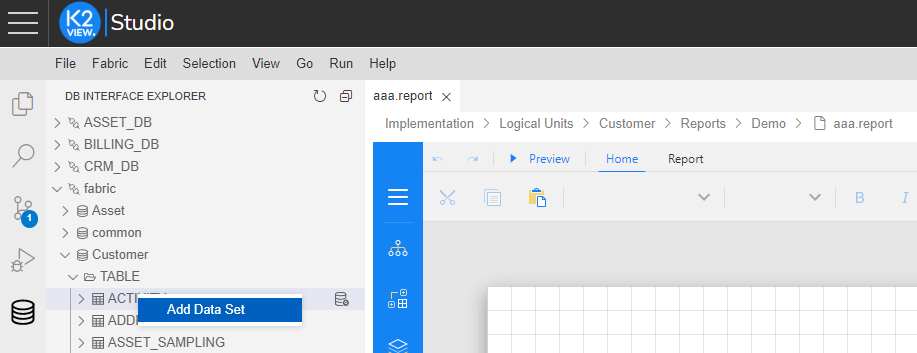
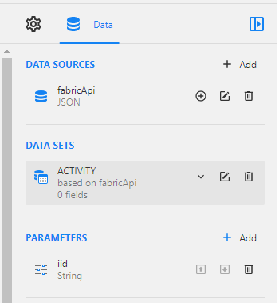

<web>

# Quick Data Binding With Fabric

The article [Data Binding](03_data_binding.md) describes all the steps needed to configure a data source and a data set in a report. Additionally, there is a quick way to set up data binding with Fabric built-in endpoints. The following steps describe how to do it:

1. Right-click on **Reports > New Report** and populate the report name to create a new report.

2. Click on  icon in the Studio Toolbox in order to switch to the DB Interface tree.

3. Drill down the Project tree until reaching the required interface and table on which you would like to create a report, right-click and select **Add Data Set**. 

   

4. As a result, the data source, data set and a parameter are automatically created:

   

5. Note that you should still validate the data set. Open the newly created data set and click on **Validate**. [Click here for more information regarding Data Set validation.](03_data_binding.md#data-set-validation)

 

</web>
