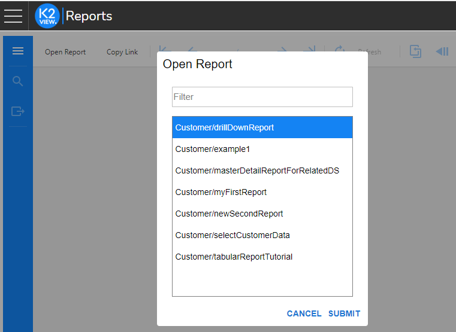
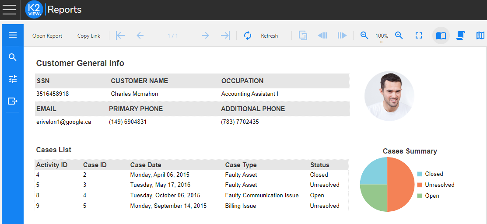
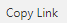
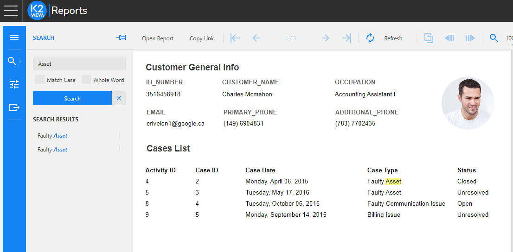
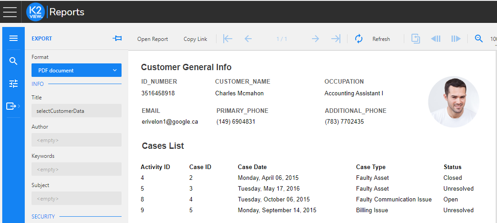

<web>

# Report Viewer

### Overview

The Viewer component can be reached by opening **Reports** from the list of pre-integrated applications of the [K2View Web Framework](/articles/30_web_framework/01_web_framework_overview.md) and it enables the following options:

* Open Report
* Search
* Export

### Open Report

The **Open Report** popup allows to select a report from a list of deployed reports. 

Selecting the report name and submitting it, generates the report preview. If the report has a parameter, you will be prompted to provide the value:

You can also share the link to the report by clicking the  button, either in the Report's Designer or Viewer. 

### Search

Click  to open the Search toolbox, which allows searching a string within the open report:

### Export

Click  to open the Export toolbox, which allows exporting the generated report. The supported export formats are: PDF, HTML and CSV. Various settings can be set for the export file, based on the format. For example, the password protection can be set for PDF files. 

 

</web>

