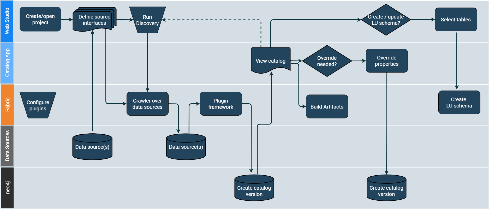

<web>

# E2E Data Discovery Process

The K2View Data Discovery process is depicted in the below diagram and it includes the following major steps:

* Start by defining an interface for a given data source and initiating the Data Discovery job (Crawler) in the Web Studio.
* The Crawler scans the data source, while identifying the existing entities and the relationships between them. The Crawler's output is the Discovery Schema.
* Next, a Plugin Framework is triggered automatically upon the Crawler completion. The Plugin Framework is a platform for executing predefined rules (plugins) and for enhancing the Discovery Schema accordingly. Examples of business rules are: 
  * Create a link (relation) between two objects.
  * Profile the field's data and categorize it (e.g. email, phone, gender).
  * Determine if a field is PII.

* Upon the completion of the Plugin Framework execution, the Discovery Schema is saved into the *neo4j* Graph DB, creating a new Catalog version. 

  * The Discovery Schema supports versioning. Each time the process is executed, a new Catalog version is created, only in case there are changes comparing to the previous version.
* Once the process is completed, the Logical Unit schema can be created based on the Data Discovery process results.

 

</web>
