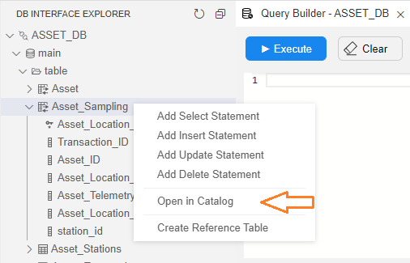

# Catalog Integration with Fabric

### Discovery Initiation

To initiate the K2View Discovery process:

* Start from defining an interface for your data source in the Fabric Studio. 

* Then, trigger the Discovery job (Crawler) on this interface by running the following command from the Fabric terminal:

  ~~~bash
  startjob DISCOVERY_CRAWLER name='<interface name>';
  ~~~

* Alternatively, open the [DB Interface explorer](/articles/04_fabric_studio/25_web_data_explorer.md) in the Web Studio, right click on the interface and click **Run Discovery Job** to trigger the job.

  

### Open In Catalog

To view a data source element in the Catalog application, do the following:

* Open the [DB Interface explorer](/articles/04_fabric_studio/25_web_data_explorer.md) in the Web Studio and select the required element. It can be an interface, schema, table or field.

* Right click the element and click **Open in Catalog**.

  

* The Catalog application opens and the selected element is displayed in the Catalog tree.

[Click for more information about the Catalog Application.](05_catalog_app.md)

### Fabric Settings for Discovery

* ENABLE_DATA_DISCOVERY is a configuration parameter in config.ini that defines whether the Discovery should be enabled in the system (if neo4j is part of the Fabric space). The default setting is true. Note that If the Fabric space doesn’t include neo4j, ENABLE_DATA_DISCOVERY should be set to false (by the system administrator).
* 'Show Catalog Commands' is a Web Studio setting to either show or hide the Catalog related commands (Run discovery job, Open in catalog) in the UI. It can be updated using the [Web Studio's user preferences](/articles/04_fabric_studio/04_user_preferences.md). 

 

