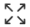
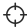
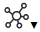

<web>

# Data Catalog Application

The Data Catalog is accessed from the [K2View Web Framework](/articles/30_web_framework/01_web_framework_overview.md) by selecting the **Data Catalog** application from the Web Framework context menu. Upon opening, the application displays the data from *neo4j* Graph DB and allows navigation from one level to another through a data model’s graph, expanding and collapsing various Catalog elements, viewing properties, searching the node, and more.

The Catalog window includes the following parts, described in this article:

* *Main area*, which displays the Catalog tree with its elements.
* Application *menu bar*, which allows to perform various activities. 
* *Properties tab*, which displays more information about a selected Catalog element.

### Main Area

The Data Catalog's main area enables navigation between the Catalog levels, by expanding and collapsing various elements.

The initial view displays the Data Platform elements - data source interfaces defined in the Fabric project, for which the Discovery process has been executed via the Web Studio.

In case the Discovery process hasn't been executed on any project interface, the catalog would be empty. 

The following activities can be performed using the entity's context menu:

* **Expand**or **collapse** the next level elements. 
  * For example, clicking the  icon of the Schema element expands all Classes under this Schema. 
  * A double-click on the selected entity can also expand or collapse it.
* **Hide** the element from the Catalog window.
* **Focus** is available on the Data Platform and the Schema elements. 
  * Clicking Focus opens a new view, which includes all the elements of the level below. 
  * For example, when Focus is clicked on the Schema element, the view will display all Class elements under this Schema.

### Menu Bar

The menu bar is a toolbar located at the top of the window. It has the following options:

* **Expand**, **collapse** and **hide**, triggering the same activities as in the element's context menu. Multiple element selection is supported.  
* **Layout selection** , enabling the Catalog layout. Horizontal (default), vertical or centered layout are supported.
* **Hidden nodes**, a drop-down list displaying the nodes that have been hidden from the Catalog window. Selecting a node from this list returns it back to the Catalog view.
* **Zoom in / out**, adjusting the zoom of the Catalog view.
* **Search**, providing a node search capability.

### Properties Tab

The Properties Tab displays more information about the selected Catalog element. The tab shows the element name, type (e.g. FIELD), origin (e.g. Crawler) and a list of properties specific per element type. 

Some of the properties are created by the Crawler and some are created by plugins. Clicking on a property opens a Property Details popup providing more details on the selected property.

 

</web>
