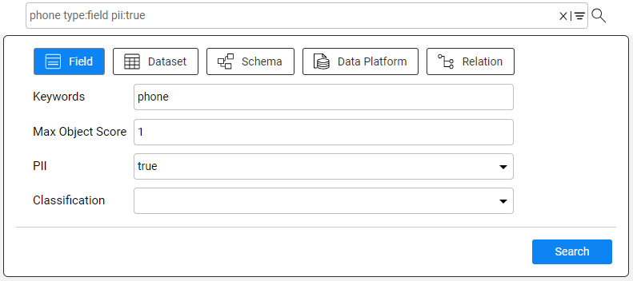

# Catalog Search

### Overview

The Catalog application provides a search of the catalog objects (data platforms, schemas, datasets, fields and relations) within the currently displayed version. 

To start the search, click the icon in the menu bar. It opens the text area where you can type a name of the object that you want to search. To search by additional parameters, open the advanced search by clicking the icon. To exit the search, click the icon.

### Advanced Search

The advanced search allows to narrow the search results by specifying one of the following parameters:

* Search within the selected object type(s) only, for example - Fields and Relations only. 

* Search by PII and Classification properties. So, when marking PII = true in the advanced search, the results list will include all nodes marked as PII.

* Search by an object's score. For example, when the user enters 0.5,  the results list will return all catalog objects with score lower than 0.5.

### Search Results

The returned result set is limited to 1,000 rows. The search results are presented in a list which can be exported into a CSV file. 

To view the selected entity in the Catalog tree, click the link in the Name column.

 

