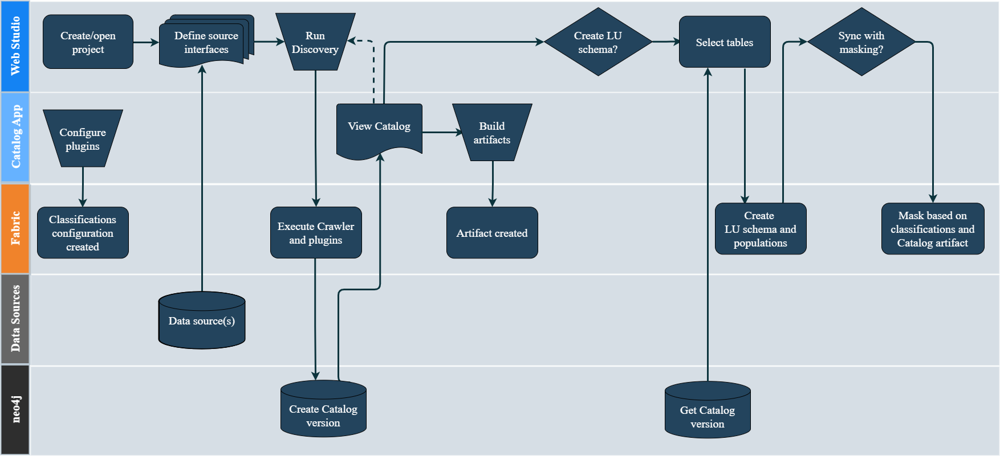

<web>

# Discovery Process

The K2view Discovery process is depicted in the below diagram and it includes the following major steps:

* Define a Fabric interface for a given data source and initiate the Discovery job (job type = ```DISCOVERY_CRAWLER```).
* The first step of the Discovery job is a Crawler. It scans the data source while identifying the existing entities and the relationships between them. The Crawler's output is the Catalog schema.
* Next, a Plugin Framework is triggered automatically upon completion of the Crawler's process. The Plugin Framework is a platform for executing predefined rules (plugins) to run on the Catalog schema and to enhance it accordingly. Examples of plugins are: 
  * Creating a relation between 2 objects, based on matching the field names.
  * Classification of the fields based on their data or metadata such as Email, Phone, etc.
  * Determining whether a field holds sensitive data and thus should be marked as PII.


* Upon completion of the Plugin Framework execution, the Catalog schema is saved into the *neo4j* Graph DB and it can be viewed via the Catalog application.

The Catalog supports the following actions:


* Versioning - a new version is created when the Discovery job is executed and it identified changes when comparing to the previous Catalog version. By default, the Catalog application displays the latest version.
* Manual overrides - editing of the Catalog is available in the Catalog application, and it includes updating of the Catalog nodes' properties and editing of the relations between the nodes.
* The Catalog artifacts (including the identified classifications and PII indications) can be built and saved into the project tree, in order to be used by the masking mechanism. 
* Once the process has been completed, the Logical Unit schema can be created based on the Catalog's version.




[](02_catalog_vocabulary.md)[](04_plugin_framework.md) 

</web>
