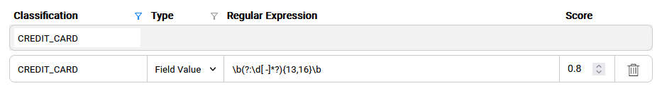
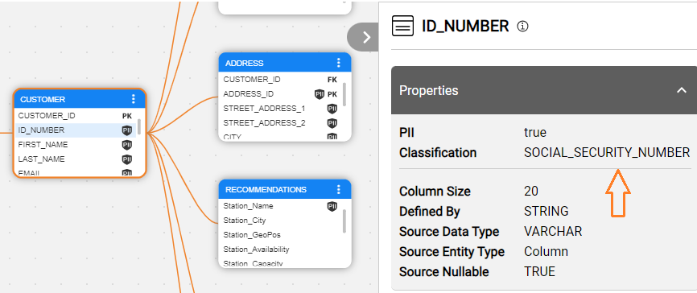

<web>

# Built-In Plugins

### Overview

The following article describes the basic built-in plugins introduced by the Fabric's Discovery and Catalog solution:

* [Metadata Logical Reference](04a_builtin_plugins.md#metadata-logical-reference) - to create *refers to* relations between two datasets based on the field name comparison.
* [Data Regex Classifier](04a_builtin_plugins.md#data-regex-classifier) - to classify the source fields based on their data - field value. 
* [Metadata Regex Classifier](04a_builtin_plugins.md#metadata-regex-classifier) - to classify the source fields based on their metadata - field name.
* [Classification PII Marker](04a_builtin_plugins.md#classification-pii-marker) - to set the fields as based on their classification.
* [NULL Percentage](04a_builtin_plugins.md#null-percentage) - to calculate the percentage of NULL values per column, based on the data snapshot.

Additional built-in plugins are described [here](plugins/README.md).

### Metadata Logical Reference

The purpose of a **Metadata Logical Reference** plugin is to identify possible foreign key references between datasets and to create *refers to* relations. This plugin is useful in a case where a source doesn't have predefined foreign key constraints.

The matching algorithm works by comparing the field names of 2 different datasets at a time. Prior to the matching, the field names are normalized using the following formatting rules: underscore ‘_’ removal, conversion to lowercase letters and addition of a table name in case the field name is an ID.

For example, the following field names will be matched: customer.ID, CUSTOMER_ID and CustomerID.

This plugin includes a exclusion list of field names (e.g., 'username' or 'age') and an exclusion list of field types (e.g., date, time, blob) to be excluded from the matching algorithm. These exclusion lists are defined in the plugins.discovery configuration file as plugin input parameters, and they can be updated on a project level.

If a match is found, the plugin evaluates both the relation direction and the foreign key fields by using the matching rule. The *refers to* relation direction is Many-to-One. The relation is created with a score - a probability of the match's correctness. 

#### Matching Rules

The following matching rules are defined in the plugins.discovery file and are applied by the plugin:

* **field_name_is_id_and_pk** - dataset1 has a PK field **id** and dataset2 has a field **dataset1id** (normalized).
  
  * The relation *dataset2 refers to dataset1* is created and its score is 0.8.
  * Example: *customer.ID (PK) and* *activity.customer_id*
* **field_name_is_id_and_not_pk** - dataset1 has a non-PK field **id** and dataset2 has a field **dataset1id** (normalized).
  * The relation *dataset2 refers to dataset1* is created and its score is 0.6.
  * Example: *customer.ID (non-PK) and* *activity.customer_id*
* **single_field_pk_and_not_pk** - dataset1 has a PK field and dataset2 has a field with the same name (normalized), non-PK.
  
  * The relation *dataset2 refers to dataset1* is created and its score is 0.8.
  * Example: *customer.customer_id (PK) and* *activity.customer_id* 
* **common_fields_in_both_pk** - common fields that are part of the PK in both datasets, but where dataset1 has less PKs than dataset2.
  * The relation *dataset2 refers to dataset1* is created and its score is 0.8.
  * Some examples of the matching rules are:

    <table style="width: 900px;">
    <tbody>
    <tr>
    <td style="width: 125px;" colspan="2"><strong>Input: 2 Datasets</strong></td>
    <td style="width: 650px;" colspan="2">
    <p><strong>Output: Relation created by plugin</strong></p>
    </td>
    </tr>
    <tr>
    <td style="width: 125px;">
    <p><strong>DS1</strong></p>
    </td>
    <td style="width: 125px;">
    <p><strong>DS2</strong></p>
    </td>
    <td style="width: 600px;">
    <p><strong>Relation direction and FK</strong></p>
    </td>
    <td style="width: 50px;">
    <p><strong>Score</strong></p>
    </td>
    </tr>
    <tr>
    <td style="width: 141.016px;">
    <p>field_1 PK</p>
    </td>
    <td style="width: 141.016px;">
    <p>field_1 PK</p>
    <p>field_2&nbsp; PK</p>
    </td>
    <td style="width: 190.531px;">
    <p><em>DS2 refers to DS1</em></p>
    <p>FK: DS2 (field_1)</p>
    </td>
    <td style="width: 49.4375px;">
    <p>High</p>
    </td>
    </tr>
    <tr>
    <td style="width: 141.016px;">
    <p>field_1 PK</p>
    <p>field_2&nbsp; (not PK)</p>
    </td>
    <td style="width: 141.016px;">
    <p>field_1 PK</p>
    <p>field_2&nbsp; PK</p>
    </td>
    <td style="width: 190.531px;">
    <p><em>DS2 refers to DS1</em></p>
    <p>FK: DS2 (field_1, field_2)</p>
    </td>
    <td style="width: 49.4375px;">
    <p>High</p>
    </td>
    </tr>
    </tbody>
    </table>

* **same_field_names_pk** - common fields that are part of the PK in both datasets, and where both datasets have an identical PKs number.
  * The relation is created and its direction is random. The score is 0.4.
* **same_field_names_not_pk** - both datasets have fields with the same names (normalized, not in *field_name_blk*), both are non-PK.
  * The relation is created and its direction is random. The score is 0.2.

#### Field Exclusion List

Fields can be excluded from the **Metadata Logical Reference** plugin's matching algorithm by either their name or type. The exclusion list can be defined using the **field_name_exclude_list** and **field_type_exclude_list** arrays in the plugin's input parameters definition of the plugins.discovery configuration file. This can be useful when, for example, the same field name exists in many datasets of the same schema and this field should not be part of the *refers to* relation, e.g., lastModifiedDate.

### Data Regex Classifier

The purpose of **Data Regex Classifier** plugin is to classify the source fields based on their data - field value. This classification helps to identify which Catalog entities store sensitive information and should therefore be masked. 

This plugin runs on a data snapshot that is extracted from the source, and it executes the regular expressions defined in a built-in **data_profiling** MTable.

If a regular expression (known as regex) matches the field's data, a Classification property is added to the field with a value corresponding to the matching regex (e.g., EMAIL). If a match is found for more than one expression, the property is created with the Classification that got a higher calculated score. 

To update the data profiling rules, go to the [Catalog Settings > Classifier Regex Setup tab](10_catalog_settings.md#classifier-regex-setup).

**Example:**

The below regular expression ```\b(?:\d[ -]*?){13,16}\b``` is executed on the field's values:



When the expression matches a field's value, the probability that this field holds a credit card number is 0.8. Thus, in case of a match, the score is 0.8 and when there is no match, the score is 0. The expression is executed on all values on the given column in the data sample and the average score is calculated. Then, the calculated average score is compared with the plugin's threshold as explained earlier in this article. If the calculated average score is above the threshold, the Classification = CREDIT_CARD property is added to the field.

### Metadata Regex Classifier

The purpose of **Metadata Regex Classifier** plugin is to classify the source fields based on their metadata - field name. 

The matching rules are defined using regular expressions in a built-in **metadata_profiling** MTable. 

If a regular expression (known as regex) matches the field's name, a Classification property is added to the field with a value corresponding to the matching regex (e.g., SOCIAL_SECURITY_NUMBER). If a match is found for more than one expression, the property is created with the Classification that has the highest score.



To update the metadata profiling rules, go to the [Catalog Settings > Classifier Regex Setup tab](10_catalog_settings.md#classifier-regex-setup).

#### Field Exclusion List

Fields can be excluded from the **Metadata Regex Classifier** plugin's logic by either their name or type. This can be useful when, for example, you need to exclude all fields with a certain name or a name pattern from the classification process. 

The exclusion list can be defined using the **field_name_exclude_list** and **field_type_exclude_list** arrays in the plugin's input parameters definition of the plugins.discovery configuration file. The **field_name_exclude_list** definition can be either the exact field name or a regular expression.

**Example:**

~~~json
"input_parameters": {
	"field_name_exclude_list": [
					"(?i).*NAME.*",
        			"STREET_ADDRESS_2"
	],
	"field_type_exclude_list": [
					"boolean"
	]
}
~~~


### Classification PII Marker

The purpose of **Classification PII Marker** plugin is to go over all the fields that have got the **Classification** property (by either one of the above plugins) and to add the **PII** property. 

The rules as to whether the classification type is considered a PII are defined in a built-in **pii_profiling** MTable. 

To update the Classification's PII indicator, go to the [Catalog Settings > Classifier PII & Masking Setup](10_catalog_settings.md#classifier-pii--masking-setup). 

#### Field Exclusion List

Fields can be excluded from the **Classification PII Marker** plugin's logic by either their name or type. This can be useful when, for example, you need to exclude all fields with a certain name or a name pattern from the PII marking process. 

The exclusion list can be defined using the **field_name_exclude_list** and **field_type_exclude_list** arrays in the plugin's input parameters definition of the plugins.discovery configuration file. The **field_name_exclude_list** definition can be either the exact field name or a regular expression.

**Example:**

~~~
"input_parameters": {
	"field_name_exclude_list": [
					"^(?i)[a-z]+_?ID$"
	],
	"field_type_exclude_list": [
					"DATETIME"
	]
}
~~~


### NULL Percentage

The purpose of this plugin is to calculate the percentage of NULL values per column, based on the data snapshot. This percentage is calculated on each column of non-empty tables. The default size of the data snapshot is configured in the plugins.discovery file as explained earlier in this article.

As a result, the **Null Percentage** property is added to the field's properties when the calculated value is above the threshold. 

For example, when 30% of the values in a certain field are null, the Null Percentage property will be added to this field with the value = 0.3. However, if 20% or less of the values in this field are null, then this property would not be added.


[](04_plugin_framework.md)[](04a_catalog_integration_with_fabric.md) 

</web>
