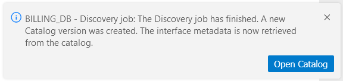

# Catalog Integration with Studio

### Run Discovery

<web>

To initiate the Discovery process:

* Start by defining an interface for your data source in the Fabric Studio. 

* Next, trigger the Discovery job on this interface. This is done by opening the [DB Interface Explorer](/articles/04_fabric_studio/25_web_data_explorer.md) in the Web Studio, right-clicking on the interface and selecting **Run Discovery Job**.

* Alternatively, run the following command from the Fabric terminal:

  ~~~
  startjob DISCOVERY_CRAWLER name='<interface name>' uid='<interface name>';
  ~~~

</web>

<studio>

To initiate the Discovery process:

* Start by defining an interface for your data source in the Fabric Studio. 

* Run the following command from the Fabric terminal:

  ~~~
  startjob DISCOVERY_CRAWLER name='<interface name>' uid='<interface name>';
  ~~~

</studio>

When the Discovery job is invoked, it automatically triggers the DATA_DISCOVERY_JOB listener job. The DATA_DISCOVERY_JOB is subscribed to the Pubsub topic dedicated to the Discovery process. Its purpose is to create a new Catalog version in the *neo4j* GraphDB.

<studio>

You can view the discovery results in the Catalog by opening it via the Fabric's Web Framework.

</studio>

<web>

### Open In Catalog

Once the Discovery job execution on a data source has been completed, the message is shown in the Fabric Studio:

You can view the discovery results in the Catalog by clicking the button in the message.

Upon the Discovery job completion, the [DB Interface Explorer](/articles/04_fabric_studio/25_web_data_explorer.md) tab in the Web Studio retrieves the Discovery schema from the *neo4j* rather than from the data source. Note that the tab should be refreshed.

To view a data source element in the Catalog application, do the following:

* Open the DB Interface Explorer tab in the Web Studio and select the required element. It can be either an interface, a schema, a table or a field.

* Right-click the element and click **Open in Catalog**. 

  

* The Catalog application opens and the selected element is displayed in the Catalog's Navigator tree.

[Click here for more information about the Catalog Application.](05_catalog_app.md)

Note that **Run Discovery Job** and **Open in Catalog** commands may be hidden in the Web Studio. 

[Click here for more information about how to hide these menu items](21_advanced_settings.md#web-studio).

</web>

 

