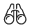
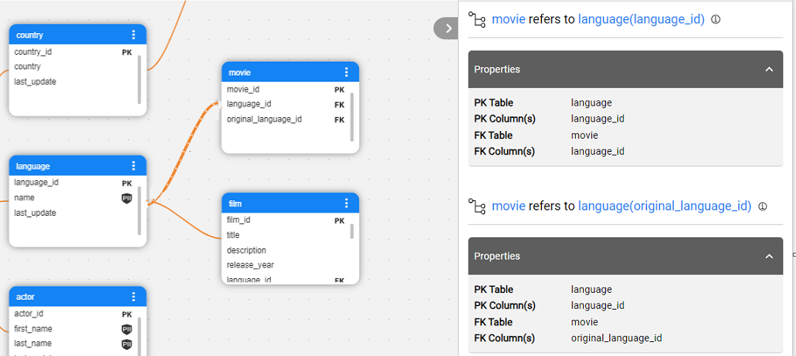

<web>

# Catalog Application

### Overview

The Catalog application is accessible from the [K2view Web Framework](/articles/30_web_framework/01_web_framework_overview.md) by selecting the **Catalog** from the menu. Upon opening, the application displays the data retrieved from *neo4j* Graph DB and it allows navigating from one level to another through a data model’s graph, expanding and/or collapsing various nodes, searching for nodes, viewing their properties, and more.

This article includes the following sub-sections:

* Catalog application [Main area](05_catalog_app.md#main-area), which displays the Catalog tree.
* Catalog application [Menu bar](05_catalog_app.md#menu-bar), which allows to perform various activities. 
* Catalog application [Properties tab](05_catalog_app.md#properties-tab), which displays the properties of the selected node or relation.
* Catalog's [deep linking](05_catalog_app.md#deep-linking) mechanism.

### Main Area

**General Navigation**

The Catalog's main area enables navigation between different hierarchy levels, by expanding and collapsing various nodes.

The initial view displays the Data Platform nodes (the data source interfaces defined in the Fabric project), for which the Discovery process is performed. In case the Discovery process hasn't been executed on any project interface, the main area would be empty. 

The Legend presents 3 types of nodes with their respective icons and allows to hide or unhide all the elements of the same type. 


**Catalog's Version**

When the Catalog application opens, it displays the latest version by default. The version number is displayed in the upper-left corner of the main area. By clicking it, you can either: 

* **View** another version by clicking its number in the drop-down list.
* **Compare** between 2 versions by clicking the compare  icon.  

[Click here for more information about the Catalog Versioning](06_catalog_versioning.md).

**Data Platform and Schema's Context Menu**

A single click on any Data Platform or Schema node opens the context menu: 


The context menu allows performing the following actions:

* **Expand** or **Collapse**  the next level elements. 
  * For example, clicking the  icon of the Data Platform expands all of its Schemas. 
  * A double-click on a selected node can either expand or collapse it.

* **Run Discovery**  on the selected Data Platform; available in V7.2.1.

* **Hide**  an element from the window. A hidden element can be unhidden either from the Actions menu (as explained further in this article) or by reloading the Catalog.

* **Focus**  on the next level elements. The difference between the Expand and Focus actions is that Focus dives into the next hierarchy level, eliminating other nodes from the screen.
* For example, whenis clicked on a Schema node, the Catalog will only display the Dataset nodes of the selected Schema. 
  
* In the Focus view, breadcrumbs are displayed in the upper-left corner of the main area, indicating your path within the Catalog tree. The breadcrumbs are clickable, and they allow to navigate up the tree.


**Dataset Context Menu**

Clicking on any Dataset node opens its context menu, which includes the following actions:

* **Expand**  Dataset fields:

  * Click the  icon of the selected Dataset node to expand its fields. The Dataset node then changes its shape from a circle to a rectangle and displays field properties such as PK, FK and PII, where applicable.

    ​	

  * To simultaneously expand all Datasets on the screen, click the  icon on the Catalog's Legend:

    ​	

  * To collapse an expanded Dataset, click the three dots in the corner of the node. To do so for all Dataset nodes together, click the  icon in the Catalog's Legend.

* **Hide**  an element from the window.

### Menu Bar

The menu bar is a toolbar located at the top of the window. It includes the following choices:

* An **Actions** menu that allows to:
  * **Edit** the catalog manually. [Click here for more information about the Manual Overrides](07_manual_overrides.md).
  * View the list of **hidden nodes**. Clicking a node in this list unhides it and the node returns to the Catalog tree.
  * Build the Catalog **artifacts**. [Click here for more information about the Catalog artifacts](09_build_artifacts.md).
* **Search**  the catalog. [Click here for more information about the Catalog Search](08_search_catalog.md). 
* **Expand**, **collapse** and **hide**, acts that trigger the same activities as using the node's context menu. Multiple element selection is supported.  
* **Show only connected** , for focusing on a selected node with its predecessors and successors only. When clicked, all other nodes are hidden and the icon changes its color to  to indicate that. Clicking the icon again unhides the nodes to the original view. Available in V7.2.1.
* **Run Discovery** , for running the Discovery Job on the selected Data Platform from the Catalog Application. Available in V7.2.1.
* **Schema Insights** , for analyzing the Catalog's statistics either in a view version mode or in a version comparison mode. The insights are currently available on Schema level only. Available in V7.2.1.
* **Data Viewer** , for connecting to the selected Fabric interface and querying the data directly from the data source. Available in V7.2.1.
* **Layout selection** , for selecting a Catalog layout. Centered (default), vertical or horizontal layouts are supported.
* **Navigation map** , for opening the Catalog's mini-map and navigation panel. 
* **Zoom in / out**, for adjusting the zoom of the view.

### Properties Tab

The Properties Tab displays the selected element's name, the icon of the type and the element's properties.

​	

Each element has different properties. For example, a Dataset field has properties such as **column size** and **source data type** - identified by the Crawler, and **PII** and **Classification** - and created by the plugins.

Clicking the property name or the  icon next to the element's name opens the More Info pop-up window that provides more details about the property. For example, the property's Origin, which can be the Crawler, one of the plugins or manual.

When the selected element is a relation (a link) between two objects in the Catalog tree, the relation's properties are displayed. 

Note that in case of more than one *refers_to* relations between two Datasets, the Catalog tree displays only one link. However, the Properties Tab displays details of all relations. In the example below, there are two *refers_to* relations between the **movie** and **language** Datasets:



### Deep Linking

When navigating the Catalog tree and clicking a node, the node's path is added to the application URL using the following format:

~~~
/app/catalog/<version>/<data platform>/<schema>/<dataset>/<field>
~~~

Having a full node path allows sharing it as a direct link to a specific in-app location, saving the time and energy of trying to locate a particular node.

The ```<version>``` should be either the word **latest** or **V** with the version number, for example:

~~~
/app/catalog/latest/CRM_DB/public/customer/customer_id
~~~

~~~
/app/catalog/V2/CRM_DB/public/customer/customer_id
~~~

The Catalog can also be accessed from the [DB Interface Explorer](/articles/04_fabric_studio/25_web_data_explorer.md) tab in the Web Studio, as explained [here](04a_catalog_integration_with_fabric.md#open-in-catalog).


[](04a_catalog_integration_with_fabric.md)[](06_catalog_versioning.md) 

</web>
