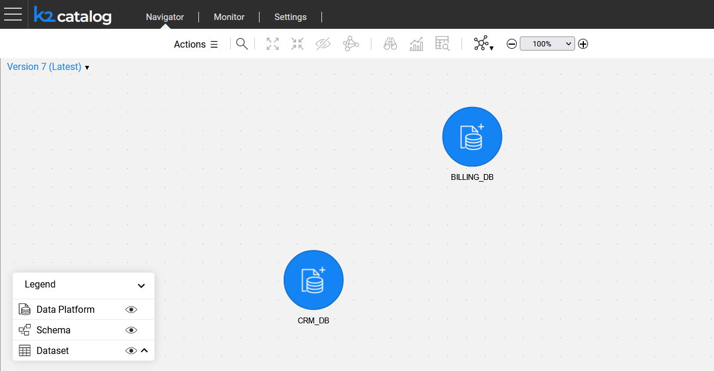
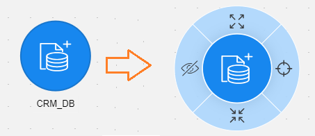
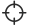
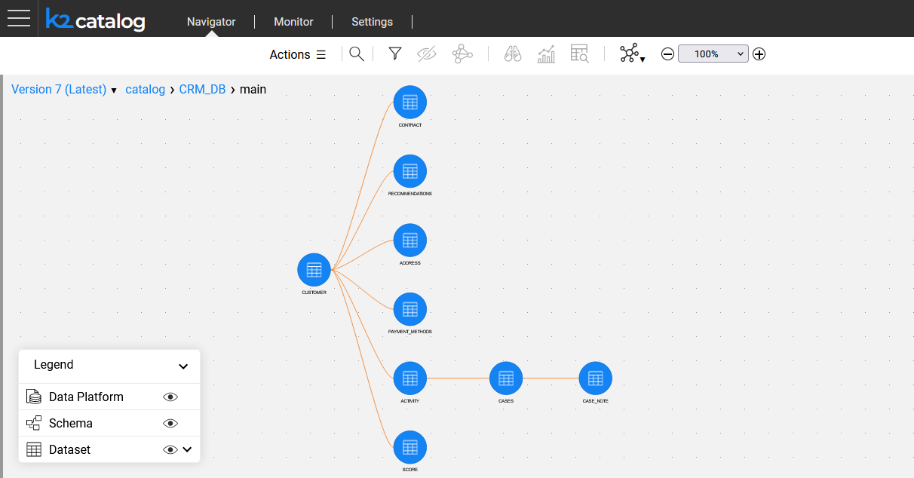
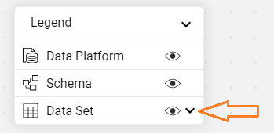
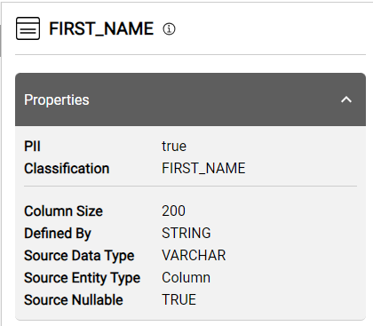
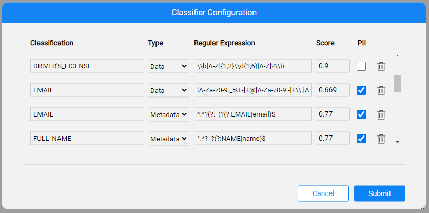

# Catalog Application

### Overview

The Catalog is accessed from the [K2View Web Framework](/articles/30_web_framework/01_web_framework_overview.md) by selecting the **Catalog** application from the context menu. Upon opening, the application displays the data from *neo4j* Graph DB and allows navigation from one level to another through a data model’s graph, expanding and collapsing various elements (nodes), viewing node's properties, searching the node, and more.

The Catalog application includes the following parts, described in this article:

* [Main area](05_catalog_app.md#main-area), which displays the Catalog tree.
* [Menu bar](05_catalog_app.md#menu-bar), which allows to perform various activities. 
* [Properties tab](05_catalog_app.md#properties-tab), which displays the properties of the selected node or relation.

In addition, the article includes the description of the Catalog's [deep linking](05_catalog_app.md#deep-linking) mechanism and the [Classifier Configuration screen](05_catalog_app.md#classifier-configuration).

### Main Area

**General Navigation**

The Catalog's main area enables navigation between the hierarchy levels, by expanding and collapsing various elements.

The initial view displays the Data Platform nodes (the data source interfaces defined in the Fabric project), for which the Discovery process has been performed. In case the Discovery process hasn't been executed on any project interface, the main area would be empty. 

The Legend presents three types of nodes with their respective icon. 

**Catalog's Version**

When the catalog application opens, the latest **catalog version** is displayed by default. The version number is displayed in the upper left corner of the main area. By clicking it, you can either: 

* Select another version from the list in order to view it.
* Click the compare  icon to perform the versions comparison analysis.  

[Click for more information regarding the Catalog Versioning](06_catalog_versioning.md).

**Data Platform and Schema's Context Menu**

Clicking on any Data Platform or Schema node opens the context menu which allows performing the following actions:

* **Expand** or **Collapse**  the next level elements. 
  
  * For example, clicking the  icon of the Data Platform expands all of its Schemas. 
  * A double-click on the selected node can also expand or collapse it.
  
* **Hide**  the element from the window. The hidden element can be unhidden either from the Actions menu (as explained further in this article) or by reloading the catalog.

* **Focus**  on the next level elements. The difference between the Expand and Focus actions is that Focus dives into the next hierarchy level, eliminating other nodes from the screen.
  
  * For example, whenis clicked on a Schema node, the Catalog will only display the Dataset nodes of the selected Schema. 
  
  * In the Focus view, the breadcrumbs are displayed in the left upper corner of the main area to indicate your path within the Catalog tree. The breadcrumbs are clickable, thus you can navigate up the tree.  
  
    ​	

**Dataset Context Menu**

Clicking on any Dataset node opens its context menu which includes only the following actions:

* **Expand** the Dataset fields:

  * Click the  icon of the selected Dataset node to expand its fields, so the Dataset changes from a circle to a rectangle node. Fields properties such as PK, FK and PII are also displayed where applicable. 

    ​	

  * To expand all Datasets on the screen at once, click the  icon on the Catalog's legend:

    ​	

  * To collapse the expanded Dataset, click the three dots in the corner or do it from the legend for all Dataset nodes.

* **Hide**  the element from the window.

### Menu Bar

The menu bar is a toolbar located at the top of the window. It includes the following choices:

* The **Actions** menu allows to:
  * **Edit** the catalog manually. [Click for more information regarding the Manual Overrides](07_manual_overrides.md).
  * Open the **Classifier Configuration** screen, to update the profiling rules. This screen is described [further in this article](05_catalog_app.md#classifier-configuration). 
  * View and unhide the **hidden nodes**. Selecting a node from this list returns it back to the Catalog tree.
* **Search** the catalog. [Click for more information regarding the Catalog Search](08_search_catalog.md). 
* **Expand**, **collapse** and **hide**, triggering the same activities as using the node's context menu. Multiple element selection is supported.  
* **Layout selection** , enabling the Catalog layout. Horizontal (default), vertical or centered layout are supported.
* **Zoom in / out**, adjusting the zoom of the view.

### Properties Tab

The Properties Tab displays the selected element's name, the icon of the type and the element's  properties.

​	

Clicking the property name or the  icon next to the element name opens the More Info popup window, providing more details about the property. For example, the property's Origin, which can be the Crawler, one of the plugins or manual.

### Deep Linking

The Catalog application supports deep linking from the data platform to the field level. When navigating the Catalog tree and clicking the nodes, the path to the node is added to the application URL using the following format:

~~~
/app/catalog/<version>/<data platform>/<schema>/<dataset>/<field>
~~~

The version should be either the word **latest** or **V** with the version number (e.g. V13).

This link can be shared as it sends another user straight to specific in-app location, saving the time and energy locating a particular node.

### Classifier Configuration

The Classifier Configuration popup screen allows to view and update the profiling rules which are used by the Catalog Classification built-in plugins (click [here](04_plugin_framework.md#built-in-plugins) to get more details about these plugins).

The rules are saved in the Discovery/MTable folder in the project tree.

​	

 

