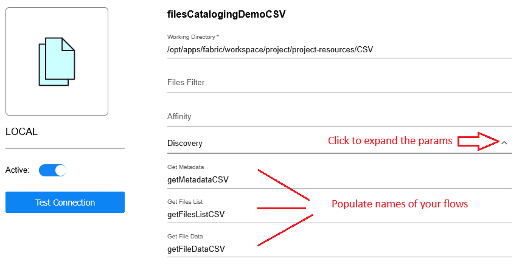

# Cataloging of Files

## Overview

Fabric Catalog is a tool designed to organize all data assets within a company's data landscape. It facilitates metadata discovery, classification, PII indication and calculation of various data quality metrics of all entities of a data source.

Sometimes the company's data assets are stored in files rather than in a data base and this data should be protected due to privacy laws. 

For example, files containing sensitive data arrive periodically to a predefined filesystem interface. Before they are utilized for the business purposes, it is essential to identify and mask any sensitive data these files might contain.

Starting V8.3 Fabric enables building a Catalog based on files. Discovery can be performed using:

* Metadata definition, such as JSON schema or AVRO schema files.
* Sample files containing data.

The Crawler framework, used for file cataloging, employs a generic mechanism that is independent of specific file types. The Crawler expects to get an input in a predefined format. Since the files might have various structures (based on each project's business needs), the Cataloging of files solution requires  creating Broadway flows and attaching them to the interface. Then are run-time these flows are invoked by the Crawler upon running the Discovery job on the given interface.

These flows define mapping and transformation rules from file to Catalog metadata, converting the specific file format (their schema definition and/or the sample files) to the Catalog’s standard structure: data platform, schema(s), dataset(s), fields and their properties. 

Once the Catalog structure is built, the plugins pipeline is executed, in the same way as running discovery over any other data source.

Further  in this article, you can learn in more details about the implementation steps: 

* [Creating transformation rules](05_cataloging_of_files.md#creating -transformation-rules)
* [Attaching rules to interface](05_cataloging_of_files.md#attaching-rules-to-interface)
* [Organizing files in filesystem](05_cataloging_of_files.md#organizing-files-in-filesystem)

To illustrate the E2E process of file cataloging, the *Cataloging of Files - Demo* extension is available on [K2exchange](/articles/04_fabric_studio/28_web_k2exchange.md). The extension can be installed in your project and it offers several comprehensive examples of file discovery (for various file types). The explanation about how to use the extension can be found in the extension's README file.

## Creating Transformation Rules

Due to multiple file formats, transformation rules are required in order to perform file's cataloging. The transformation rules are created using Broadway flows, that should be placed in a Project tree under the Shared Objects and deployed. 

Below is the description of each expected flow (transformation rule):

1. **Get Metadata** is the first transformation rule that builds the Catalog's expected metadata, returning an array of maps. This flow is mandatory.

   * The metadata can be based on the schema definition file(s), if they are provided. In this case, each map is expected to represent a Catalog's field with its respective structure: data platform, schema, dataset, class, field name and all of its properties (defined in the schema definition file).
   * When there is no schema definition file and the metadata is expected to be discovered based on data sample, each map should represent a Catalog's dataset with its respective structure: data platform, schema, dataset, class. Then the fields and their properties will be completed from the example data.
   * The combined approach is also possible. Meaning, some datasets can be defined by schema definition files and some can be defined by sample data.

2. **Get Files List** is the second transformation rule that returns a mapping between the dataset and the respective list of sample files. This flow is optional and only required when sample files are provided.

   * The flow should return a list of relevant data sample files per each dataset. Several sample files can be provided for the same dataset. However, one sample file cannot include data for more than one dataset. 

3. **Get Data Snapshot** is the third transformation rule that returns each file's data. This flow is optional and only required when sample files are provided (when **Get Files List** is defined, it should be defined too).

   * Per each file, the flow should return a result set which represents one dataset row. 

When creating your own flows, it is recommended to start from the sample flows provided in the *Cataloging of Files - Demo* extension and customize them per your needs. Keep in my to keep the flow's external input and output parameters as in the example flows!

## Attaching Rules To Interface

The filesystem interfaces include a group of input parameters called Discovery, which enable setting the names of Broadway flows to each of the rules.

1. Click the arrow icon near Discovery to view the parameters .
2. Populate the names of the Broadway flows.
3. Save and deploy the Web Services.

## Organizing Files In Filesystem

There is no limitation to how to organize the files in the filesystem interface. The only rule is that files setup should correspond to the flow's logic.

The *Cataloging of Files - Demo* extension demonstrates various ways to organize the files. 

In the example of CSV files cataloging, all CSV files are located in one folder assuming each file represents a dataset, while the schema name is set to **main** in the respective **Get Metadata** flow.

In the examples of JSON and XML files, the folders hierarchy is created: **main** folder represents the schema, then **contact** and **customer** folders represent datasets, while each one include its relevant sample data files. 

Note that the **masked** or **masked_main** folders are included only for illustration of the masking results folders. 

To sum up, the data sample files folders as well as the masking results folders can be setup per your project's business needed. 