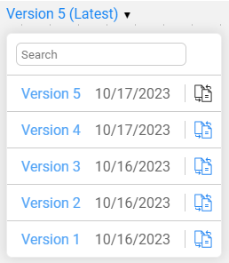

<web>

# Catalog Versioning

The Catalog supports **versioning** - ability to create a new Catalog version in the  *neo4j* Graph DB every time the Discovery process runs and finds differences when comparing to the previous version.

Then, using the Catalog application, a user can view each version separately or check the differences between 2 selected versions, as described below.

Note that if the Discovery process doesn't identify any changes in the data source or in the plugins settings, a new version is not created.

Additional trigger for a version creation is a manual editing of the Catalog . [Click here for more information about the manual overrides](07_manual_overrides.md).

### Version View

By default, the Catalog displays the latest version. To view any version, select a version number from the list: 

The coloring scheme of the standard view is blue. 

### Version Comparison

To compare 2 versions, click the comparison  icon in the version's drop-down list. 

The differences between the 2 versions are indicated using the colors, as follows:
* The new elements are green, the removed elements are red, and the updated elements are blue.
* When a property is updated, it is displayed twice – the new value is highlighted in green, the removed one is red.
* All unchanged entities and relations are grey.

To return to the regular view mode, select a version from the list.

 

</web>
