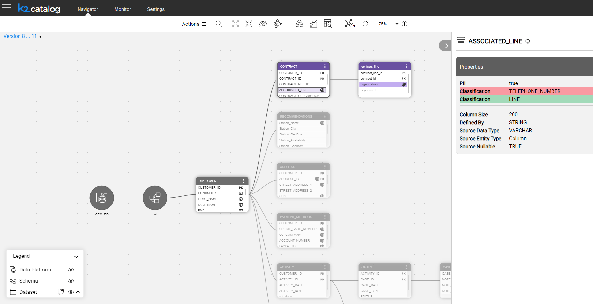
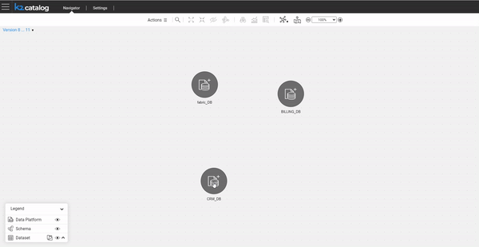

<web>

# Catalog Versioning

The Catalog supports **versioning**, which is the ability to create a new Catalog version in the  *neo4j* Graph DB every time the Discovery process runs and finds differences when comparing with the previous version.

A user can view each version separately or check the differences between 2 selected versions using the Catalog application, as described below.

Note that if the Discovery process doesn't identify any changes in the data source or in the plugins' rules, it doesn't create a new Catalog version.

Additional trigger for a version creation is a manual edit of the Catalog. 

[Click here for more information about manual overrides](07_manual_overrides.md).

### Version View

By default, the Catalog displays the latest available version. To view any version, open the version's drop-down list and click a version number: 

The Catalog tree is then displayed using the standard coloring scheme, where all the nodes are blue and the relations are orange. 

### Version Comparison

To compare 2 versions, click the comparison  icon in the version's drop-down list. The Catalog tree is then displayed using the comparison coloring scheme, indicating the differences between the 2 versions, as follows:

* The new elements are green, the removed elements are red, and the updated elements are blue.
* When a property is updated, it is displayed twice – the new value is highlighted in green whereas the removed value is in red.
* All unchanged entities and relations are grey.

​	

When a Schema contains too many Datasets, it might be difficult to identify the updated nodes. To view updated Datasets only, you should first expand the Datasets and then click the comparison icon in the Catalog's legend:

To return to a regular view mode, open the version's drop-down list again and click a version number.

 

</web>
