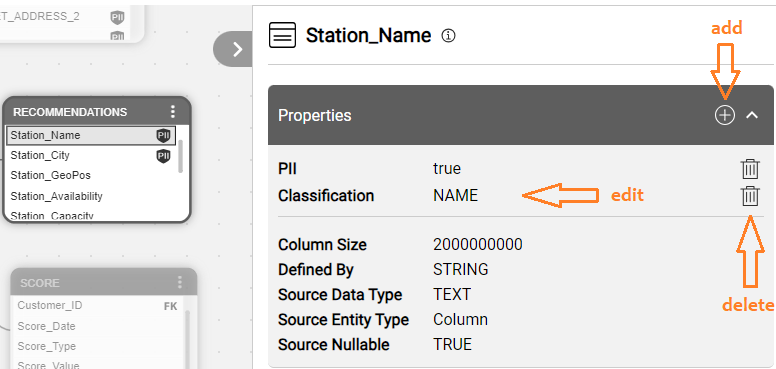
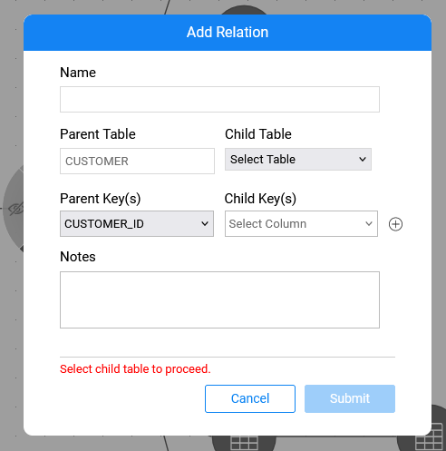

<web>

# Manual Overrides

### Overview

The Catalog supports the ability to perform manual overrides. 

To start the manual overrides, click **Actions > Edit Catalog** in the menu bar. To end it, either save the changes or discard them. Upon saving, a new Catalog version is created in *neo4j*. Once the changes are committed to *neo4j*, they are marked as manual, which enables keeping them as a part of the Catalog after running the Discovery job (Crawler) again.

The graph's coloring scheme changes in the edit mode to the same theme as in the [version comparison](06_catalog_versioning.md) mode. This means that all entities and relations become grey and then every change is indicated by either green, red or blue color.

Only the latest Catalog version can be edited. This article includes the description of available manual overrides.

### Edit Properties

As part of the Discovery process, properties are created for each node. Some properties are created by the Crawler (e.g., PK or source data type) and some are created by the plugins (e.g., PII or Classification). The Catalog allows to update only the properties that are predefined as editable in the ```properties-info.JSON``` configuration file. This definition can be updated on the project level. [Click here for more information about the configuration file](11_advanced_settings.md#catalog-application-configuration).



* To **edit** an existing property:

  * Click the property in the Properties Tab to open the More Info pop-up window and update the **Value** and **Notes** fields. 

  * When clicking Submit in the More Info pop-up window – the change is being aggregated on the client side and is not yet sent to the server. The tab indicates the change: the row with the new value is marked in green and the row with the old value is marked in red.

  * When clicking Cancel – the change performed in the More Info pop-up window is discarded.
* To **delete** a property, click the  icon. Only editable or manually added properties can be deleted.
* To **add** a new property, click the  icon and populate the **Name**, **Value** and **Notes** fields via the More Info pop-up window. **ID** will be generated according to the property's path, **Origin** will be set to Manual, and the **Score** to 1.
  * When adding a new property, you can either select the property name from the pre-defined list or create a completely new property.


### Edit Relations

The relations can be modified as follows:

* To **add** a new relation, click on the source (Dataset1) and click **Add Relation** in its context menu. Then, click the target (Dataset2). The Add Relation popup will open with the following:
  * The name of the new link: *Dataset2 refers to Dataset1*. 
  * PK Table Name is Dataset1 and PK Columns are the primary key columns of the Dataset1.
  * FK Table Name is Dataset2.
  * Populate the FK Columns and notes, and save the link.
* An alternative way to **add** a new relation is to click **Add Relation To**.
  * The Add Relation popup will open where you need first to select the Dataset2 and then populate the FK Columns.

* To **delete** a link, click theicon in the relation's Properties tab.

Only *refers_to* relations can be edited. 



### Saving Manual Overrides

While the Catalog is in the edit mode, all updates are aggregated on the client side only. Once the manual changes have been made, the **Save** button should be clicked in the menu bar. It will trigger saving of all the changes together and would create a new version. The Catalog will then exit the edit mode.

Alternatively, it is possible to exit the edit mode without saving any changes, by clicking the **Discard** button.

The Save and Discard buttons are only visible when the Catalog application is in an edit mode.


[](06_catalog_versioning.md)[](08_search_catalog.md) 

</web>
