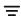

<web>

# Catalog Search

### Overview

The Catalog application provides a search of the Catalog objects (data platforms, schemas, datasets, fields and relations) within the currently displayed version. 

To start the search, click the  icon in the menu bar. It opens a text area where you can type one or more keywords - the names of the objects that you want to search. To search by additional parameters, open the advanced search by clicking the  icon. To exit the search, click the  icon.

### Advanced Search

The advanced search allows to narrow the search results by specifying one (or more) of the following parameters:

* Search the selected object type(s) only, for example - fields and datasets. 

* Search by PII and Classification properties. For example, when marking PII = true in the advanced search, the results list will include all nodes marked as PII.

* Search by score. For example, when the user enters 0.8,  the results list will return all catalog objects with score 0.8 and below.

Note that once the advanced search opens, the selected search criteria is written in the search area using pre-defined syntax. For example, when searching by the keyword = phone, PII is true and object type is field, the search syntax is:

~~~
phone pii:true type:field
~~~

Thus, you can define your search criteria using this syntax. [Click for more details about the syntax](10_catalog_APIs.md#search-catalog).

### Search Results

The search results are presented in a list which can be exported into a CSV file. The result set returned to the client is limited to 750 nodes and 750 relations. In one search you can get to a total of 1500 results.

To navigate from the Search Results to a node in the Catalog tree, click the  icon in the Name column. When navigating to a relation, the Catalog will focus on the FK column of the *refers_to* relation.

 

</web>
