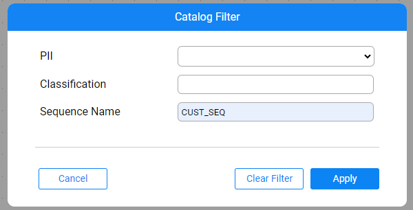

# Filter Catalog

### Overview

The Catalog application allows filtering the Catalog graph based on the Datasets, Class and Field properties. Meaning, the property should be on either a dataset, class or field, in order that dataset/class will be displayed.

Set the filter by clicking theicon in the menu bar. 

The PII and Classification properties are defined as filterable, by default. Their value can be set is to either 'property exists' value or any other existing value, selected from a drop-down list.

The value of Classification can be set to a custom value, which doesn't exist in a drop-down list.

Click **Apply** to apply the filter on the Catalog. The pop-up closes and the icon changes its color to . If the Data Platform has been expanded before setting the filter, irrelevant Datasets are filtered out. Otherwise, irrelevant Datasets are filtered upon the expand of each Data Platform. 

Click **Clear Filter** to clear the filter and return to the full Catalog view.

### How Do I Filter by Additional Properties

To filter by any other property (e.g. by sequenceName), add the property definition to the `properties-info.json` as follows:

~~~json
            {
                "name": "sequenceName",
                "editable": true,
                "deletable": true,
                "filterable": true,
                "allow_custom_values": true
            }
~~~

* `"filterable": true` adds the property to the Catalog Filter popup and allows filtering by it.
* `"allow_custom_values": true` allows typing custom values in the value drop-down list.

 

