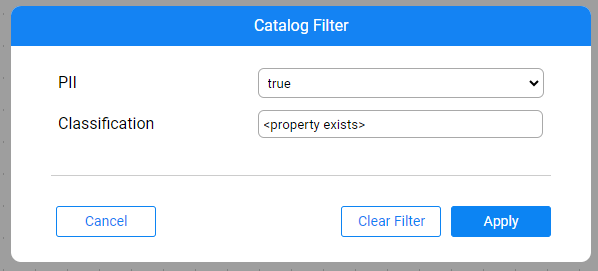

# Catalog Filter

### Overview

The Catalog application allows filtering the Catalog graph based on the Datasets, Class or Field properties. Hence, the property should be set either on a dataset, class or field, in order for the dataset/class to be displayed.

Set the filter by clicking theicon in the menu bar. 

The PII and Classification properties are defined as filterable, by default. Their values can be set to either 'property exists' or any other existing value, selected from a drop-down list.

The Classification value can be set to a custom value, which doesn't exist in a drop-down list.

Click **Apply** to apply the filter on the Catalog. The pop-up window then closes, and the icon changes its color to . If the Data Platform has been expanded prior to setting the filter, irrelevant Datasets are filtered out. Otherwise, the irrelevant Datasets are filtered out upon expansion of each Data Platform.

Click **Clear Filter** to clear the filter and return to the full Catalog view.

### How to Filter by Additional Properties

To filter by any other property (e.g., by sequenceName), add the property definition to the **properties-info.json** as follows:

~~~json
            {
                "name": "sequenceName",
                "editable": true,
                "deletable": true,
                "filterable": true,
                "allow_custom_values": true
            }
~~~

* `"filterable": true` adds the property to the Catalog Filter pop-up window and allows filtering by it.
* `"allow_custom_values": true` allows typing custom values rather than selecting an existing value from the drop-down list.

Follow the instructions [here](21_advanced_settings.md#catalog-application-configuration) in order to override the **properties-info.json** on the project level.

 

