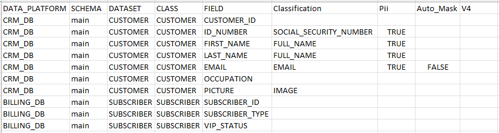

<web>

# Catalog Artifacts and Masking

### Overview

The Catalog provides an ability to build artifacts and save them into the Project tree. An artifact is a file, created in a CSV format, that includes the list of fields of all Catalog's datasets, with their Classification, PII and Auto-Mask properties, for a given Catalog version.

While Classification and PII properties are added to the Catalog nodes by the Classifier plugins, the Auto-Mask property should be added manually, when needed. Learn about the purpose of the Auto-Mask property further in this article.

### Build Artifacts

Building the catalog's artifact is triggered by clicking **Actions > Build Artifacts** in the menu bar.  

The artifact called **catalog_info** is created for the Catalog version displayed in the application and it is saved into the ```Implementation/SharedObjects/Interfaces/Discovery/MTable``` folder of the Project tree and uploaded to the Fabric memory.

Below is an illustration of the catalog_info.csv file:



The last column's name is the Catalog version for which the artifact was created (e.g. V4). This column is always empty. 

Note that the artifact can be created for any Catalog version. Each new artifact overrides the previous one in the Project tree.

### Catalog Masking

The Catalog Masking Actor uses the catalog_info MTable in order to identify at run-time which fields are supposed to be masked. 

The Catalog Masking algorithm is as follows:

* Go over the fields of an input row received from the DbQuery or DbCommand Actor (which precedes the Catalog Masking Actor in the population flow).
* Search each field in the **catalog_info** MTable (using the of combination of data_platform, schema, dataset, class and field columns). If a field name is found, check:
  * If PII is true and Auto-mask is true or empty, the field's value should be masked. 
* To find which Masking Actor should be used, get the Classification value from the catalog_info and retrieve the Masking Actor name & parameters from the masking_setup MTable. 

### Auto-Mask Property

The purpose of the Auto-mask property is to mark which Catalog fields, that were identified as PII, should not be masked using the Masking Actor defined for their Classification. 

For such fields the user should manually add Auto-mask = false property in the Catalog application and then attach the relevant masking logic in the population flow.


[](08_search_catalog.md)[](10_catalog_APIs.md) 

</web>


