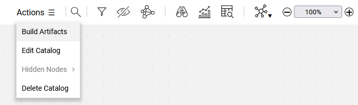

# Catalog Artifacts

### Overview

The Catalog provides an ability to build artifacts and save them into the Project tree. An artifact includes details of all the Catalog fields with their properties, such as Classification and PII, for a currently displayed Catalog version. 

Pre-requisite for building the Catalog artifact is running the Discovery Job for at least one Project interface.

### Build Artifacts

Building a Catalog artifact is done by clicking **Actions > Build Artifacts** in the Catalog application's [Menu bar](05_catalog_app.md#menu-bar). 



A Catalog artifact is a file called **catalog_field_info.csv**. It is created in a CSV format, saved into the ```Implementation/SharedObjects/Interfaces/Discovery/MTable``` folder in the Project tree and uploaded to the Fabric memory as an [MTable](/articles/09_translations/06_mtables_overview.md).

The below image is a Catalog artifact example:


The artifact is created for the Catalog version, which is displayed in the application. The last column's heading holds the version number, **V4** in the above example. This column remains always empty.

Catalog's artifacts can be created for any Catalog version. Each new artifact overrides the existing artifact in the Project tree.

### Artifact of Relations

Starting from V8.3, the artifacts of the relations can be created, when needed. This is only available by the ```/api/catalog/{version}/build-catalog-artifacts``` API, by setting ```refersTo=true``` in the API's input, as described [here](20_catalog_APIs.md#build-catalog-artifacts). 

The below image is an example of the Catalog's relations artifact:


Note that when clicking on **Actions > Build Artifacts** in the Catalog application's [Menu bar](05_catalog_app.md#menu-bar), the relations artifacts are not created.

### Splitting and Combining Artifacts

Catalog artifacts can be split into separate files per each data platform and schema of a given Catalog version. The files' content is then combined into one single MTable in Fabric's memory although the files are saved separately in the Project tree

The splitting is enabled when the SPLIT_CATALOG_ARTIFACTS parameter in the config.ini file is set to ON (default parameter's setting starting from V8.3).

This ability allows to combine separate artifacts, created in different projects (or different spaces), into a single artifact. Hence, the artifact files can be copied from one project to another, and upon deployment, they will be combined into one MTable.

Note that if the ```catalog_field_info.csv``` or ```catalog_relations_info.csv``` file exist in the Project tree, they should be manually deleted.

The separate files' name follows the below format:

*  ```catalog_field_info___<dataPlatform>_<schema>.csv```, (containing 3 underscores before the data platform name)
*  ```catalog_relations_info___<dataPlatform>_<schema>.csv```, (containing 3 underscores before the data platform name)


[](08a_filter_catalog.md)[](10_catalog_settings.md) 


