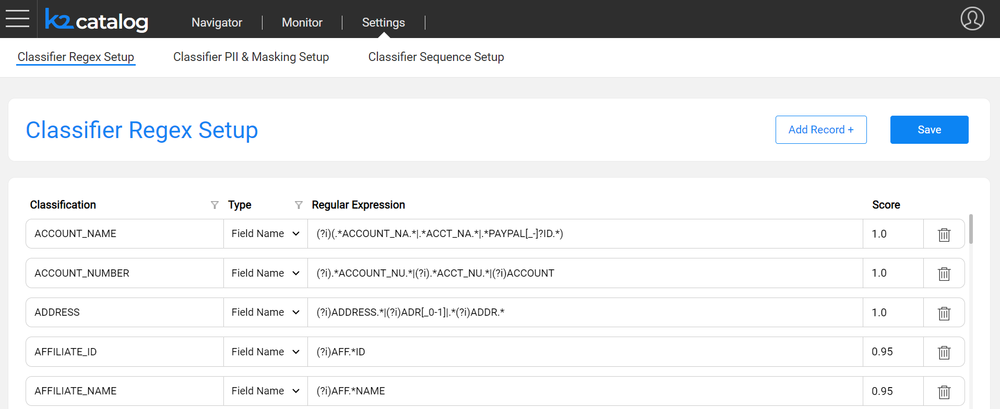
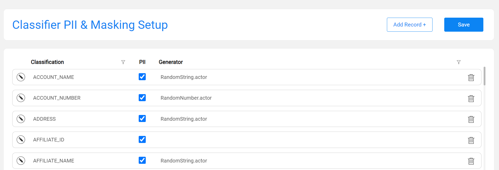
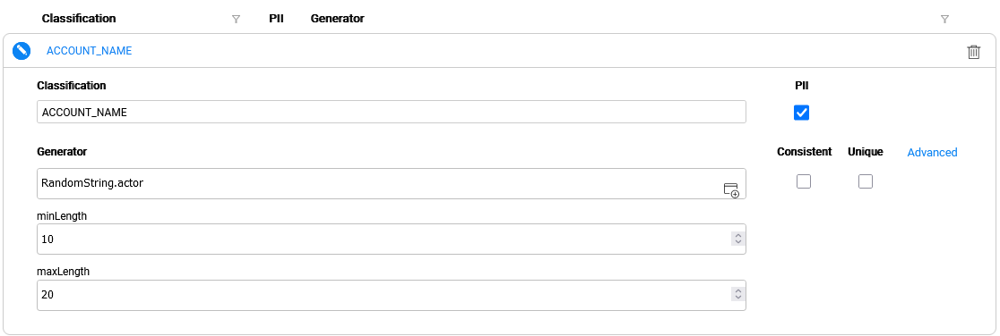
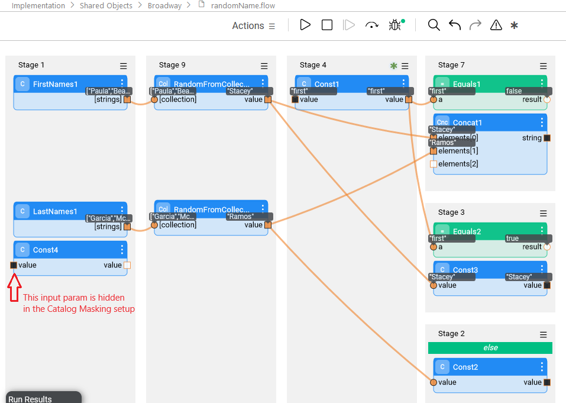

# Catalog Settings

The purpose of the Settings screen in the Catalog application is to view and edit the rules used by the Catalog. The Catalog includes the built-in rules for profiling and masking. These rules can be updated to fit the Project's needs. 

This article includes the following sections:

* [Classifier Regex Setup](10_catalog_settings.md#classifier-regex-setup)
* [Classifier PII & Masking Setup](10_catalog_settings.md#classifier-pii--masking-setup)

## Classifier Regex Setup

The **Regex Setup** tab allows to view and update the Profiling regular expression rules that are used by the Profiling built-in plugins: *Data Regex Classifier* and *Metadata Regex Classifier*. 



The columns of this tab are:

* **Classification** defines the value of a Classification property added to the Catalog's fields as a result of the Profiling plugins. 

* **Type** can be either **Field Name** or **Field Value**:
  * The entries defined with the **Field Name** type are used by the *Metadata Regex Classifier* plugin.
  * The entries defined with the **Field Value** type are used by the *Data Regex Classifier* plugin.
* **Regular Expression** defines the expression applied on the field, either its name or its value, depending on the **Type**.
* **Score** defines the confidence level that the current rule is true. 

Each **Classification** can have several definitions, with the same or different **Types**.

Using this screen, you can either edit existing definitions or add new ones. The Classification value can be either new or selected from the list.

Once the Save button is clicked, the **metadata_profiling** and **data_profiling** MTables are updated in the Fabric's memory and in the ```Implementation/SharedObjects/Interfaces/Discovery/MTable ```folder of the Project Tree.

Click [here](04_plugin_framework.md#built-in-plugins) for more details about these plugins.

## Classifier PII & Masking Setup

The **PII & Masking Setup** tab allows to view and update the PII and Catalog-based masking settings of each classification. The PII indicator is used by the *Classification PII Marker* built-in plugin. The Masking setup is used by the Catalog Masking actors as described further. 



This tab includes 2 definitions per each Classification:

* **PII** - indicates whether the Classification is considered as PII. 
* **Generator** - shows which actor or flow is applied by the [Catalog masking mechanism](11_catalog_masking.md).

Each **Classification** can have **only one** definition (row) in this tab.

### Generator Setup

To set up the Generator and its parameters - click the  icon to expand the Classification area. Here you could select an actor or a flow for generating a random value. The Generator can be either one of the existing built-in actors, a custom actor or a flow. Note that a flow should be created under the **Shared Objects** Broadway folder in the Fabric Studio.

Upon the invocation of a Catalog Masking actor - e.g., during a table population - the generated value is populated to a field with a given Classification. For example, for masking fields that are classified as Social Security Number, you can either use the built-in RandomSSN.actor or create your own actor or a flow and attach it as the Classification's generator using the above screen.



Upon selecting an actor or a flow, its respective input parameters are automatically added to the setup screen. Note that the first input parameter (defined as Link or External) is considered to include the value that should be masked, and not one of the masking configuration parameters. Thus, this input parameter is hidden in this configuration screen. When creating a custom actor or a flow to generate a value, the actor/flow must have an input called 'value', even if this flow doesn't need to receive any input, to prevent hiding the first input (defined as Link or External).



Once the Save button is clicked on the **PII & Masking Setup** tab, the **pii_profiling** and **catalog_classification_generators** MTables are updated in the Fabric's memory and in the ```Implementation/SharedObjects/Interfaces/Discovery/MTable ```folder of the Project Tree.

Click for more details about the [Catalog masking mechanism](11_catalog_masking.md).

### Advanced Masking Settings

The purpose of the Advanced Settings popup is to define additional parameters for masking functionality. The following is included:

* **Masking indicators** are the inputs that determine masking behavior during the flow run. They can be either set on the Catalog Masking actor's inputs or in the Catalog's settings here. When set here, the definition is per classification and it overrides the Catalog Masking actor's settings.
* **Formatter name and parameters** are set in order to enable the format preserving masking.


[](08_search_catalog.md)[](11_catalog_masking.md) 

