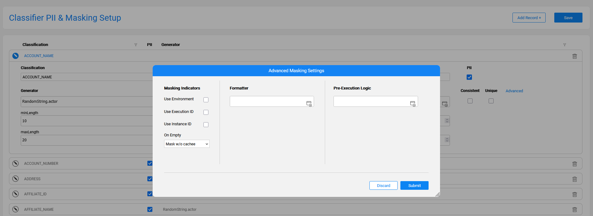
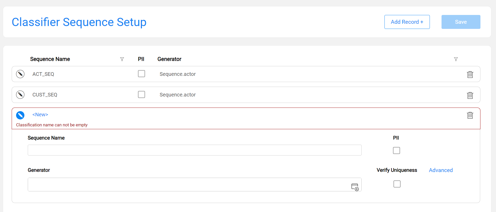

# Catalog Settings

The purpose of the Settings tab in the Catalog application is to enable viewing and editing various Catalog configurations. The Catalog includes pre-defined settings which can be updated to accommodate the Project's needs.

This article includes the following sections:

* [Classifier Regex Setup](10_catalog_settings.md#classifier-regex-setup)
* [Classifier PII & Masking Setup](10_catalog_settings.md#classifier-pii--masking-setup)
  * Masking Setup
  * Advanced Masking Settings
* [Classifier Sequence Setup](10_catalog_settings.md#classifier-sequence-setup), available from V8.1.
  * Advanced Sequence Settings

## Classifier Regex Setup

The **Classifier Regex Setup** tab allows to view and update the Profiling regular expression rules that are used by the Profiling built-in plugins, *Data Regex Classifier* and *Metadata Regex Classifier*.


The columns of this tab are:

* **Classification**, which defines the value of a Classification property added to the Catalog's fields as a result of the Profiling plugins. 

* **Type**, which can be either **Field Name** or **Field Value**:
  * Entries defined as the **Field Name** type are used by the *Metadata Regex Classifier* plugin.
  * Entries defined as the **Field Value** type are used by the *Data Regex Classifier* plugin.
* **Regular Expression**, which defines the expression applied on the field, either its name or its value, depending on the **Type**.
* **Score**, which defines the confidence level that the current rule is true. 

Each **Classification** can have several definitions, with either the same or different **Types**.

Using this tab, you can either edit existing definitions or add new ones. The Classification value can be either new or selected from the list.

Once the Save button is clicked, the **metadata_profiling** and **data_profiling** MTables are updated in Fabric's memory and in the ```Implementation/SharedObjects/Interfaces/Discovery/MTable ```folder of the Project tree.

Click [here](04_plugin_framework.md#built-in-plugins) for more details about these Profiling plugins.

## Classifier PII & Masking Setup

The **Classifier PII & Masking Setup** tab allows to view and update the PII and Catalog-based masking settings of each classification. The PII indicator is used by the *Classification PII Marker* built-in plugin. The Masking setup is used by the Catalog Masking actors as described later in this article.


Each **Classification** in this tab is unique, and it includes 2 attributes:

* **PII** - indicates whether the Classification is considered Personally Identifiable Information. 
* **Generator** - shows which actor or flow is applied by the [Catalog masking mechanism](11_catalog_masking.md) for generating masking values. The generator runs in the case of either:
  - Data masking
  - [Rule-based](/articles/TDM/tdm_implementation/16_tdm_data_generation_implementation.md) synthetic data generation

In this tab, each classification can have only one definition (row). Note that you cannot create a sequence (via the Sequence Setup tab) with the same name as a classification that appears in this tab since both classifications & sequences are saved in the same MTable.

### Masking Setup

Click the  icon to expand the Generator and its parameters setup area (PII, Consistent and Unique indicators as well as other [Advanced](10_catalog_settings.md#advanced-masking-settings) parameters), that will be used for generating a random value. The Generator can be any existing built-in actor, a custom actor or a flow, which should be created under the **Shared Objects** in the Fabric Studio.

Upon invocation of a Catalog Masking actor - e.g., during a table population - the generated value is populated in a field with a given Classification. For instance, when a field is classified as a Social Security Number, you should set up the Generator for masking it. The Generator can be either the built-in RandomSSN.actor, or a custom actor or flow.


When selecting an actor or a flow, its respective input parameters are dynamically added below it. 

**Guidelines for Creating a Masking Flow**

The first input parameter of a masking flow (or a custom actor) - selected as a Generator - is considered as the value that should be masked, and not as a masking configuration parameter. Hence, it is hidden (and not dynamically added) when a masking flow is selected in the Masking setup screen above. This is applicable only for an input parameter of Link or External type. 

Therefore, when creating such a flow, its first input should be named 'value', even if this flow doesn't need to receive any input. This prevents the hiding of the first input from the Masking setup screen as explained above. 

Below is a sample of such flow:


Once the Save button is clicked in the **Classifier PII & Masking Setup** tab, the **pii_profiling** and **catalog_classification_generators** MTables are updated in Fabric's memory and in the ```Implementation/SharedObjects/Interfaces/Discovery/MTable ```folder of the Project tree.

Click for more details about the [Catalog masking mechanism](11_catalog_masking.md).

### Advanced Masking Settings

The purpose of the Advanced Masking Settings pop-up window is to allow setting up of additional masking parameters. This window includes the following:

* **Masking indicators** determine the masking behavior during a flow run. They can be set either per population via the Catalog Masking Actor's inputs or per Classification via the Settings screen of the Catalog application. The Catalog definition of masking indicators overrides the setting of these indicators on the Catalog Masking Actor - for all the fields with the same Classification.
* **Formatter Name and Parameters** are set in order to enable the [format-preserving masking](/articles/26_fabric_security/06_data_masking.md#format-preserving-masking).
* **Pre-Execution Logic** is an actor or a flow to be executed by the Catalog Masking Actor. 



The Advanced Masking Settings are defined per each Classification by using the above pop-up window.

The **Submit** button in this window aggregates the data in the application’s client side until saving is done using the **Save** button in the **Classifier PII & Masking Setup** tab. 

Upon clicking the **Save** button in the **Classifier PII & Masking Setup** tab, the **pii_profiling** and  **catalog_classification_generators** MTables are updated in Fabric's memory and in the ```Implementation/SharedObjects/Interfaces/Discovery/MTable ```folder of the Project tree.

## Classifier Sequence Setup

Starting from V8.1, the Classifier Sequence Setup tab was added to the Catalog Settings. 

The **Classifier Sequence Setup** tab allows to set up the sequences that can be used in a project as part of the masking flow (note that usage of the sequences will be introduced in the next Fabric version). 

This tab doesn't have a product built-in setup as the sequence names and definitions are always project specific. 

Click the **Add Record +** button to create a sequence, and populate a **Sequence Name**, **Generator** and its parameters (PII, Verify Uniqueness indicators and the [Advanced](10_catalog_settings.md#advanced-sequence-settings) parameters, if needed), that will be used for generating a sequence value. The Generator can be any existing built-in actor, a custom actor or a flow, which should be created under the **Shared Objects** in the Fabric Studio.



Each sequence can have only one definition (row). Note that you cannot create a classification (via the PII & Masking Setup tab) with the same name as a sequence in this tab.

### Advanced Sequence Settings

The purpose of the Advanced Sequence Settings pop-up window is to allow the setting up of additional sequence parameters; it is very similar to the Advanced Masking Settings pop-up window. 

Upon clicking the **Save** button in the **Classifier Sequence Setup** tab, the **pii_profiling** and **catalog_classification_generators** MTables are updated in Fabric's memory and in the ```Implementation/SharedObjects/Interfaces/Discovery/MTable ```folder of the Project tree.

The sequences are saved in the same MTable as the masking classifications - **catalog_classification_generators**, with the following difference:

* The masking classifications have a category = **enable_masking**.
* The non-PII sequences have a category = **enable_sequence**.
* The PII-sequences have category = **enable_masking_uniqueness**.


[](08_search_catalog.md)[](11_catalog_masking.md) 

