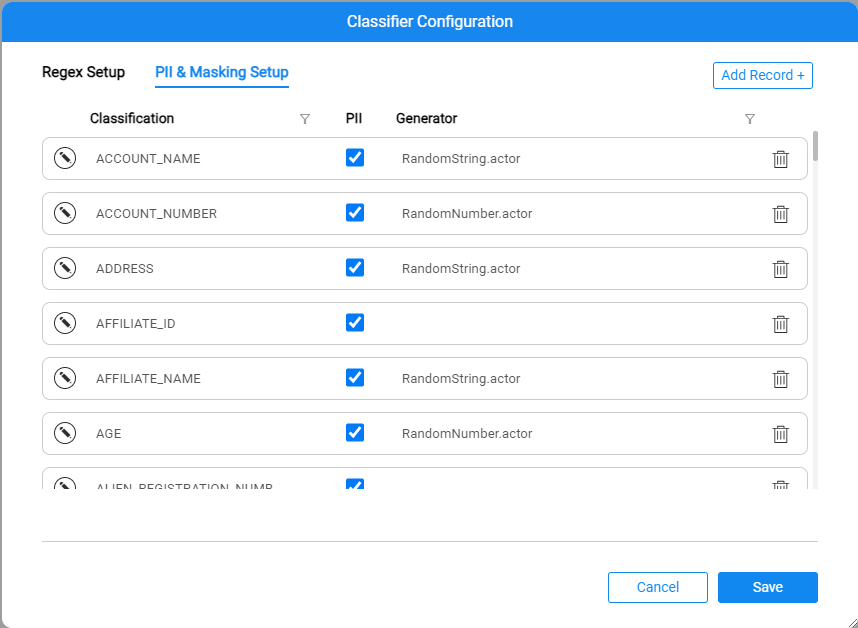
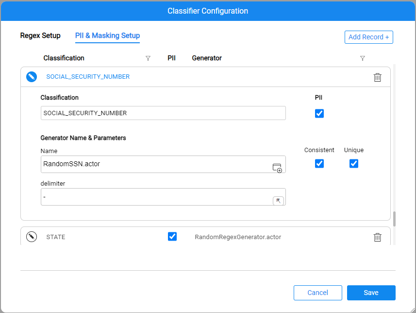

# Classifier Configuration

The Classifier Configuration screen includes the following tabs that provide various configuration capabilities for the Catalog.

### Regex Setup

The **Regex Setup** tab allows to view and update the profiling regular expression rules that are used by the Profiling built-in plugins (click [here](04_plugin_framework.md#built-in-plugins) to get more details about these plugins). 


* **Type** can be either Field Name or Field Value:

  * The entries defined with the **Field Name** type are used by the *Metadata Regex Classifier* plugin.
  * The entries defined with the **Field Value** type are used by the *Data Regex Classifier* plugin.

* **Regular Expression** displays the expression applied on the field, either its name or its value, depending on the **Type**.

* **Score** defines the confidence level that the current rule is true. 

* Each **Classification** can have several definitions in this tab, with the same or different types.

* When a match is found, a new property Classification is created in the Catalog for a field that match the above rules. The property's value is **Classification** that matched the regular expression. 

* If a match is found for more than one expression, the property is created with the Classification that has the highest score.

  

### PII & Masking Setup

The **PII & Masking Setup** tab allows to view and update the PII and Catalog based masking settings of each classification. Each classification can have **only one** definition in this tab.



The tab includes two definitions:

* **PII** - to indicate whether the field with this Classification should be marked as PII.
* **Generator** - to display which masking logic should be applied by the [Catalog masking mechanism](09_build_artifacts.md#catalog-masking).

To edit the Generator and its parameters - click the  icon.

* The Generator can be either an actor or a flow that will be used to perform the masking logic for the values of field with a given Classification.

* For example, for masking the fields classified as Social Security Number, you can either use the built-in RandomSSN.actor or create your own flow and attach it here.

  

The **Save** button commits all the changes performed in both tabs into the Fabric memory. The profiling rules are also saved in the ```Implementation/SharedObjects/Interfaces/Discovery/MTable ```folder in the Project tree, thus the updated configuration MTables can be committed to your Project.


[](08_search_catalog.md)[](11_catalog_masking.md) 

