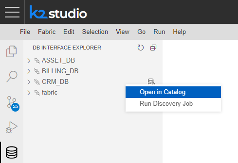
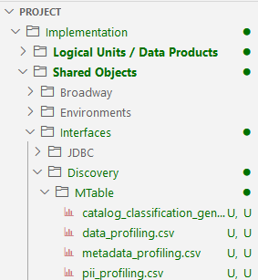

# Catalog Advanced Settings

### Web Studio

* *Show Catalog Commands* is a Web Studio setting to either show or hide the Catalog related commands in the Web Studio. 

  * This setting can be updated using the [Web Studio's user preferences](/articles/04_fabric_studio/04_user_preferences.md). 
  * Once *Show Catalog Commands* is enabled, **Run Discovery Job** and **Open in Catalog** commands can be executed by doing the right click on the interface name.  

  ​	

* The ```Implementation/SharedObjects/Interfaces/Discovery/``` folder in the Project tree is a folder that holds all Catalog and Discovery process related configuration files. 

  * The **plugins.discovery** is a configuration file that defines the plugin's list and their execution order. 
  * The **MTables** sub-folder holds the MTables used by the Catalog various processes.

  

  Click [here](04_plugin_framework#plugins-pipeline) for more details about these files. 

### Catalog Application Configuration

* The ```properties-info.JSON``` is a configuration file used by the Catalog Application to determine the view and behavior of the node's properties in the Catalog application. 
  * This JSON file defines the order of the properties display on the Properties tab, which properties are editable (for the purpose of [Manual override](07_manual_overrides.md)), which properties are searchable (for the [advanced search](08_search_catalog.md#advanced-search)) and more.
  * The file is located in fabric/staticWeb folder and can be updated on the project level.

### General

The [data_discovery] section of config.ini defines the Catalog system configurations, such as the connection details to the neo4j GraphDB.

ENABLE_DATA_DISCOVERY is a hidden configuration parameter that defines whether the Discovery should be enabled in the system (if neo4j is part of the Fabric space). By default it is set to true. 

If the Fabric space doesn’t include *neo4j*, ENABLE_DATA_DISCOVERY should be added to this section and set to false.

