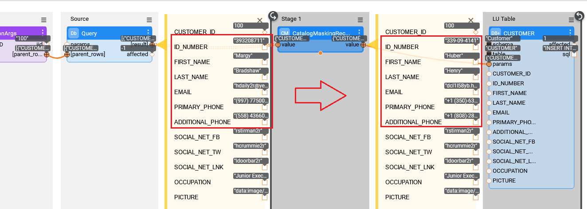
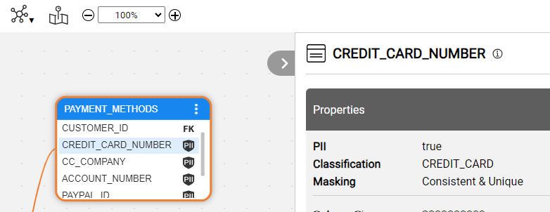

<web>

# Catalog Masking Mechanism

The purpose of the Catalog Masking mechanism is to perform masking based on the Catalog's classifications. It provides a great simplification of the masking implementation, since it allows to base the masking logic on the Discovery results in the Catalog rather than defining it manually in each LU table population. 

To apply the Catalog Masking mechanism on a flow or population, start with running the Discovery job and building the [Catalog artifact](09_build_artifacts.md). Then, create an LU and add either the **CatalogMaskingMapper** or the **CatalogMaskingRecord** Actor to LU populations. 

### Catalog Masking Actors

The following 3 actors have been introduced by the Catalog Masking mechanism: 

* CatalogMaskingMapper
* CatalogMaskingRecord
* CatalogMaskingField

Their purpose is to mask the values based on Catalog’s classification and masking rules definition. The object (or record) to be masked is set using the following 3 actor’s input  parameters: dataPlatform, schema and dataset, that identify it in the  Catalog.

The Catalog based masking logic is included in the CatalogMaskigField while the CatalogMaskingMapper and the CatalogMaskingRecord serve as a wrapper - on a dataset level and a record level accordingly. 

The **CatalogMaskingMapper** Actor receives a dataset, which maps the data on the fly, and does not load the entire dataset to memory. The actor iterates internally on each record and invokes the **CatalogMaskingRecord** Actor. The actor returns a dataset with the same structure it was received.

The **CatalogMaskingRecord** Actor receives a record, splits it internally into key-value pairs and invokes the **CatalogMaskingField** Actor for each pair. The actor returns an object with the same structure it was received.

The **CatalogMaskingField** Actor’s purpose is to mask a single field’s value based on the Catalog’s Classification and the masking rules definition. 
* The actor starts from checking whether the field should be masked. The check is based on the field's PII and Masking columns in the Catalog artifact (catalog_field_info MTable). [Click for more information about the Catalog artifact](09_build_artifacts.md).
  * If both PII is true and the Masking property is not OFF, the field's value should be masked. (More details about the Masking property are explained further in this article).
* Then, the actor retrieves the field's Classification from the **catalog_field_info** MTable and searches for the generator in the **catalog_classification_generators** MTable. The generator can be either one of the existing built-in actors (RandomSSN, RandomZipCode, etc.), a custom actor or a flow.
  * Click for more information about the Catalog's [PII & Masking Setup](10_catalog_settings.md#classifier-pii--masking-setup).
* Finally, the actor internally invokes the **Masking** actor, sending its parameters as follows:
  * The **maskingId** is set to the Classification.
  * The **flowName** is set to the Generator defined in the **catalog_classification_generators** MTable for this Classification.
  * If the given Generator has parameters, they are also taken from the above MTable.

### The Masking Property

While the Classification and PII properties are added to the Catalog nodes by the Classifier plugins, the **Masking** property should be added manually when it is required to control the masking mechanism of some fields. 

The purpose of adding the Masking property to a field is to override the Classification level definitions. It indicated that this field requires a special handling by the Catalog Masking mechanism. The Masking property can have one of the following valid values:

* **Consistent** - the Catalog Masking Actors should produce a consistent value across the Catalog (meaning the same input will always return the same masked value).
* **Unique** - the Catalog Masking Actors should produce a unique value across the Catalog (meaning the masking value will be unique).
* **Consistent & Unique** - the Catalog Masking Actors should produce a consistent yet unique value across the Catalog.
* **Generate value** - the Catalog Masking Actors should produce any random value, not consistent and not unique. 
* **OFF** - the Catalog Masking mechanism should not mask the field. This valid value is useful when a custom masking logic is required. In this case, it is the implementor's responsibility to add the custom masking logic to the relevant LU population.

 

</web>

