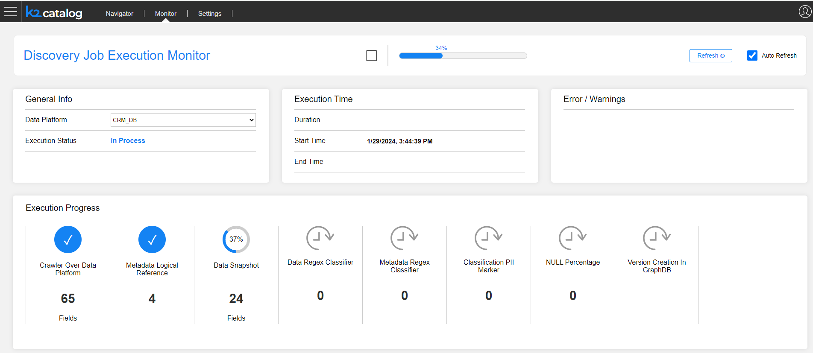

# Discovery Job Execution Monitor

The purpose of the Discovery Job execution monitor is to track the progress and performance of the Discovery process. This allows users to anticipate when the job will be completed. The monitoring also provides valuable insights that can help to analyze the job progress, such as which step is taking the most amount of time. 

The monitor is split into several areas:

* The **General Info** area allows to select the Data Platform in order to retrieve the monitoring details. 
* The **Execution Time** area shows the job start time and the duration. If the job is completed, the end time is also displayed. 
* The **Error Messages** area displayed the errors, in case of the job failure. 
* The **Execution Progress** is the main monitor area. It shows the progress of the job including the percent of completion of each step.

](10_catalog_settings.md) 

