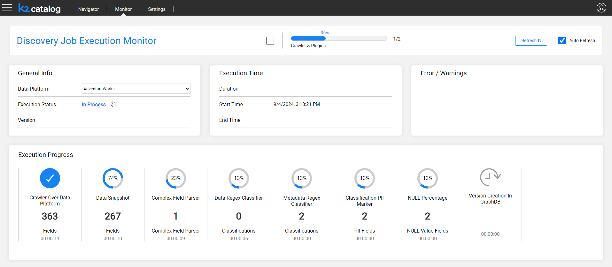

# Discovery Job Execution Monitor

The purpose of the Discovery job execution monitor is to track the progress of the Discovery process. The monitoring provides valuable insights that can help to follow-up the job execution, displaying the progress per each step. 

The monitor is split into the following areas:

* The **General Info** area allows to select the Data Platform in order to retrieve details of the monitoring.
  * The monitor shows the last execution for the given Data Platform, either throughout its progress or when completed.

* The **Execution Time** area shows the job's start time and its duration. If the job has been completed, the end time is displayed as well. 
* The **Error / Warnings** area displays either the error (in case of a job failure) or the number of warnings received during the job execution, if any.
* The **Execution Progress** is the monitor's main area. It shows the progress of the job, including the completion percentage of each step and the number of elements found.
  * The steps displayed in this area are dynamic, and they depend on the job configuration. The disabled plugins are not displayed.

The monitor allows to either stop the Discovery job, when it is in progress, or to start the job execution for the selected Data Platform.

Upon completion of the job, the monitor displays the version number and indicates whether a new version has been created or not.

 

