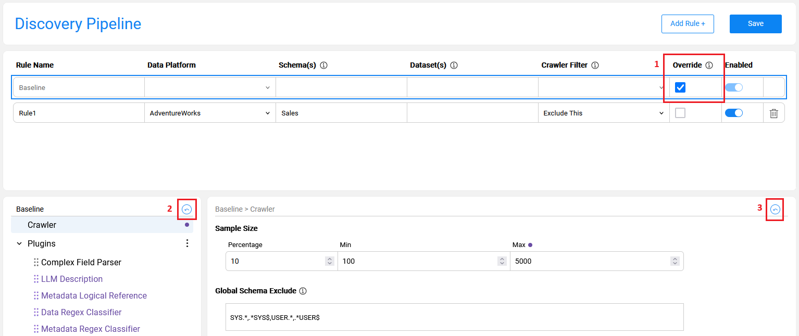

# Discovery Pipeline Settings

### Overview

The **Discovery Pipeline** screen in the Catalog Settings tab provides a full and comprehensive view of the Discovery job configuration. It displays the product's default baseline configuration (retrieved from the product's **plugins.discovery** file) and the project-level rules. 

The **Baseline** rule includes a list of product built-in plugins with their input parameters, data snapshot sample size and more. 

The Discovery Pipeline screen enables performing the following actions, described further in this article:

* Overriding the product's default [Baseline rule](13_discovery_pipeline_settings.md#baseline-rule).
* Creating [project rules](13_discovery_pipeline_settings.md#project-rule) to set a crawler filter and/or override the plugins' settings.
* [Adding new plugin](13_discovery_pipeline_settings.md#adding-new-plugin) to the pipeline.


The overrides are saved into the project **pluginsOverride.discovery** file, created in the Project's ```Implementation/SharedObjects/Interfaces/Discovery/``` folder.

This article describes the screen capabilities and explains how they can impact the Discovery job. 

### Baseline Rule

The **Baseline** rule is a default configuration applied when running the Discovery job on any data platform. It includes a sample size definition, a global schema exclude list and a list of product plugins with their settings.

The Baseline rule is always enabled. It can be edited by checking the **Override** checkbox. The following changes can be applied to the Baseline rule:

* Update the Crawler-related settings, e.g., a sample size. 
* Update the parameters of the product built-in plugins. 
* [Add a new plugin](13_discovery_pipeline_settings.md#adding-new-plugin) - described further in this article. 

Note that the Baseline rule overrides are automatically propagated to the project-level rules. For example, when a plugin is updated from 'active' to 'inactive' in the baseline, it becomes 'inactive' in all project-level rules. The rule, however, can override the baseline.

#### Revert Baseline Overrides

The Baseline rule overrides can be reverted in one of the following ways:



1. Uncheck the **Override** checkbox on the Baseline rule to remove all overrides at once.
2. Click the **revert** icon at the lower-left-side of the screen to reset the plugin's order to the original order.
3. Click the **revert** icon at the lower-right-side of the screen to reset the plugin's current settings back to the baseline.
   * Note that if this is a project-level plugin, reverting to the baseline would delete it (since this plugin is not part of the baseline).

### Project Rules

The Discovery Pipeline screen enables the user to refine the default configuration per the project's requirements. 

A **rule** should be attached to a data platform, along with several optional parameters (schema, dataset, crawler filter and override indicator) that may become mandatory, based on conditions; this is described further in this article. 

The rules follow the following hierarchy: 

* There can be zero or more rules for the same data platform. 
* When multiple rules apply on the same process element, the most specific rule takes precedence.
* When there is no specific rule for a process element, the Baseline rule is executed.

#### How Do I Create a Rule?


* Click **Add Rule +** to create a new rule. 


* The mandatory rule's parameters are *Rule Name* (which must be unique) and *Data Platform*. 


* Populating a schema and a dataset is optional. 


* When multiple schemas or datasets are populated, they should be comma-separated.
* A rule should include either a Crawler filter or a checked Override checkbox, or both. Possible filter settings are described below.

#### Crawler Filter = Exclude This 

When the filter is set to **Exclude This**:

* The Crawler excludes the specified *Schema(s)* and *Dataset(s)*. Thus, at least the schema should be populated.
* This rule cannot be combined with the *Override* action, as the specified *Schema(s)* and *Dataset(s)* are excluded by the Crawler.

#### Crawler Filter = Exclude Others

When the filter is set to **Exclude Others**:

* The Crawler will only include the specified *Schema(s)* and *Dataset(s)* (if they were stated). Thus, at least the schema should be populated.
* This rule can be combined with the *Override* action. It allows to define the Crawler's include list as well as to override the Baseline rules at the same time.


#### No Crawler Filter; Override is Checked

When the *Crawler Filter* is empty and the *Override* checkbox is checked:

* The Crawler is executed on the whole Data Platform.
* The override rules are applied only on the specified *Schema(s)* and *Datasets(s)*.

### Adding New Plugins

When a new plugin is created in a project, it should be added to the Baseline rule in order to become part of the Discovery job execution. Once added to the baseline, it is automatically propagated to all the existing rules and can have different settings in each rule.

For example, when a newly created plugin is applicable only for running Discovery on the CRM_DB, it should be added to the baseline as 'inactive'. In addition, a rule for the CRM_DB should be created, where this plugin should be set to 'active'.

The steps to add a new plugin to the pipeline are:

1. Click **Override** of the Baseline rule.
2. Click the  icon to open the Plugins context menu and click **Add Plugin**.
3. Alternatively, you can select a plugin in the list and click **Duplicate selected** in the context menu. Once the plugin has been duplicated, you can update all its parameters. 


The new plugin is always added to the end of the list. However, the plugin's execution order can be changed by dragging it to the desired position in the list.  

Note that the **Delete selected** option in the context menu is only available for the project plugins. A product plugin cannot be deleted. If not needed, it can be set to 'inactive' in the Baseline rule. 
