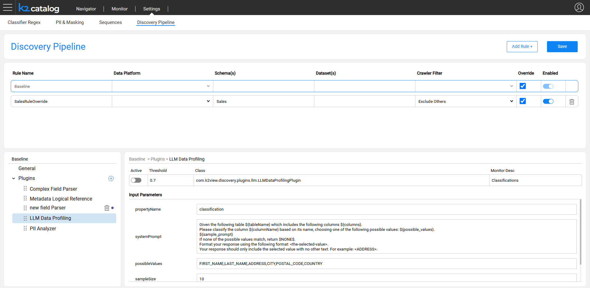
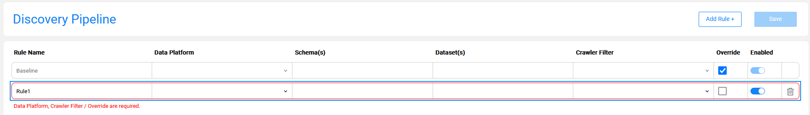
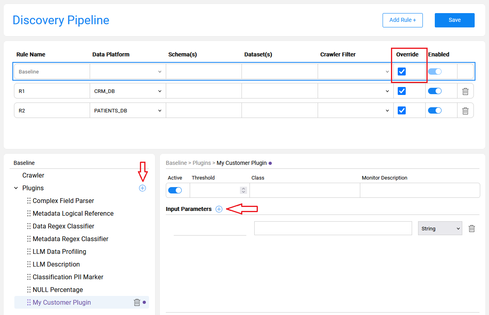

# Discovery Pipeline Settings

### Overview

The **Discovery Pipeline** tab in the Catalog Settings provides a full and comprehensive view of the Discovery job configuration. It displays the product's default Baseline configuration (retrieved from the product's **plugins.discovery** file) and the project-level rules. 

The **Baseline** rule includes a list of product built-in plugins with their input parameters, data snapshot sample size and more. 

The Discovery Pipeline setup screen enables performing the following updates:

* Override the product's default Baseline configuration.
* Create various rules to set a crawler filter and/or override the plugins settings.
* Add new plugins to the pipeline.


The overrides are saved into the project **pluginsOverride.discovery** file, created in the Project's ```Implementation/SharedObjects/Interfaces/Discovery/``` folder.

This article describes the screen capabilities and explains how they can impact the Discovery job. 



### Baseline Rule

The **Baseline** rule is a default configuration applied when running the Discovery job on any data platform (if a more specific rule doesn't exist). It includes the definition of a sample size, global schema exclude and a full list of plugins.

The Baseline rule is always enabled. You can edit the Baseline rule by clicking the **Override** checkbox. The following changes can be applied to the Baseline rule:

* Update the crawler related settings, e.g. a sample size. 
* Update the parameters of the product built-in plugins, e.g. set to inactive or update the threshold. 
* Add a new plugin - described further in this article. 

Note that the Baseline rule overrides are automatically propagated to the project-level rules. For example, when a new plugin is added to the Baseline, it is automatically added to all other rules. 

### Project Rules

The Discovery pipeline enables the creation of multiple rules. Each rule is attached to a data platform, with several optional parameters (schema, dataset, crawler filter and override indicator) that become mandatory based on conditions, as described further in this article. 

The rules follow the following hierarchy: 

* There can be one or more rules for the same data platform. 
* When multiple rules apply on the same process element, the most specific rule takes precedence.
* When there is no specific rule for a process element, the Baseline rule is executed.

### How Do I Create a Rule?



* Click **Add Rule +** to create a new rule. 


* The mandatory rule's parameters are a Rule Name (which must be unique) and a Data Platform. 


* Populating a schema and a dataset is optional. 


* When multiple schemas or datasets are populated, they should be coma separated.
* A rule should either include a Crawler filter or the Override checkbox or both. 

Possible filter settings are described below.

#### Crawler Filter = Exclude This 

When the filter is set to **Exclude This**:

* The Crawler excludes the specified Schema(s) and Dataset(s), so this rule requires that at least a schema will be populated.
* This rule cannot be combined with Override, because the specified Schema(s) and Dataset(s) are excluded by the Crawler.

#### Crawler Filter = Exclude Others

When the filter is set to **Exclude Others**:

* The Crawler excludes everything except for the specified Schema(s) and optionally Dataset(s), so this rule requires that at least a schema will be populated.
* This rule can be combined with Override. It allows to define the Crawler include list and both override the Baseline rules at the same time.


#### No Crawler Filter & Override 

When the filter is empty and the Override checkbox is checked:

* The Crawler is executed on the whole Data Platform.
* The override rules are only applied on the specified Schema(s) and Datasets(s).

### How Do I Add New Plugin?

When a new plugin is created in a project, it should be added to the Discovery Pipeline. The plugin needs to be defined under the Baseline rule. Once added to the baseline, it is automatically propagated to all the existing rules and can have different settings in each rule.

For example, the plugin should only be active when running discovery on CRM_DB. Then it should be added to the baseline as inactive and a rule should be created for CRM_DB with setting this plugin to active.

A new plugin can be added by clicking the plus icon in the lower part of the screen. This option is only available when the Baseline rule is selected and Override is clicked. Once the plugin name is populated, its parameters can be set in the lower right part of the screen: active (true/false), threshold, class and the monitor description. 

