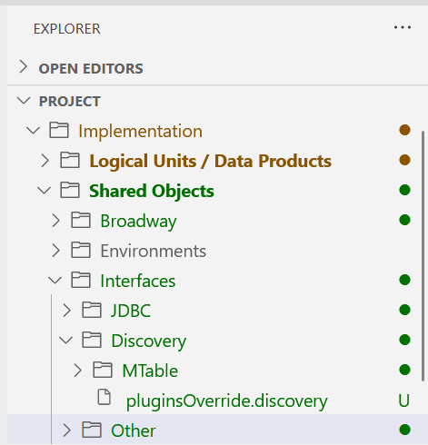
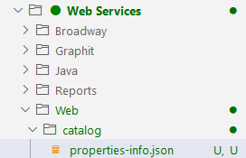

# Discovery Advanced Configuration

<web>

### Web Studio

The ```Implementation/SharedObjects/Interfaces/Discovery/``` folder in the Project tree is a folder that holds all Catalog and Discovery process-related configuration files: 



* The **MTable** subfolder holds the MTables used by the Catalog's various processes. Additionally, when the [Build Artifacts](/articles/39_fabric_catalog/catalog_app/09_build_artifacts.md) action is performed, the Catalog artifact — **catalog_field_info.csv** — is created in this folder.
  * Starting from V8.3, the splitting of artifacts is enabled by default. Click [here](/articles/39_fabric_catalog/catalog_app/09_build_artifacts.md#splitting-and-combining-artifacts) for more information about it.
* The **pluginsOverride.discovery** is a configuration file that defines the prospective overrides in the Crawler and the plugins configuration (starting from V8.2). Click [here](/articles/39_fabric_catalog/catalog_app/13_discovery_pipeline_settings.md#overview) for more information about it.
  * Note that prior to V8.2, the project-level overrides file was called **plugins.discovery**. 

*Show Catalog Commands* is a Web Studio setting that either shows or hides the Catalog's related commands — **Run Discovery Job** and **Open in Catalog** — in the Web Studio. 

* By default, *Show Catalog Commands* is enabled. 
* This setting can be updated using the [Web Studio's user preferences](/articles/04_fabric_studio/04_user_preferences.md). 

### Catalog Application Configuration

The **properties-info.json** is a configuration file used by the Catalog application to determine the view and the behavior of various Catalog UI elements. The following settings can be performed:
* ```"editable": true``` — the property is editable via the [Edit Catalog capabililty](/articles/39_fabric_catalog/catalog_app/07_manual_overrides.md).
* ```"deletable": true``` — the property can be deleted via the [Edit Catalog capabililty.](/articles/39_fabric_catalog/catalog_app/07_manual_overrides.md)
* ```"searchable": true``` — the Catalog can be searched using this property in the [Advanced Search](/articles/39_fabric_catalog/catalog_app/08_search_catalog.md#advanced-search) screen.
* ```"filterable": true``` — the Catalog can be filtered using the [Catalog Filter](/articles/39_fabric_catalog/catalog_app/08a_filter_catalog.md) screen.
* ```"values":[]``` specifies the list of valid values for a property. For some properties, this list is combined with programmatically retrieved values (e.g., classification).
* ```"allow_custom_values": true``` defines the ability to populate a custom value for a property that includes a drop-down list. 
* ```"hidden": true``` — the property is hidden from the Catalog's Properties tab.

The properties-info.json file is located in the ```fabric/staticWeb/catalog``` folder.

In order to perform the project-level overrides in the **properties-info.json** file:

* Create a **catalog** folder under the **Web** folder of the **Web Services** LU, and copy the file into it. 

  <web>



</web>

* After updating the file, save it and deploy the LUs.


### General

The ```NEO4J_SERVER_MEMORY_HEAP_MAX_SIZE_MB``` parameter in the ```[data_discovery]``` section of the config.ini file specifies the maximum heap size for the Neo4j server. By default, it is set to 2048 MB. 

* The Neo4j heap size is set when starting Neo4j in a space. 
* This value can be adjusted, based on the data platform size and the number of schemas. For example, when an expected data platform size is large, it is recommended to increase this setting. 
* To update the heap size for an existing space, stop the Neo4j server and the DATA_DISCOVERY_JOB, update this setting in the config.ini file and run the Discovery job.

The ```DATA_SNAP_WRITE_MEMORY_CAP_MB``` parameter in the ```[data_discovery]``` section of the config.ini file specifies the maximum Fabric memory allocated for the Data Snapshot process. This parameter helps to balance the Fabric memory when running Discovery on a data platform with multiple schemas or when multiple Discovery jobs run in parallel on the same Neo4j DB.

* When the in-memory data reaches this predefined limit, the Data Snapshot's data is committed to the SQLite file. 


* By default, the parameter is set to 4096 MB. When working with very large data sources, it is recommended to increase this setting – assuming the system has sufficient resources for such increase.

```STUDIO_INTERFACES_FROM_CATALOG``` (known as ```ENABLE_DATA_DISCOVERY``` before version 8.3) is a hidden configuration parameter that defines whether the interfaces metadata (in the Web Studio's Interface Explorer) should be retrieved from the Catalog or from the source DB. By default, it is set to 'true'. If the Fabric configuration does not include Catalog, the ```STUDIO_INTERFACES_FROM_CATALOG``` parameter should be added to this section and set to 'false', to prevent the Studio APIs trying to retrieve the metadata from the Catalog.

Starting from V8.3.1, during the version creation in GraphDB step of the Discovery job the list of version changes are split into batches and written into Neo4j as separate transactions, allowing the batches to run in parallel and by that reduce the memory consumption. The ```NODES_BATCH_SIZE_PER_TRANSACTION``` parameter in the ```[data_discovery]``` section of the config.ini file defines the maximum number of nodes written into Neo4j in each transaction. By default, it is set to 5000. In addition, the ```RELATIONS_BATCH_SIZE_PER_TRANSACTION``` parameters defines the maximum number of relations written into Neo4j per each transaction. By default, it is set to 1000.

