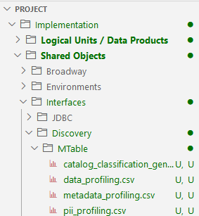

<web>

# Advanced Configuration

### Web Studio

* *Show Catalog Commands* is a Web Studio setting that either shows or hides the Catalog's related commands **Run Discovery Job** and **Open in Catalog** in the Web Studio. 

  * By default, *Show Catalog Commands* is enabled. 
  * This setting can be updated using the [Web Studio's user preferences](/articles/04_fabric_studio/04_user_preferences.md). 

* The ```Implementation/SharedObjects/Interfaces/Discovery/``` folder in the Project tree is a folder that holds all Catalog and Discovery process-related configuration files. 

  * The **plugins.discovery** is a configuration file that defines a list of plugins and their execution order. 
  * The **MTables** subfolder holds the MTables used by the Catalog's various processes.

  

  Click [here](/articles/39_fabric_catalog/04_plugin_framework.md) for more details about these files.

### Catalog Application Configuration

The ```properties-info.JSON``` is a configuration file used by the Catalog Application to determine the view and behavior of various Catalog application elements. This JSON file defines for example:
* Which properties are editable (via [manual override](07_manual_overrides.md)) in the Properties tab;
* Which properties are searchable via the [Advanced Search](08_search_catalog.md#advanced-search) screen.

The file is located in ```fabric/staticWeb``` folder and can be updated on the project level.

### General

ENABLE_DATA_DISCOVERY is a hidden configuration parameter that defines whether the Discovery should be enabled in the system (if neo4j is part of the Fabric space). By default it is set to true. If the Fabric space doesn’t include *neo4j*, ENABLE_DATA_DISCOVERY should be added to this section and set to false.


[](20_catalog_APIs.md)

</web>
