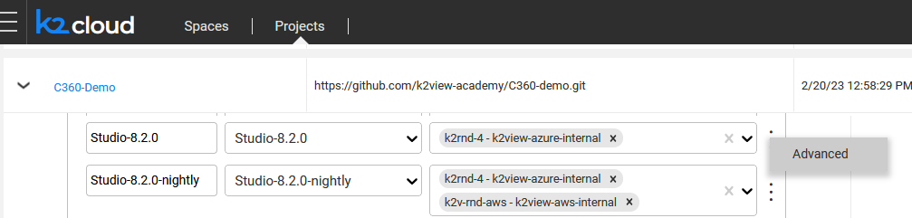

<web>

# Centralized Catalog for Multiple Fabric Instances

### Overview

Starting from V8.2, it is possible to configure one centralized Catalog for multiple Fabric instances. This is useful when, for example, several users need to work on the same project in parallel. Working on separate Fabric instances (e.g., spaces), the users can define different Catalog settings and run the Discovery independently from one another, on different interfaces. Eventually, the Catalog artifacts from each Fabric instance can be combined together, as explained [here](09_build_artifacts.md#splitting-and-combining-artifacts). 

In addition, the centralized Catalog’s setup allows for some of the users to be connected to the Catalog in a read-only mode, that is, they will be able to view the Catalog tree but would not be able to run the Discovery job or perform any manual overrides. Having only read-only permissions in the Neo4j, these users would still be able to update the Catalog Settings and create an artifact in the Fabric instance.

Utilizing this feature requires creating a Central Neo4j space and the Child spaces that will point to the 'Central Neo4j' GraphDB. The steps of how to do it are described below.

### Setup Steps

The following steps should be performed to configure a centralized Catalog for multiple Fabric instances:

**Step 1**: Creation of a Central Catalog's space. 

- Create the Central Neo4j space using a dedicated space profile.

**Step 2**: Creation of a 'Child' space with a regular user.  

- Prior to creating a 'Child' space, open the *Advanced* settings of your Project's space profile:

  

- Add the following to the config.ini section of the *Advanced* settings:

  ~~~
  [data_discovery]
  CENTRAL_SPACE_NAME_TENANT_NAME=<space_name-tenant_name>
  ~~~

  - The ```<space_name-tenant_name>``` is the Central Neo4j space and tenant name.

- Create the 'Child' space. This space will point to the Central Neo4j GraphDB rather than to its local Neo4j.

**Step 3 (optional)**: 'Child' space creation with a read-only permission for the Neo4j user. 

- Prior to creating a 'Child' space, open the *Advanced* settings of your Project's space profile:


  

- Add the following to the config.ini section of the *Advanced* settings:

  ~~~
  [data_discovery]
  CENTRAL_SPACE_NAME_TENANT_NAME=<space_name-tenant_name>
  IS_READONLY=Y
  ~~~

  - The ```<space_name-tenant_name>``` is the Central Neo4j space and tenant name.

- Create the 'Child' space. This space will point to the Central Neo4j GraphDB rather than to its local Neo4j; the space will connect to the Neo4j using the default user with read-only permissions.

  - Note that the user with **read-only** permissions is created automatically upon the first run of the Discovery job (in a regular space). This means that it is possible to connect to the 'read-only space' only after the first Discovery run.
  - These users will only have read-only permissions in the Neo4j, while still being able to update the Catalog Settings and create an artifact in the Fabric instance.


</web>


