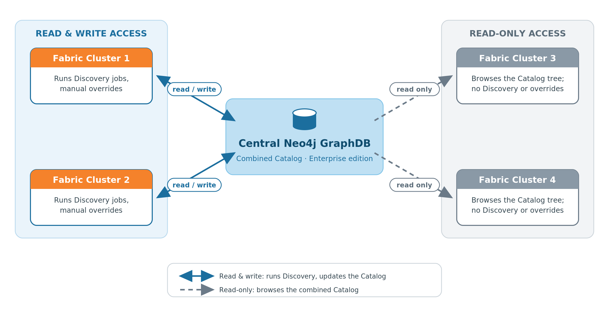

# Centralized Catalog for Multiple Fabric Instances

### Overview

Starting from V8.2, it is possible to configure one centralized Catalog for multiple Fabric instances. This is useful when, for example, several users need to work on the same project in parallel. Working on separate Fabric instances (e.g., spaces), the users can define different Catalog settings and run the Discovery independently from one another, on different interfaces. Eventually, the Catalog artifacts from each Fabric instance can be combined together, as explained [here](09_build_artifacts.md#splitting-and-combining-artifacts). 

In addition, the centralized Catalog’s setup allows for some of the users to be connected to the Catalog in a read-only mode, that is, they will be able to view the Catalog tree but would not be able to run the Discovery job or perform any manual overrides. Having only read-only permissions in the Neo4j, these users would still be able to update the Catalog Settings and create an artifact in the Fabric instance.

Utilizing this feature requires creating a Central Neo4j and additional clients (Fabric instances) that will point to the Central Neo4j GraphDB. The steps of how to do it are described below.

### Setup Steps

The following steps should be performed to configure a centralized Catalog for multiple Fabric instances:

**Step 1**: Creation of a Central instance. 

- Create the Central Neo4j.
- In case of cloud architecture, use a dedicated space profile for that.

**Step 2**: Creation of a client Fabric instance (e.g. a Child space) with a regular user.  

- A client Fabric instance should point to the Central Neo4j. To do so, update the client Fabric instance's GRAPH_DB_URL parameter in the [discovery] section of config.ini to the URL of the Central Neo4j.

- In case of cloud architecture, set the following via the *Advanced* settings of your Project's space profile prior to creating a 'Child' space:

  ~~~
  [data_discovery]
  GRAPH_DB_URL=<Central Neo4j URL>
  ~~~

**Step 3 (optional)**: Creation of a client Fabric instance (e.g. a Child space) with a read-only permissions for the Neo4j user. 

- Connect to the Central Neo4j to create a new Neo4j user with read-only permissions, as follows:

  ~~~bash
  CREATE USER $READ_ONLY_USER SET PASSWORD '$READ_ONLY_PASS' CHANGE NOT REQUIRED;
  GRANT ROLE reader TO $READ_ONLY_USER;
  GRANT ACCESS ON DATABASE $DB_NAME TO reader;
  ~~~

- Update the client Fabric instance's GRAPH_DB_URL parameter in the [discovery] section of config.ini to the URL of the Central Neo4j. In addition, update GRAPH_DB_USER and GRAPH_DB_PASSWORD parameters to the credentials of the newly created user.

- In case of cloud architecture, set the following via the *Advanced* settings of your Project's space profile prior to creating a 'Child' space:

  ~~~
  [data_discovery]
  GRAPH_DB_URL=<Central Neo4j URL>
  GRAPH_DB_USER=<Name of user with read-only permissions>
  GRAPH_DB_PASSWORD=<Password of user with read-only permissions>
  ~~~

- Note: the 'read-only' user will have the read-only permissions only in Neo4j, while still being able to update the Catalog Settings and create an artifact in the Fabric instance.

