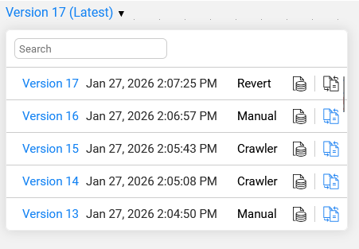
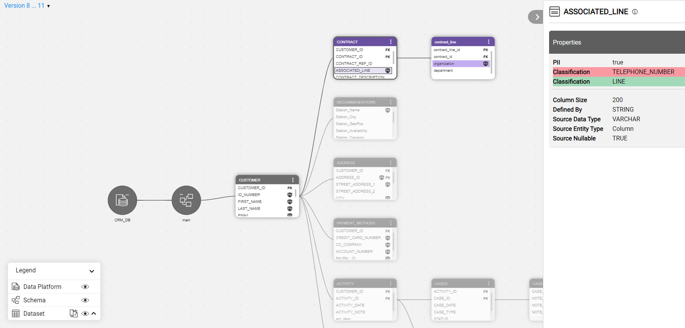
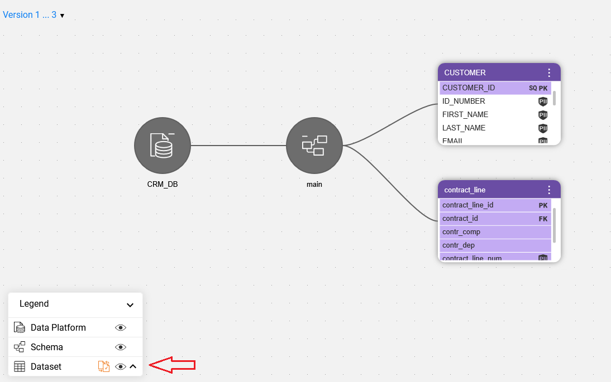
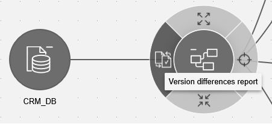
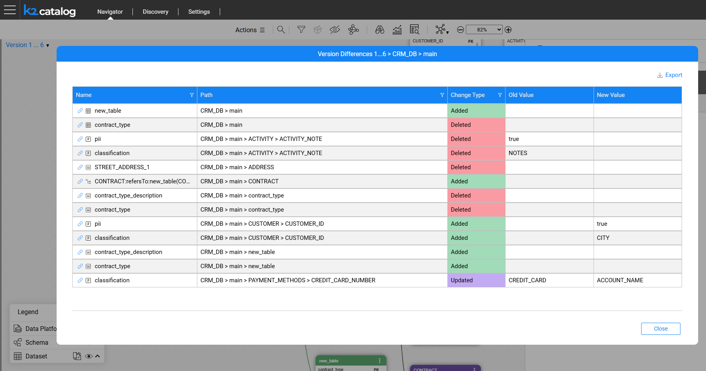

# Catalog Versioning

K2view's Catalog supports **versioning**, which is the ability to create a new Catalog version in the Neo4j Graph DB whenever the Discovery process runs and detects differences compared to the previous version.

Using the Catalog application, a user can view each version separately or compare two selected versions to identify their differences, as described below.

## Version Creation

Every time the Discovery job is executed, it compares the current results with the previous Catalog version of the same data platform. The differences may result from changes in the data source (such as a new table or field) or from configuration updates, such as adding a new profiling rule or modifying an existing one. 

If the Discovery process does not identify any differences in either the data source or the configuration rules, it does not create a new Catalog version.

If differences are detected, a new version is created and they can then be analyzed through version comparison, as described later in this article. 

A new version is also created whenever the Catalog is manually edited. 

[Click here for more information about manual overrides](07_manual_overrides.md).

## Version View

By default, the Catalog application displays the latest available version. To view any version, open the version's drop-down list and click a version number: 

The Catalog tree is then displayed using the standard coloring scheme, with nodes shown in blue and relations in orange. 

## Version Comparison

To compare two versions, click the comparison  icon in the version's drop-down list. The Catalog tree is then displayed using the comparison coloring scheme, indicating the differences between the two versions, as follows:

* New elements are shown in green, the removed elements in red, and updated elements in purple.
* When a property is updated, it is displayed twice — the new value is highlighted in green, while the removed value is shown in red.
* All unchanged entities and relations are shown in grey.

To return to the regular view mode, open the version's drop-down list again and click a version number.

### Show Differences Only

When a schema contains many datasets, it might be difficult to spot which ones were updated. To view only the differences between versions, start by expanding the schema and then click the 'Show differences only' icon in the Catalog legend. Note that this icon is visible only in version comparison mode.

### Version Differences Report

The **Version Differences** window, available from Fabric V8.3.1, displays all changes between the two selected versions, under the selected data platform and schema. Its purpose is to present data in a table view, providing a clear and structured overview.

The window can be accessed by clicking the 'Version differences report' icon, which is available on the schema node and appears only in version comparison mode.

Each line in the **Version Differences** window includes the node name, its path and the type of change. The latter indicates whether the node was added, deleted or updated. For property changes, the Old Value and New Value columns display the previous and updated property values.

The differences list can be exported to a CSV file by clicking the Export icon (top-right corner).

 

