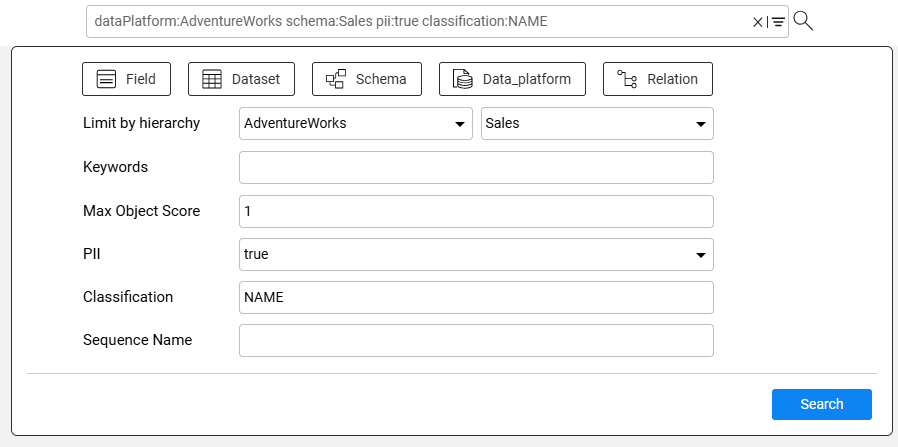
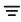
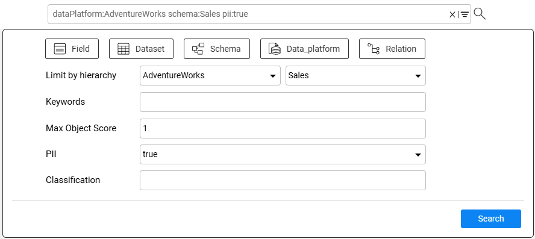
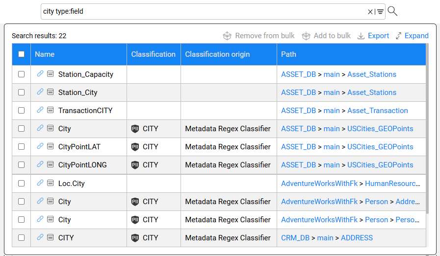

# Catalog Search

### Overview

The Catalog application allows searching for Catalog objects (data platforms, schemas, datasets, fields and relations) within the currently displayed version. 

To start the search, click the  icon in the menu bar. It opens a text box, where you can enter one or more keywords - the names of the objects to be searched. To search by additional parameters, open the Advanced Search by clicking the  icon. To exit the search, click the icon.

### Advanced Search

Advanced Search allows to narrow the search results by specifying one or more of the following parameters:

* Search the selected object type(s) only, such as field, dataset, schema, data platform or relation. Multiple types can be selected.
* Search by PII and Classification properties. For example, when marking PII = true in the advanced search, the results list will include all nodes marked as PII.
* Search by score. For example, when the user enters 0.8,  the results list will return all Catalog objects with score 0.8 and below.
* Search a node that belong to a specified Catalog hierarchy - a data platform and optionally a schema. Available in V8.5.

Note that once Advanced Search opens, each selection of the search criteria feeds the search text box at the top, using predefined syntax. For example, when searching by the keyword = phone, PII is true and object type is field, the search syntax is:

~~~javascript
phone pii:true type:field
~~~

And vice versa, you can define your search criteria using syntax only in the text box, which will automatically feed back the search criteria fields. 

Click [here](/articles/39_fabric_catalog/20_catalog_APIs.md#search-catalog) for more details about the Search API and the syntax of Catalog search.

### Search Results

The search results are presented in a list, limited to maximum 1000 results. 

The search results can be exported to a CSV file. Starting from Fabric V8.4, the export of the results is performed via the server API and it exports all the results, without a 1000 rows limitation.  

To navigate from the search results to a node in the Catalog tree, click the  icon in the Name column. When navigating to a relation, the Catalog will focus on the FK column of the *refersTo* relation.

 

