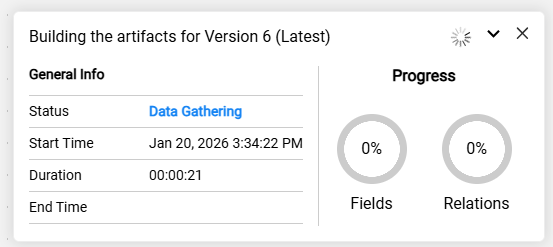
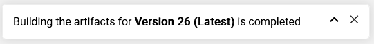
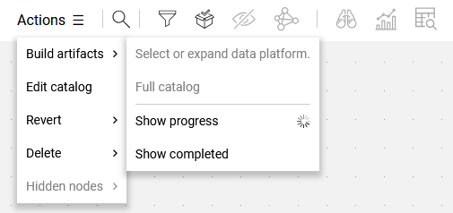
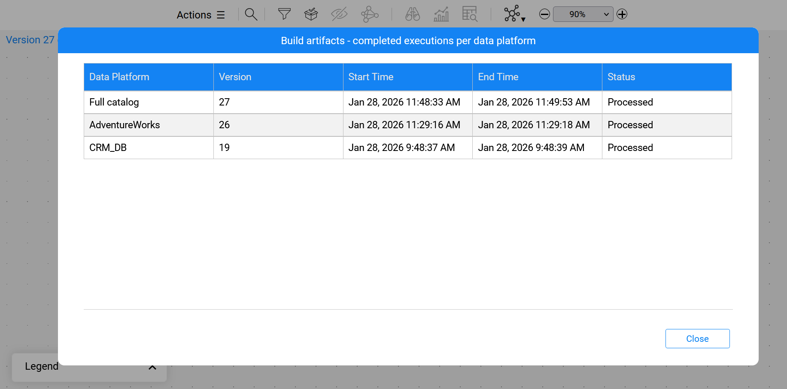

# Catalog Artifacts

### Overview

Catalog artifacts are extracts of Catalog's metadata, created upon request and uploaded to Fabric memory. In addition to memory, the artifacts are also generated as CSV files in the Project tree.

There are two types of artifacts: Catalog fields artifacts and relations artifacts.  

Artifacts are used in the masking and synthetic data generation mechanisms, as explained [here](11_catalog_masking.md).

### Building Artifacts

To create Catalog artifacts, select **Actions > Build artifacts** in the [Menu bar](05_catalog_app.md#menu-bar). 

* You can build artifacts for a single data platform (either selected or expanded) or for the entire Catalog. 
* Once initiated, a progress popup appears in the bottom-right corner of the screen, showing the process progress. Details about the progress bar can be found [further in this article](09_build_artifacts.md#build-artifacts-progress-bar).
* Building artifacts for a selected data platform and the progress bar feature are available starting from Fabric V8.4. 

The artifacts are uploaded to Fabric memory as **catalog_field_info** and **catalog_relations_info** [MTables](/articles/09_translations/06_mtables_overview.md). 

The following CSV-format files are created and saved under the  ```Implementation/SharedObjects/Interfaces/Discovery/MTable``` folder in the Project tree:

* **Field artifact** files, named as: ```catalog_field_info___<dataPlatform>_<schema>.csv```, (with 3 underscores before the data platform name).
* **Relation artifact** files, named as: ```catalog_relations_info___<dataPlatform>_<schema>.csv```, (with 3 underscores before the data platform name). These files include a list of *refersTo* relations with their properties (parent info, child info, origin). Note that these files are generated only from V8.3.1 onward.

The below image is an example of a ```catalog_field_info___DB2_sakila.csv``` file:


The below image is an example of ```catalog_relations_info___CRM_DB_main.csv```:


The heading of the last column indicates the version number (**V14** in the above examples), and the column itself always remains empty.

Catalog artifacts can be created for any Catalog version. Each new artifact overrides the existing one in the Project tree.

### Splitting and Combining Artifacts

Catalog artifacts can be split into separate files for each data platform and schema of a given Catalog version. The content of these files is then combined into a single MTable in Fabric's memory although the files are saved separately in the Project tree.

Starting from Fabric V8.3, all artifacts are split by default into separate files. The splitting or combining of artifacts is controlled by the SPLIT_CATALOG_ARTIFACTS parameter in the config.ini file.

This capability allows the combination of separate artifacts, created in different projects (or different spaces), into a single artifact. Hence, the artifact files can be copied from one project to another, and upon deployment, they will be combined into one MTable.

Note that if either the ```catalog_field_info.csv``` or ```catalog_relations_info.csv``` file exists in the Project tree, it should be manually deleted.

### Build Artifacts Progress Bar

Starting from Fabric V8.4, once the artifact building has started, a progress popup appears in the bottom-right corner of the screen, showing the progress and estimated remaining time to completion.



The progress bar can be minimized or closed.



To reopen the progress bar while artifact building is still underway, select **Actions > Build artifacts > Show progress** in the [Menu bar](05_catalog_app.md#menu-bar). 



Completed executions are displayed by selecting **Actions > Build artifacts > Show completed** in the [Menu bar](05_catalog_app.md#menu-bar). Only the last completed execution for each data platform or for the entire Catalog are shown here.




[](08a_filter_catalog.md)[](10_catalog_settings.md) 


