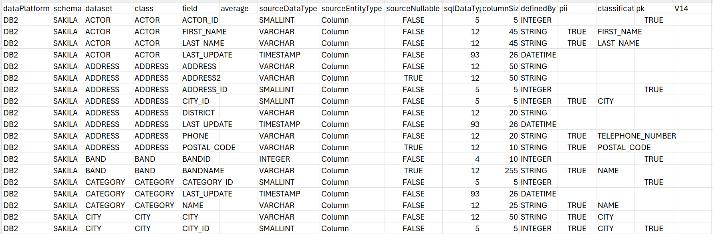
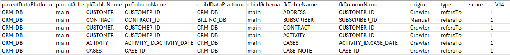

# Catalog Artifacts

### Overview

The Catalog provides the ability to build artifacts and save them in the Project tree. The field artifact files include details of all Catalog fields and their properties - such as Classification and PII - for the currently displayed Catalog version. The relations artifact files include details of the Catalog's relations.

The prerequisite for building the Catalog artifact is running the Discovery job for at least one project interface.

### Building Artifacts

Catalog artifacts are created by clicking **Actions > Build Artifacts** in the Catalog application's [Menu bar](05_catalog_app.md#menu-bar). 

The artifacts are uploaded to the Fabric memory as **catalog_field_info** and **catalog_relations_info** [MTables](/articles/09_translations/06_mtables_overview.md). 

In addition, the following CSV-format files are created and saved in the Project under the  ```Implementation/SharedObjects/Interfaces/Discovery/MTable``` folder:

* **Field artifacts** files, with the following name format: ```catalog_field_info___<dataPlatform>_<schema>.csv```, (containing 3 underscores before the data platform name).
* **Relation artifact** files, with the following name format: ```catalog_relations_info___<dataPlatform>_<schema>.csv```, (containing 3 underscores before the data platform name). It includes a list of *refersTo* relations with their properties (parent info, child info, origin). Note that these files are generated only from V8.3.1 onward.

The below image is an example of a ```catalog_field_info___DB2_sakila.csv``` file:



The below image is an example of ```catalog_relations_info___CRM_DB_main.csv```:



The heading of the last column indicates the version number (**V14** in the above examples), and the column itself always remains empty.

Catalog artifacts can be created for any Catalog version. Each new artifact overrides the existing one in the Project tree.

### Splitting and Combining Artifacts

Catalog artifacts can be split into separate files for each data platform and schema of a given Catalog version. The content of these files is then combined into a single MTable in Fabric's memory although the files are saved separately in the Project tree.

Starting from Fabric V8.3, all artifacts are split by default into separate files. The splitting or combining of artifacts is controlled by the SPLIT_CATALOG_ARTIFACTS parameter in the config.ini file.

This capability allows to combine separate artifacts, created in different projects (or different spaces), into a single artifact. Hence, the artifact files can be copied from one project to another, and upon deployment, they will be combined into one MTable.

Note that if either the ```catalog_field_info.csv``` or ```catalog_relations_info.csv``` file exists in the Project tree, it should be manually deleted.


[](08a_filter_catalog.md)[](10_catalog_settings.md) 


