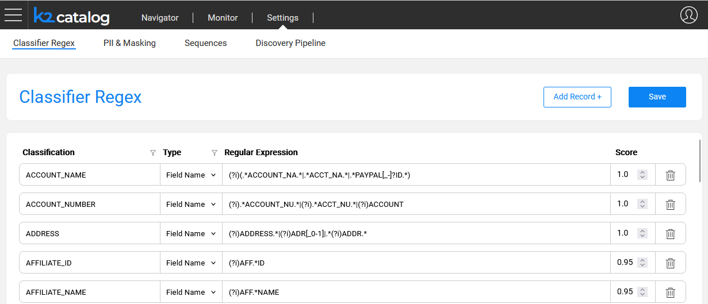
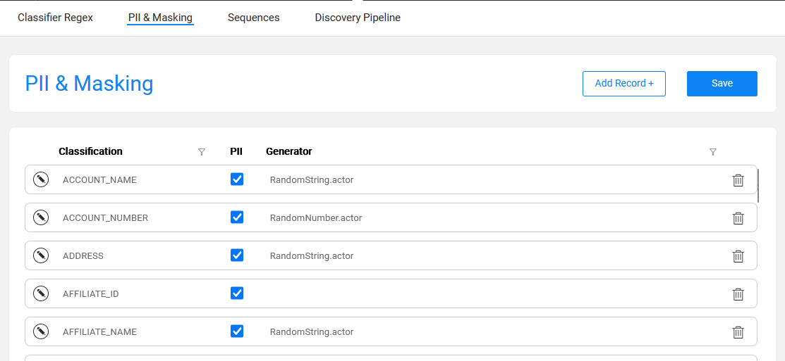
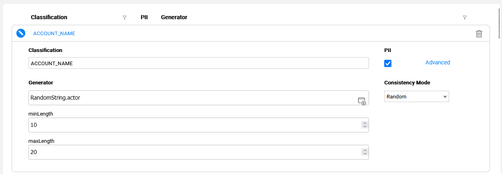
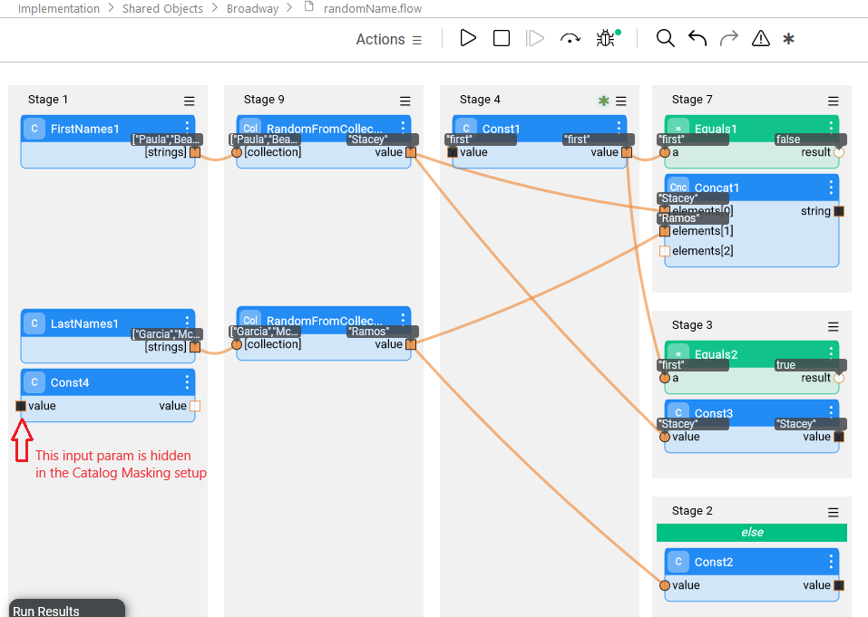
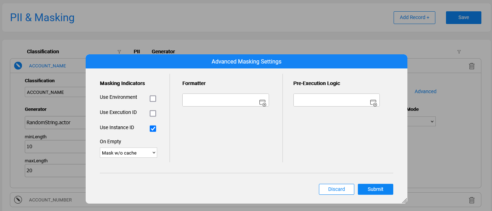
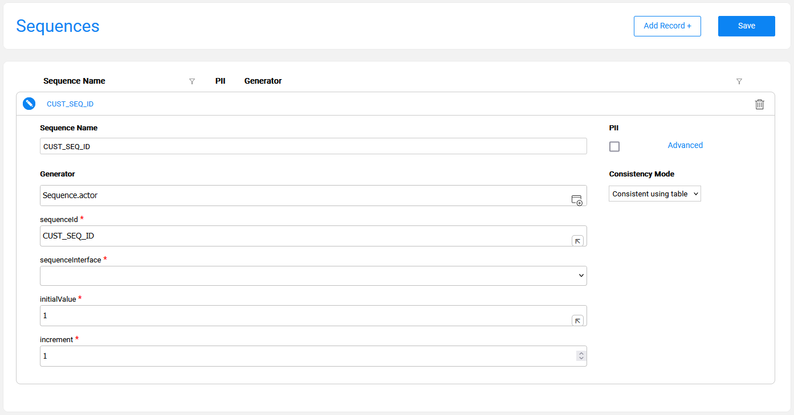
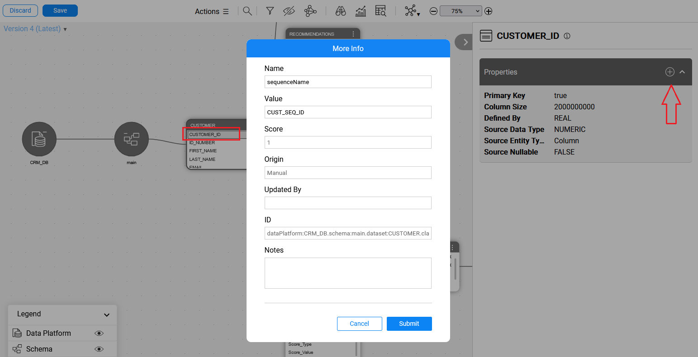
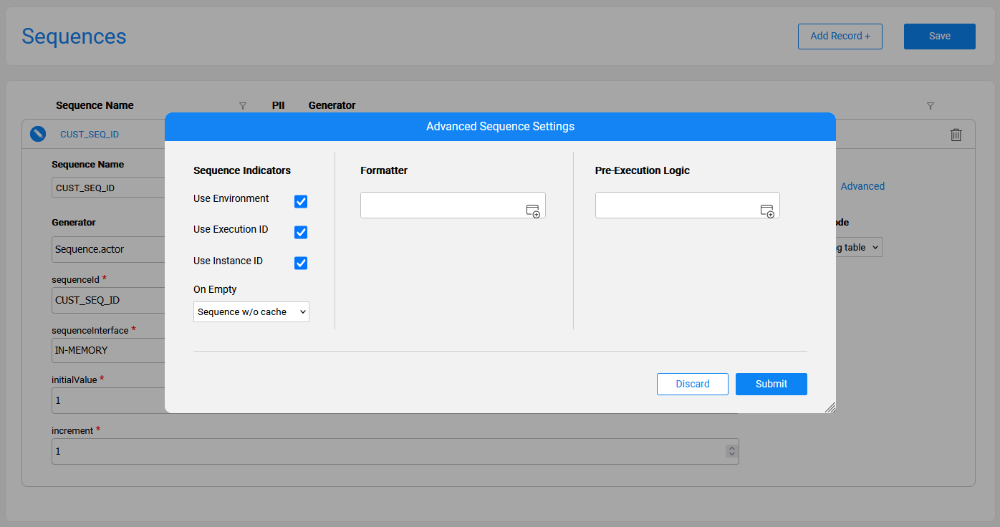

# Catalog Settings

The purpose of the Settings tab in the Catalog application is to enable viewing and editing of various configurations. The Catalog includes product settings that can be updated to accommodate the Project's needs. The updates are saved in the project. 

The Settings tab includes the following sections:

* [Classifier Regex](10_catalog_settings.md#classifier-regex-tab)
* [PII & Masking](10_catalog_settings.md#pii--masking-tab)
* [Sequences](10_catalog_settings.md#sequences-tab), available from Fabric V8.1
* [Discovery Pipeline](13_discovery_pipeline_settings.md), available from Fabric V8.2

## Classifier Regex Tab

The **Classifier Regex** tab allows to view and update the Profiling regular expression rules that are used by the Profiling built-in plugins, *Data Regex Classifier* and *Metadata Regex Classifier*.



The columns of this tab are:

* **Classification** — defines the value of a Classification property added to the Catalog's fields as a result of the Profiling plugins. 

* **Type** — can be either **Field Name** or **Field Value**:
  * Entries defined as **Field Name** type are used by the *Metadata Regex Classifier* plugin.
  * Entries defined as **Field Value** type are used by the *Data Regex Classifier* plugin.
* **Regular Expression** — defines the expression applied on the field, either its name or its value, depending on the **Type**.
* **Score** — defines the confidence level that the current rule is true. 

Each **Classification** can have several definitions, with either the same or different **Types**.

Using this tab, you can either edit existing definitions or add new ones. The Classification value can be either newly entered or selected from the list.

Once the **Save** button is clicked, the **metadata_profiling** and **data_profiling** MTables are updated in Fabric's memory and in the ```Implementation/SharedObjects/Interfaces/Discovery/MTable ```folder of the Project tree.

Click [here](/articles/39_fabric_catalog/plugins/02_classification_plugins.md) for more details about these Profiling plugins.

## PII & Masking Tab

The **PII & Masking** tab allows to view and update the PII and the Catalog-based masking settings of each classification. The PII indicator is used by the *Classification PII Marker* built-in plugin. The Masking setup is used by the Catalog Masking actors as described later in this article.



Each **Classification** in this tab is unique and contains the following attributes:

* **PII** indicates whether the Classification is regarded as Personally Identifiable Information. 
* **Generator** shows which actor or flow is applied by the [Catalog masking mechanism](11_catalog_masking.md) for generating masking values. The Generator runs in one of the following cases:
  - Data masking
  - [Rule-based](/articles/TDM/tdm_implementation/16_tdm_data_generation_implementation.md) synthetic data generation
* **Consistency Mode** sets the definition of consistency, uniqueness and seed for a value that will be generated by the selected Generator. The available values for Consistency Mode are:
  * **Random** (not consistent and not unique)
  * **Consistent using table** (consistent and not unique)
  * **Consistent using seed** (consistent with seed and not unique)
  * **Consistent and unique**

Note that the **Consistent using seed** value is only available when the selected Generator supports seed.

Click [here](/articles/41_masking/02_data_masking_flow.md) for more information about data consistency.

In this tab, each classification can have only one definition (row). Note that you cannot create a sequence (via the Sequence Setup tab) with the same name as a classification listed in this tab, since both classifications and sequences are saved in the same MTable.

#### Masking Setup Guidelines

Click the  icon to expand the Generator and its parameters setup area (PII, Consistency Mode and other [advanced](10_catalog_settings.md#advanced-masking-settings) parameters), that will be used for generating a value. The Generator can be any existing built-in actor, a custom actor, or a flow — created under **Shared Objects** in Fabric Studio.

Upon invocation of a Catalog Masking actor — e.g., during table population — a generated value is populated in a field with a given Classification. For instance, if a field is classified as a Social Security Number, you should set up the Generator to mask it. The Generator can be the built-in RandomSSN.actor, a custom actor, or a flow.



Selecting an actor or a flow dynamically adds its corresponding input parameters underneath it. 

**Guidelines for Creating a Masking Flow**

The first input parameter of a masking flow (or a custom actor) — selected as a Generator — is regarded as the value that should be masked, and not as a masking configuration parameter. Hence, it is hidden (and not dynamically added) when a masking flow is selected in the above Masking setup screen. This is applicable only for an input parameter of Link or External type. 

Therefore, when creating a masking flow, its first input should be named 'value', even if this flow doesn't need to receive any input. This prevents the hiding of the first input from the Masking setup screen as explained above. 

Below is a masking flow sample:




Once the **Save** button is clicked in the **PII & Masking** tab, the **pii_profiling** and **catalog_classification_generators** MTables are updated in Fabric's memory and in the ```Implementation/SharedObjects/Interfaces/Discovery/MTable ```folder of the Project tree.

Click for more details about the [Catalog masking mechanism](11_catalog_masking.md).

#### Advanced Masking Settings

The purpose of the Advanced Masking Settings pop-up window is to allow the setting-up of additional masking parameters. The settings included in this window are:

* **Masking indicators** - determine the masking behavior during a flow run. They can be set either per population via the Catalog Masking Actor's inputs or per Classification via the Advanced Masking Settings screen. The Catalog definition of masking indicators overrides the setting of these indicators on the Catalog Masking Actor - for all the fields with the same Classification.
* **Formatter Name and Parameters** - set in order to enable the [format-preserving masking](/articles/41_masking/03_format_preserving_masking.md).
* **Pre-Execution Logic** - an actor or a flow to be executed by the Catalog Masking Actor. 
* **Property Alias Map** - establish the mapping between the Catalog's property and an input parameter of the attached Masking Actor. These mappings are created to override actor’s input parameters (Generator, Formatter or Pre-execution logic) with the values of Catalog’s field properties, by that to improve the quality of the generated value.



The Advanced Masking Settings are defined per each Classification by using the above pop-up window.

The **Submit** button in this window aggregates the data in the application’s client side until saving is done using the **Save** button in the **PII & Masking** tab. 

Upon clicking the **Save** button in the **PII & Masking** tab, the **pii_profiling** and  **catalog_classification_generators** MTables are updated in Fabric's memory and in the ```Implementation/SharedObjects/Interfaces/Discovery/MTable ```folder of the Project tree.

## Sequences Tab

The **Sequences** tab allows to set up the sequences that can be generated in a project as part of a population or any other flow. This tab doesn't have a product built-in list of sequences as the sequence names and their definitions are usually project-specific. 

To create a sequence: 

* Click the **Add Record +** button and populate a **Sequence Name**, **Generator** and its parameters (PII, Consistency Mode and the [Advanced](10_catalog_settings.md#advanced-sequence-settings) parameters, if needed), that will be used for generating a sequence value. 
* Note that the **Generator** is pre-populated with the [Sequence.actor](/articles/19_Broadway/actors/08_sequence_implementation_guide.md) though it can be updated to any existing built-in actor, a custom actor or a flow (the flow should be created under the project's **Shared Objects**).
* The **sequenceId** parameter of the **Sequence.actor** is populated with the same value that is stated in the **Sequence Name**, when it is typed for the first time. Later, each one of them can be changed to a different value, if needed.



Each sequence can have only one definition (row). Note that you cannot create a classification (via the PII & Masking tab) with the same name as a sequence in this tab.

Currently, the Catalog doesn’t automatically identify the sequence fields. Thus, after a list of sequences has been set in the **Sequences** tab, the relevant Catalog fields should be manually marked as sequences, as follows:

* Click **Actions > Edit Catalog**.
* Navigate to the required field and click the  icon to add a new property. 
  * Select or type *sequenceName* as the property name.
  * In the property value, select the name of the sequence that was set up via the Sequences tab. 



#### Advanced Sequence Settings

The purpose of the Advanced Sequence Settings pop-up window is to set up additional sequence parameters; it is very similar to the Advanced Masking Settings pop-up window. 



Upon clicking the **Save** button in the **Classifier Sequence Setup** tab, the **pii_profiling** and **catalog_classification_generators** MTables are updated in Fabric's memory and in the ```Implementation/SharedObjects/Interfaces/Discovery/MTable ```folder of the Project tree.

The sequences are saved in the **catalog_classification_generators** MTable (same location as the masking classifications), with the following differences:

* The category of masking classifications is **enable_masking**.
* The category of non-PII sequences is **enable_sequence**.
* The category of PII-sequences is **enable_masking_uniqueness**.


[](08_search_catalog.md)[](11_catalog_masking.md) 

