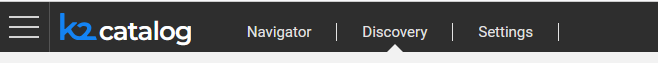
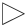
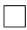
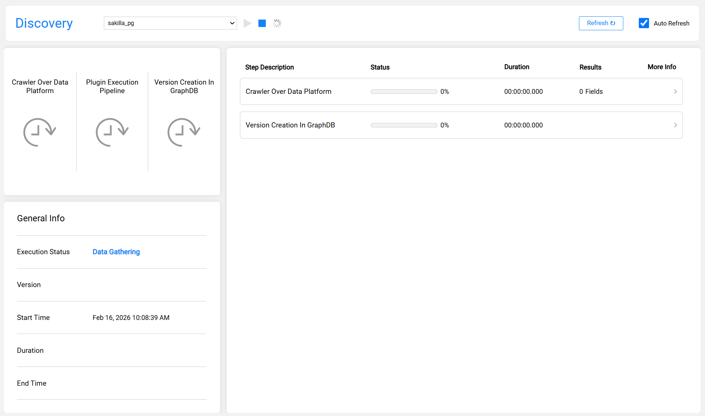
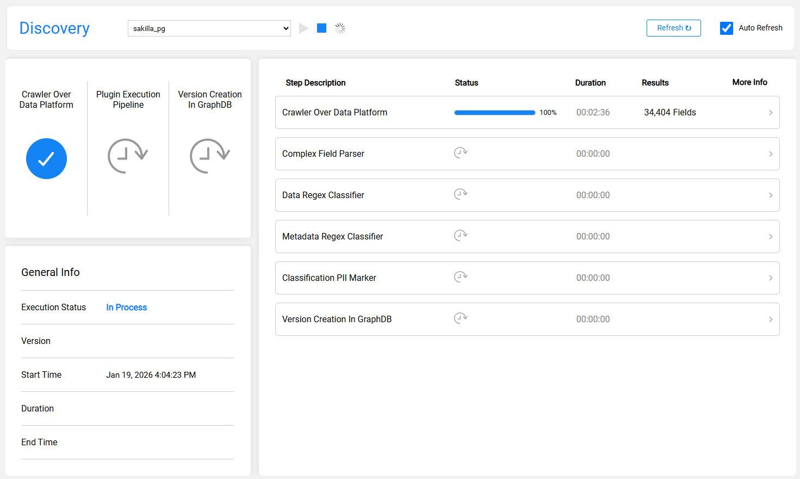
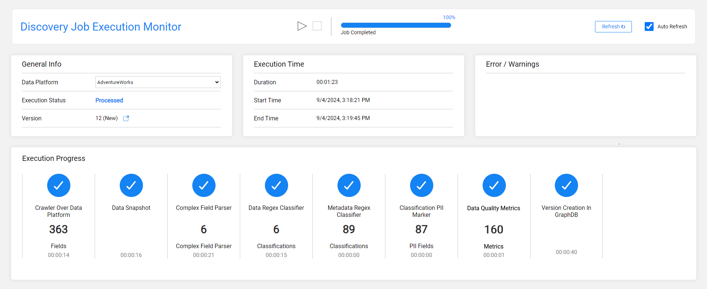
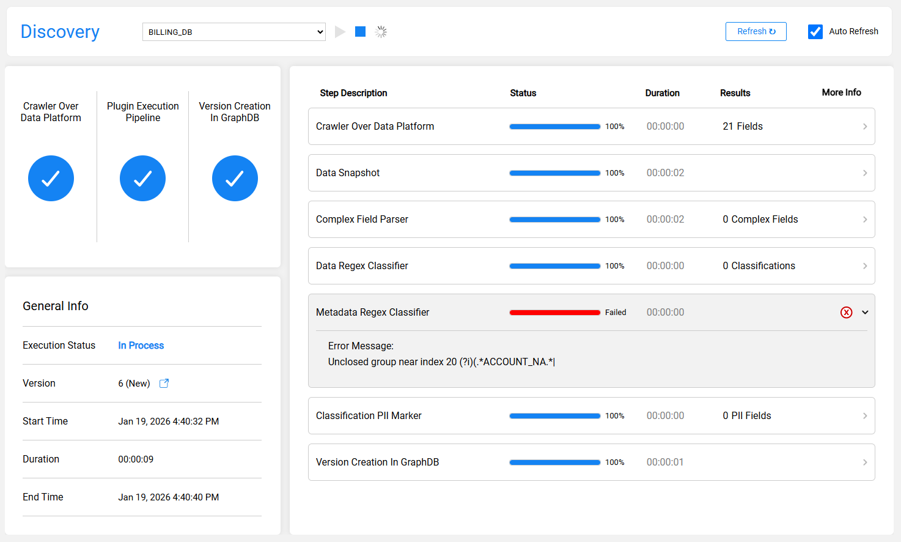
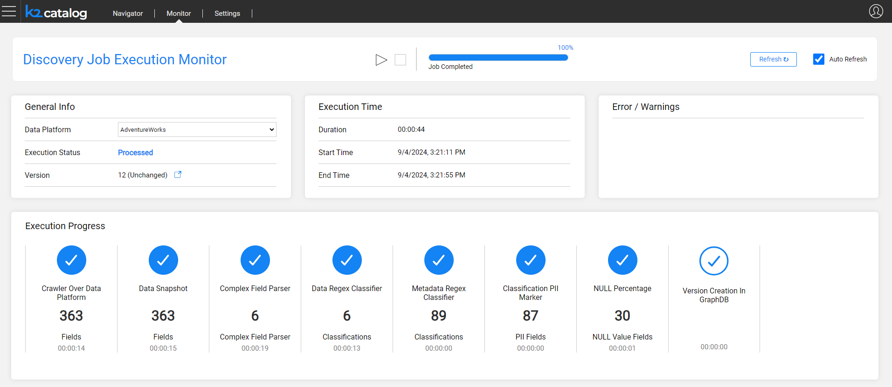

# Discovery Execution Monitor

The purpose of the Discovery execution monitor is to track the Discovery progress. The monitoring provides valuable insights that can help to follow-up the job execution, displaying the progress per each step. 

Click Discovery in the top Catalog navigation bar to open the monitor:

The monitor is split into the following areas:

* The Data Platform selection drop-down together with **Run**  and **Stop**  icons are located at the top of the Monitor screen. The monitor enables starting the job execution for the selected Data Platform, and stopping the job, when it is in progress.
  * The monitor shows the last execution for the selected Data Platform, either throughout its progress or when completed.
* The **General Info** area shows the job's start time and its duration, execution status and the version. If the job has been completed, the end time is displayed as well. 
* The monitor's main area shows the Discovery steps progress, including the completion percentage of each step and the number of elements found.
  * The steps displayed in this area are dynamic, and they depend on the job configuration. The disabled plugins are not displayed.
  * Each step has an indication whether it is in progress, not started, completed or failed. 
  * Upon completion of the job, the monitor displays the version number and indicates whether a new version has been created or not.

The monitor displays the execution progress by using various icons, as follows:

* The following image shows that the job is gathering the source data in order to start the crawler:

  

* The following image shows that the job is currently running:

  

* The following image shows that the job has been completed and a new version was created: 

  

* The following image shows that the job has been completed while one of the plugins failed:

  

* The following image shows that the job has been completed without creating a new version:

  

 

