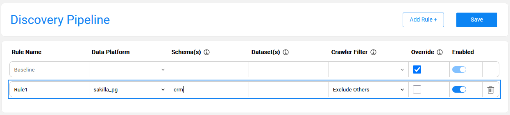
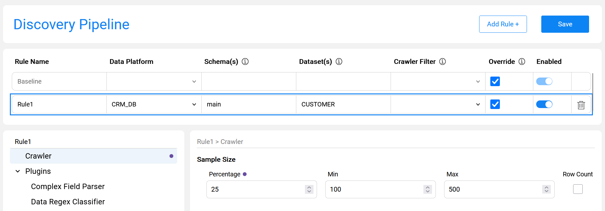
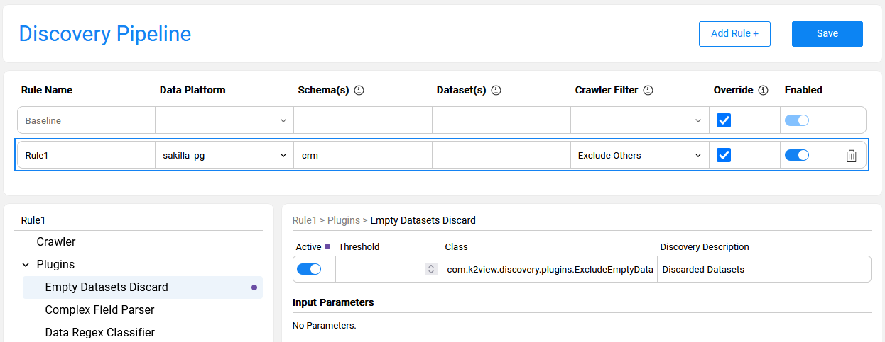
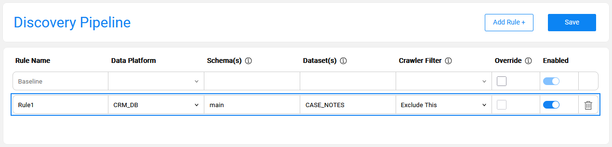
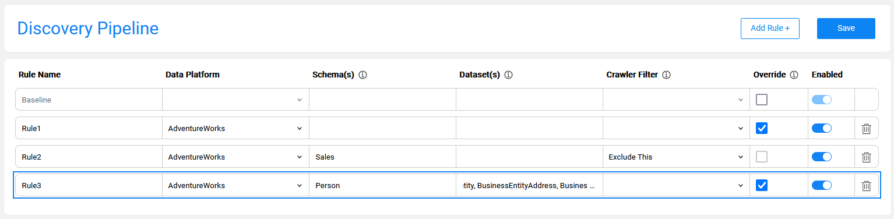

# Discovery Pipeline Settings

## Overview

The **Discovery Pipeline** window in the Catalog Settings tab provides a full and comprehensive view of the Discovery job configuration. It displays the product's default baseline configuration (retrieved from the product's plugins.discovery file) and the project-level rules. 

The Baseline rule includes a list of the product's built-in plugins with their input parameters, data snapshot sample size and more. 

The Discovery Pipeline window enables performing the following actions, described further in this article:

* Overriding the product's default [Baseline rule](13_discovery_pipeline_settings.md#baseline-rule).
* Creating [project rules](13_discovery_pipeline_settings.md#project-rule) to set a crawler filter and/or override the crawler and/or plugins' settings.
* [Adding new plugins](13_discovery_pipeline_settings.md#adding-new-plugins) to the pipeline.


The overrides are saved in the project **pluginsOverride.discovery** file, which is created in the Project's ```Implementation/SharedObjects/Interfaces/Discovery/``` folder.

This article describes the capabilities of the Discovery Pipeline window and explains how they can impact the Discovery job. 

## Baseline Rule

The **Baseline** rule is a default configuration, applied when running the Discovery job on any data platform. It includes a sample size definition, a global schema exclude list and a list of product plugins with their settings.

The Baseline rule is always enabled. It can be edited by checking the **Override** checkbox. The following changes can be applied to the Baseline rule:

* Updating the Crawler-related settings, e.g., a sample size. 
* Updating the parameters of the product's built-in plugins. 
* [Adding a new plugins](13_discovery_pipeline_settings.md#adding-new-plugins) — described further in this article. 

Note that the Baseline rule overrides are automatically propagated to the project-level rules. For example, when a plugin is changed from 'inactive' to 'active' in the baseline, it will become 'active' in all project-level rules. A project rule, however, can override the Baseline rule.

#### Revert Baseline Overrides

The Baseline rule overrides can be reverted by one of the following ways:


1. Unchecking the **Override** checkbox on the Baseline rule to remove all overrides at once.
2. Clicking the **revert** icon at the lower-left pane of the window to reset the plugin order to its original sequence.
3. Clicking the **revert** icon at the lower-right pane of the window to reset the plugin's current settings back to the baseline.
   * Note that reverting to the baseline would delete project-level plugins as they are not part of the baseline.

## Project Rules

The Discovery Pipeline window enables the user to refine the default configuration per the project's requirements. 

A rule should be attached to a data platform, along with several other parameters that may become mandatory, based on conditions. Mandatory and optional parameters of each rule type are described further in this article. 

#### How Do I Create a Rule?


* Click on '**Add Rule +**' to create a new rule. 
  * Starting from Fabric V8.3.1, a new rule is added with **Crawler Filter** parameter set by default to '**Exclude Others**'. This value can be updated to any other value if needed. 
* Rules may be of three types:
  * For filter rule creation, set either '**Exclude Others**' or '**Exclude This**' in the **Crawler Filter** column. In this case, the **Data Platform** and **Schema(s)** fields are mandatory, while the Dataset field is optional.
  * For override rule creation, the only mandatory actions are selecting a **Data Platform** and checking the **Override** checkbox. This rule will apply to the entire Data Platform. Populating the Schema(s) and Dataset(s) fields will make this rule more specific.

  * For creating a combined rule, which includes both a filter and the overrides, set **Crawler Filter** = **'Exclude Others'** and check the **Override** checkbox.


#### Rule Type: 'Exclude Others'

The purpose of this rule type is to limit the Discovery process to the specified source entities. 

- The rule requires selecting a data platform and populating at least one schema that will be included in the discovery. 
- The Crawler Filter should be set to 'Exclude Others'.
- Optionally, dataset(s) can be populated as well on the rule. When one or multiple datasets are populated, only these datasets will be included, while all other dataset(s) will be excluded.
- This rule can be combined with an override action (as explained further in this article).  

**Example**

The below image presents a rule defined for **sakilla_pg** data platform and **crm** schema. The purpose of this rule is to limit the Discovery process to **crm** schema only, since **sakilla_pg** includes multiple schemas that are irrelevant for the current run.



#### Rule Type: 'No Filter' & Override

The purpose of this rule type is to override one or multiple baseline settings without filtering the data source.

* The rule requires selecting a data platform and checking the Override checkbox.
* The Crawler Filter should be set to 'No Filter' as the discovery should be executed on the entire data platform.


* Note that when the schema(s) and dataset(s) fields are populated, the override rules are applied only to them. This type of rule has no filter effect.  

**Example**

The below image presents an override rule defined for the **CUSTOMER** table of the **CRM_DB** data platform and **main** schema. 

The purpose of this rule is to override the Sample Size definition, increasing it to 25% (instead of the default 10% setting). This override is only applicable for the specified dataset - CUSTOMER. The discovery is executed on the whole CRM_DB data platform without any filter.




#### Rule Type: 'Exclude Others' & Override

The purpose of this rule type is to limit the Discovery process to the specified source entities and at the same time to override some of the baseline settings.

- The rule requires selecting a data platform and populating at least one schema that will be included in the discovery. 
- The Crawler Filter should be set to 'Exclude Others' and check an Override checkbox.
- Optionally, dataset(s) can be populated as well on the rule. When one or multiple datasets are populated, only these datasets will be included while all other dataset(s) will be excluded.

**Example**

The below image presents a rule defined for **sakilla_pg** data platform and **crm** schema. The purpose of this rule is to limit the Discovery process to **crm** schema only, since **sakilla_pg** includes multiple schemas irrelevant for the current run. In addition to the filter, the rule also defines a baseline override - by setting one of inactive plugins to active.



#### Rule Type: 'Exclude This'

The purpose of this rule type is to exclude specified source entities during the Crawler run. 

- The rule requires to select a data platform and populate at least one schema. 
- When one or multiple datasets are populated, these dataset(s) will be excluded.


- This rule cannot be combined with the override action, as the Crawler excludes the specified nodes.

**Example**

The below image presents a rule that excludes the **CASE_NOTES** table of **CRM_DB** data platform and **main** schema from the Discovery process. It means that discovery run on all **CRM_DB** tables, except for **CASE_NOTES**.



#### Rules Combination and Hierarchy

Multiple rules can be defined for the same data platform. The purpose of creating multiple rules is to allow variations of the Discovery process execution for different elements. For example, one may need to set a larger sample size for some datasets or execute a specific plugin on a designated dataset or schema. 

When multiple rules are defined for the same data platform, they adhere to the following hierarchy: 

- When multiple rules apply on the same process element, the most specific one takes priority. 

**Example of rule combinations and hierarchy**

The below image presents three rules defined for the **AdventureWorks** data platform:



- **Rule1** defines one or more overrides applied on all elements of the AdventureWorks. 
- **Rule2** defines a filter on Sales schema. This rule implies that the Sales schema is excluded from the Crawler on the AdventureWorks. 
- **Rule3** defines an override that applies only to the specified datasets of the Person schema. This means that for this dataset, only the plugins defined in **Rule3** are applied. Having the most specific criteria, this rule takes priority.

## Adding New Plugins

When a new plugin is created in a project, it should be added to the Baseline rule in order to be included in the Discovery job execution. Once added to the baseline, the new plugin is automatically propagated to all existing rules and can have different settings in each.

For example, if a newly created plugin is applicable only to running Discovery on the CRM_DB, it should be added to the baseline as 'inactive'. Then, a rule for the CRM_DB should be created, where this plugin is set to 'active'.

The steps for adding a new plugin to the pipeline are:

1. Check the *Override* checkbox of the Baseline rule.
2. Click the  icon to open the Plugins context menu and choose **Add Plugin**.
3. Alternatively, you can select an existing plugin from the list and choose **Duplicate selected** from the context menu. Once the plugin has been duplicated, you can update all its parameters. 


The new plugin is always added to the end of the Plugins list. However, the plugin's execution order can be changed by dragging it to the desired position within the list.  

Note that the **Delete selected** option in the context menu is available only for the project plugins as product plugins cannot be deleted. If a product plugin is not needed, it can be set to 'inactive' in the Baseline rule.
