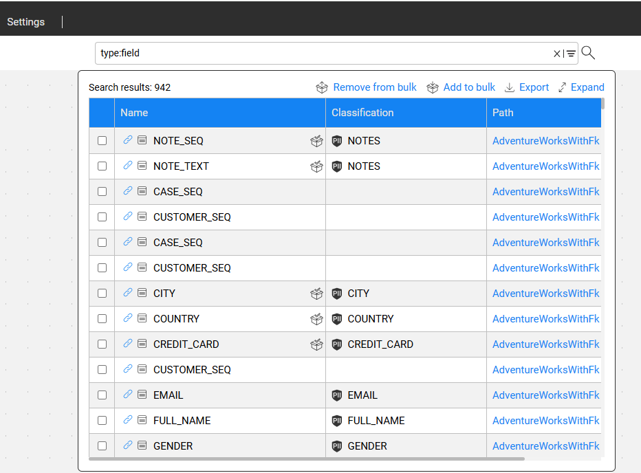
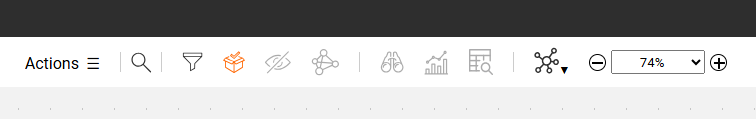
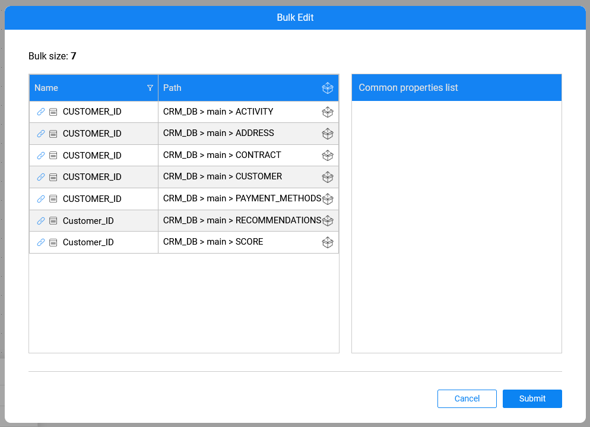

# Bulk Creation of Catalog Entities 

### Overview

Manual update of multiple Catalog entities can be time-consuming and error-prone, especially when applying the same change — such as adding a new property — to many entities. Starting from Fabric V8.3, the Catalog includes **Bulk Creation and Edit** capabilities for improving efficiency and usability of manual procedures.

**Why Should I Create a Bulk of Entities?**

- For adding a new property to several entities simultaneously.
- For updating or removing an existing property from multiple entities.

This capability streamlines tasks that are often performed by database administrators or managers who need to make large-scale changes easily and consistently.

This article explains how to create and view a bulk of entities. Click [here](14_2_bulk_edit.md) to learn how properties can be bulk-edited.

### How Can I Add Entities to a Bulk Group?

1. Search for the nodes (e.g., Catalog fields) using the [Catalog search](08_search_catalog.md).
2. Select the required nodes and click on the  **Add to bulk** icon. 
3. Once the entity has been added to the bulk, the  icon appears next to it (in the Name column of the Search results screen), indicating that the entity is now part of the bulk.

### How Can I View Entities in a Bulk Group?

To view entities in a bulk group, click the  icon on the menu bar:

* The icon is black when the bulk is empty.
* An orange icon indicates that the bulk includes one or more entities.

When the Catalog is in Edit mode, editing via the Bulk Edit screen is enabled. However, when the Catalog is in non-Edit mode, only viewing the bulk and removing entities from it is possible; properties cannot be modified in this mode. 

The **Common properties list** displays only the properties that are shared across all bulk-selected entities. If a property's values differ across the bulk-selected entities, only its name is displayed — without a value.

Click [here](14_2_bulk_edit.md) to learn how to bulk-edit properties.
