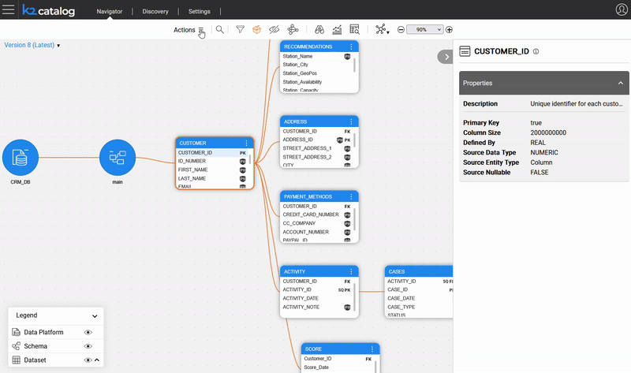

# Bulk Edit of Catalog Entities

### Overview

Manual update of multiple Catalog entities is often slow and prone to errors, especially when the same change must be applied to many of them. Starting from Fabric V8.3, the Catalog includes **Bulk Creation and Edit** capabilities for improving efficiency and usability of manual procedures.

**Why Should I Bulk-Edit Entities?**

- For simultaneous editing, adding or deleting of multiple entities.

This capability streamlines tasks often performed by database administrators or managers that need to make large-scale changes with consistency and ease.

This article explains how to edit properties in bulk. Click [here](14_1_bulk_creation.md) to learn how to create and view bulk.

### How Can I Edit a Bulk?

1. To start the manual overrides, click **Actions > Edit Catalog** in the menu bar.  
2. Then click the  icon on the menu bar to view the bulk.
3. To **add** a new property:
   * Click the  icon and populate the **Name**, **Value** and **Notes** fields in the **Edit property** area. 
   * Then click the  icon to add the new property to the **Common properties list**.
4. To **delete** a property, click the  icon.
5. To **edit** an existing property:
   * Click the property in the Common properties list and update its **Value** and **Notes** fields. 
   * Then click the  icon to add it to the **Common properties list**.
6. Click **Submit** when bulk edit is completed.

Note that all updates are aggregated on the client side only. The **Save** button should be clicked in the menu bar to trigger saving of all the changes together and creation of a new version. The Catalog will then exit the edit mode.

