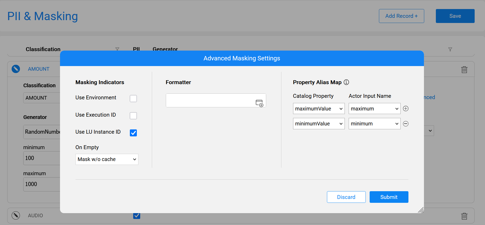
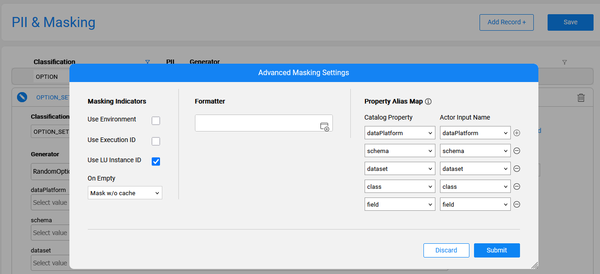

# Overriding Masking Actor Inputs

### Overview

The [PII & Masking tab](10_catalog_settings.md#pii--masking-tab) of the Catalog Settings window allows to view and update the Catalog-based masking settings for each classification. The masking settings include, among other configurations, the Generator (actor or flow) responsible for generating the masked values. 

Starting from Fabric V8.3.1, it is possible to override the Generator's input parameters with values of the Catalog-calculated metrics. The purpose of this capability is to improve the quality of generated data by using data snapshot values retrieved from the source system during the Discovery process.

This cross-system capability is based on several Fabric features. The following article includes user stories that illustrate how to properly utilize the override during the masking or synthetic data generation process.  

The solution is generic and not limited to the specific user stories presented below.

### User Story 1: Improving the generation of random numeric values

Suppose that a numeric field contains a value that should be masked. The default Generator for masking numeric fields is ```RandomNumber.actor```, which is assigned to various classifications in the Catalog's PII & Masking tab. This actor generates a random number in the range defined by the input parameters — ```minimum``` and ```maximum```. The default values of these parameters are set for each classification. 

It is required that the generated random values be significantly closer to the actual field values in the data source. 

The below steps describe how to generate a random value in a range that is derived from the field's calculated properties rather than on the default values:

1. Set the **Data Quality Metrics** plugin to 'active' in the **Catalog Settings > Discovery Pipeline** window and run Discovery on the required interface. 

2. Perform the **Build Artifacts** action and validate that ```minimumValue``` and ```maximumValue``` metrics were created for the Catalog fields. 

3. Find which **classification** is assigned to the fields with calculated metrics.

4. Then, in the **Catalog Settings > PII & Masking** tab, open the relevant classifications and click the **Advanced** link to set up the **Property Alias Map** between the generator's inputs and the Catalog's calculated properties: 

   


Once this alias map is set, the values of the Catalog field properties are used during the **masking** or **synthetic data generation** process. 

### User Story 2: Improving the generation of values from distinct list

Suppose there is a field, whose value is taken from a predefined list. For example, a 'status' field usually includes values such as *New*, *Open*, *Pending*, *In progress*, *Resolved* or *Closed*. 

When generating a value for such field, it is required to randomly select one of the existing values from the data sample rather than generating a random string. This approach ensures the generated output is closely aligned with the data sample values in this field.

The below steps describe how to generate a random value derived from the field's list of possible values:

1. Activate the **Option Set Analyzer** plugin in the **Catalog Settings > Discovery Pipeline** window and run Discovery on the interface. 
2. Perform the **Build Artifacts** action and validate which Catalog fields include the property ```classification = OPTION_SET```. These fields were identified as containing a predefined list of possible values based on the data sample. 
3. Validate that the ```catalog_field_option_set___<data platform>_<schema>_main.csv``` file was created and that it includes field names along with their distinct values identified in the data sample.
4. In the **Catalog Settings > PII & Masking** tab, validate that the **OPTION_SET** classification exists and that it includes the **RandomOptionSet.actor** generator. Click the **Advanced** link to view the predefined alias map connecting the Generator's inputs and the Catalog's calculated properties, as shown below.
   * If the alias map is not set, create it based on the below image:



Once this alias map is set, the values of the Option Set field are used during **masking** or **synthetic data generation** process. 
