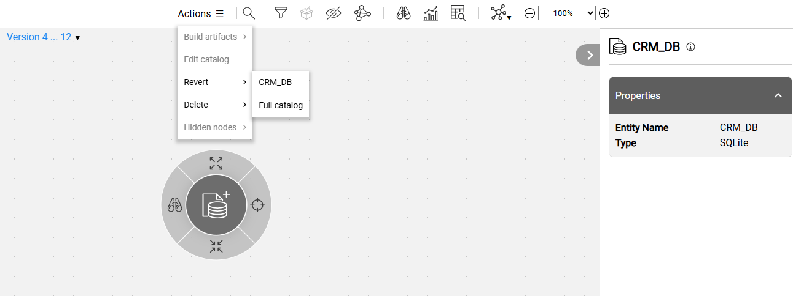
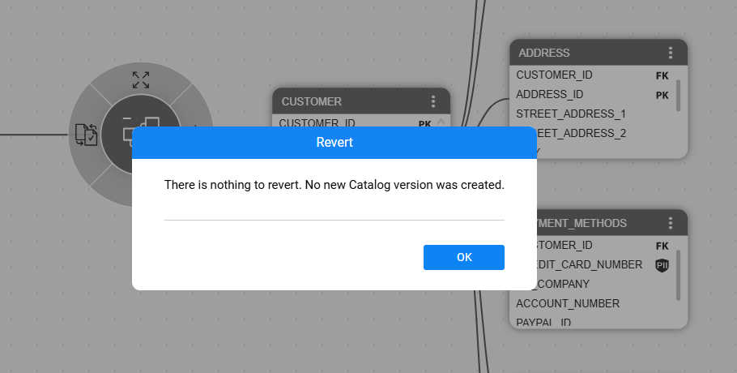

# Revert Catalog Version

### Overview

K2view's Catalog supports [versioning](06_catalog_versioning.md), allowing a new Catalog version to be created in the Neo4j Graph DB whenever the Discovery process identifies differences from the previous version.

If these changes are found to be incorrect or irrelevant - perhaps due to an imprecise regular expression - the user may wish to revert to a previous Catalog version.

The Catalog allows reverting from the latest version to any earlier version. The revert can be applied to a selected data platform or the entire catalog, and it generates a new Catalog version. This capability is available starting from Fabric V8.4.

### How Can I Initiate Revert?

To initiate the revert, start from switching to the Catalog's comparison mode by clicking the comparison  icon in the version drop-down list. You can then choose to revert either the selected (or expanded) data platform or the entire Catalog.

The revert begins once the user confirms the action.

When the revert is completed successfully, a new Catalog version is created. 

If there are no differences between the selected versions, the user is notified, and a new version is not created:

