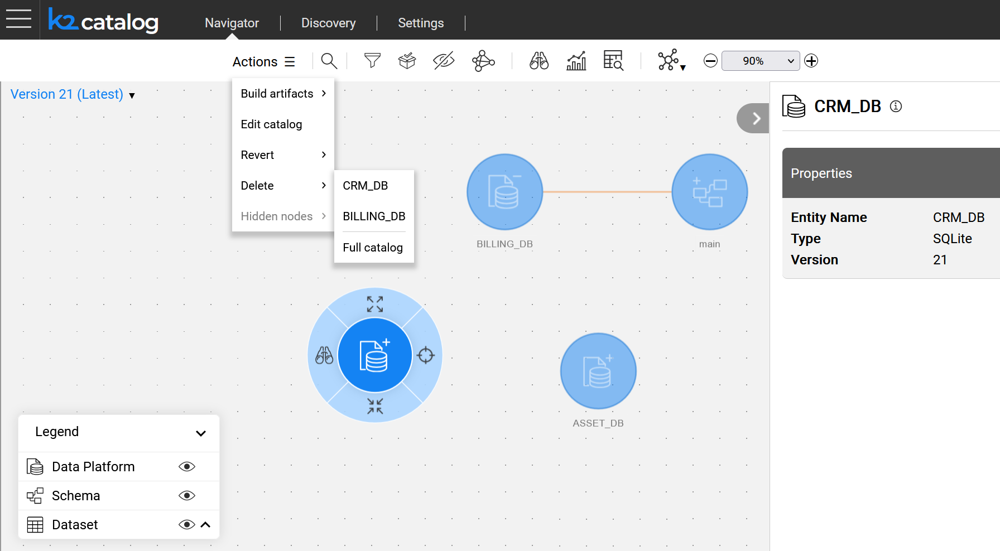
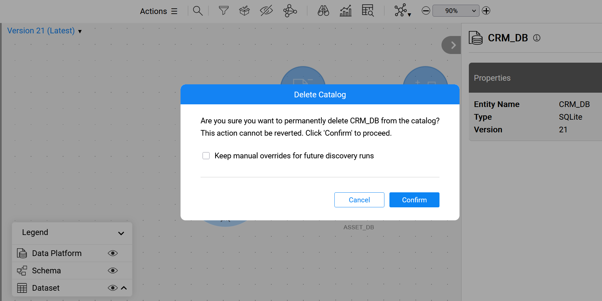

# Delete Catalog

### Overview

K2view's Catalog supports [versioning](06_catalog_versioning.md) by creating a new Catalog version in the Neo4j Graph DB whenever the Discovery process detects differences from the previous version, either due to source changes or configuration updates.

During the Catalog lifecycle some data platforms may become irrelevant or obsolete. The Catalog provides the following cleanup options:

* **Delete the entire Catalog**: This removes all data from Neo4j Graph DB.
* **Delete the selected data platform**: This removes only the specified data platform only. Note that it this case, some versions may contain no data. This feature is available starting from Fabric V8.4.

### How Can I Initiate Delete?

To initiate a delete, click **Actions > Delete** in the menu bar. You can choose to delete either the selected (or expanded) data platform or the entire Catalog.

The delete process begins once the user confirms the action.

Two delete options are available:

* Removing manual overrides as part of the delete (default).
* Keeping manual overrides for future discovery runs.

To keep the manual overrides, select the checkbox in the confirmation message. The overrides will remain in the Neo4j Graph DB and will be reapplied to the data platform during the next discovery run.