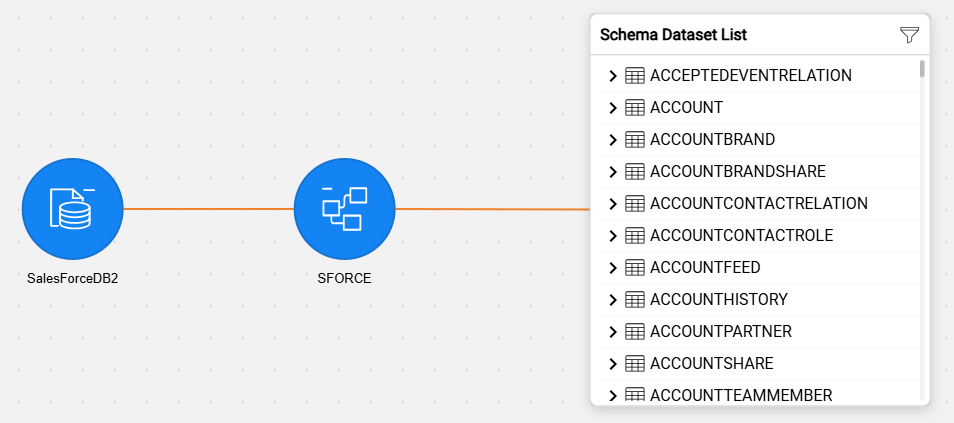
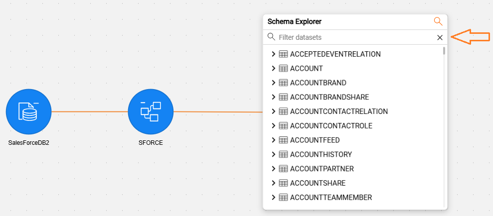
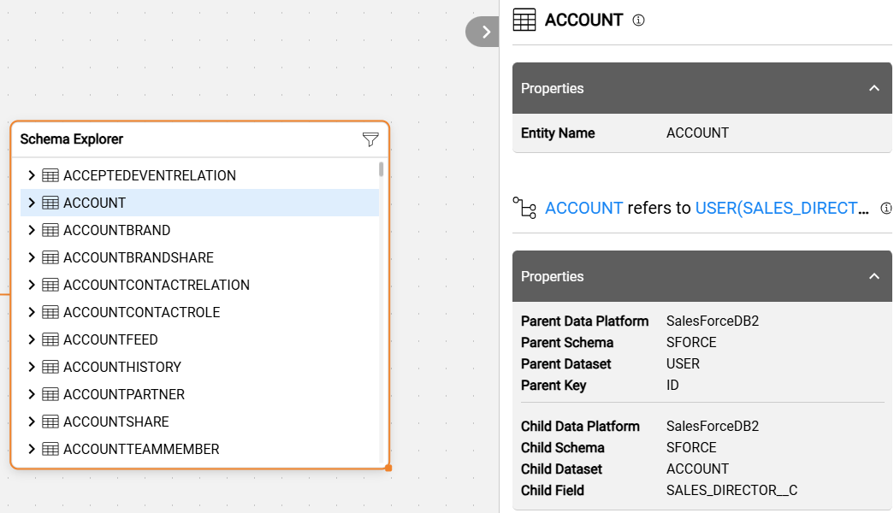
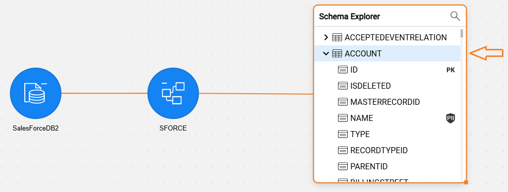
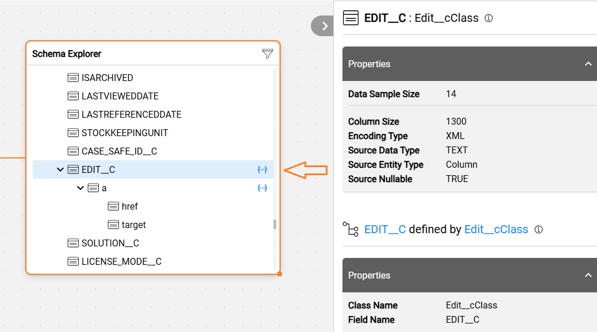
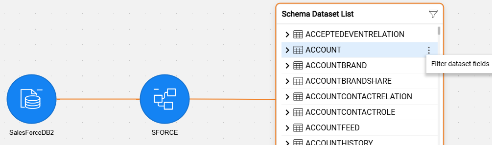
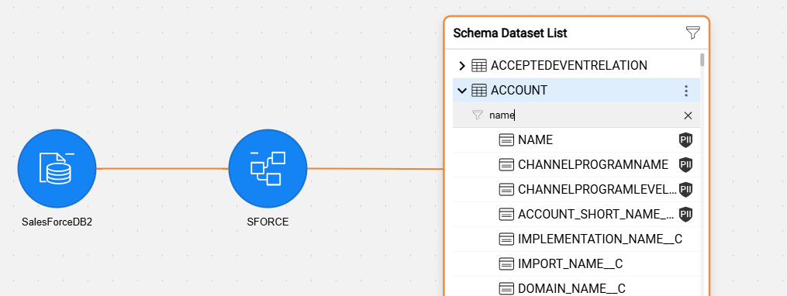
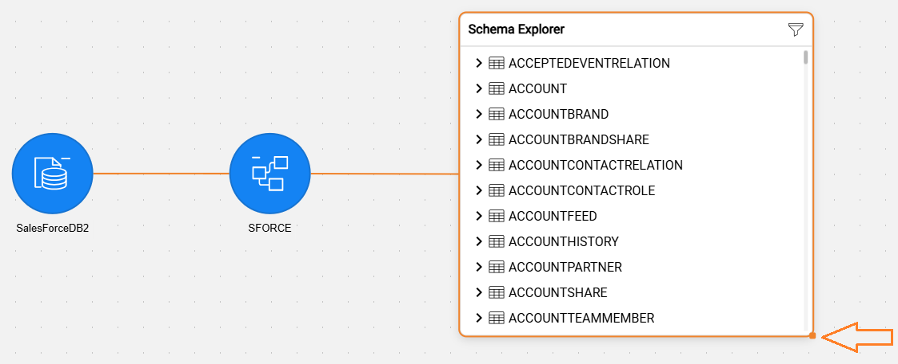
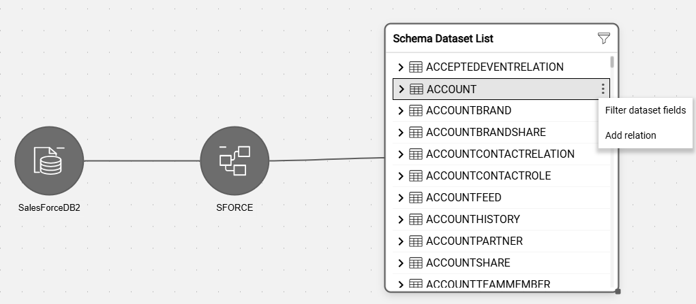

# Large Schema Navigation

### Overview

The Catalog Navigator's main area enables navigation between different hierarchy levels by expanding and collapsing Catalog nodes. While the number of schemas under a data platform is typically low (usually in the tens), there might be thousands of datasets and foreign key relations under each schema. Given that each dataset may include hundreds of fields and each field has multiple properties, the total volume of data per schema can be significant.

All of the above makes navigating a large schema quite challenging, for the following reasons:

* Expanding the schema in the Catalog App requires retrieving a large amount of data from the server to the client and then rendering it on the client side. This process may become unresponsive and cause the browser to crash.
* Even if the schema eventually expands without crashing the browser, navigating a large schema is very difficult since the zoom level must be reduced significantly to see the full schema.

To improve the user experience when working with large schemas, Catalog introduces the Schema Dataset List view. 

This view displays the datasets in a list instead of the tree view, significantly reducing the time needed to render nodes in the UI. The list view is displayed automatically upon expanding a schema whose size exceeds any of the predefined thresholds (as explained further in this article); otherwise, the tree view is displayed.

This feature is available starting from Fabric V8.5. 

### Schema Dataset List View

Datasets are presented in a Schema Dataset List instead of the tree view for large schemas only. A schema is considered large if it meets any of the following thresholds: 

* Total number of datasets > 100, or
* Total fields > 5000, or
* Total relations > 500

When the discovery process scans the data source, the total number of datasets is calculated for each schema, along with two other properties - total fields and total relations. Then, upon expansion of the schema, these calculated properties are compared against predefined thresholds to determine whether to open the standard tree view or the list view.

The default thresholds are defined by the `"largeSchemaThreshold"` tag of the **properties-info.json** and can be updated per project needs as explained [here](/articles/39_fabric_catalog/21_advanced_settings.md#catalog-application-configuration).

### Schema Dataset List Actions

The following actions are available in the Schema Dataset List view:

* **Filter datasets** - to limit the displayed dataset list:

  * **Click**  in the upper-right corner and start typing the required string. The list of datasets is then limited to those that contain the typed string. Click **X** to clear the filter.
  * The filter helps users quickly find the required dataset without scrolling through a long list.

  

* **View dataset properties and the *refersTo* relations**:

  * Click the dataset name in the Schema Dataset List to open the Properties tab that displays the *refersTo* relations between the selected and other datasets. The related dataset names are clickable hyperlinks. Clicking on each of them allows you to jump to the relevant dataset.

  

* **View dataset fields with their properties**: 

  * Click the  icon to expand the fields list in the Schema Dataset List view. Then, clicking on any of the fields in the list displays the field's properties.

  

  * **Complex fields** can also be expanded within the Schema Dataset List view:

  

* **Filter fields** - to limit the displayed fields of the selected dataset:

  * Click thecontext menu icon (visible when a dataset is selected) and click **Filter dataset fields** to trigger the expansion of the dataset fields.

  

  * Once the dataset fields are expanded, type the required string. The list of fields is then limited to those that contain the typed string. Click **X** to clear the filter.

  

* **Resize the list view** by dragging the orange dot in the lower-right corner of the Schema Dataset List. This is useful when some datasets have long names that don't fit within the default width.

  

* **Add relation** to another dataset (available in Edit mode only):

  * Switch to **Edit catalog** mode and go to the required dataset.
  * Click thecontext menu icon (visible when a dataset is selected), then click **Add relation**.
  * A popup opens, allowing you to define the required *refersTo* relation.

  
