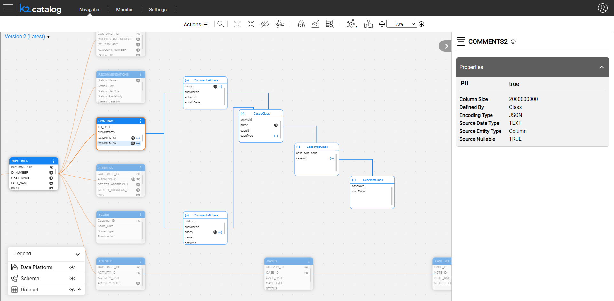

# Complex Field Parsing

Starting V8.0, the Catalog supports parsing of text fields which include complex structures (JSON or XML) using a **Complex Field Parser** plugin. 

The plugins uses the data snapshot taken from the source. When the plugin identifies a complex structure embedded into a field, a node type **class** is created for each complex field level, recursively for all levels of the embedded complex structure. The parsing logic is as follows:

* If the same complex field includes different structures within the data snapshot, these structures  are combined as the fields of the same class.
* If the same field includes structures (e.g. JSON) and regular strings, the parsing is not performed.

A **definedBy** relation type is created to connect between a complex field and its respective class. This relation cannot be added or deleted in the Edit mode. 

Once the complex field is parsed and the class nodes are created, it undergoes the auto-profiling using the same profiling rules as all other Catalog fields. 

The profiling is performed by the **Data Regex Classifier** and **Metadata Regex Classifier** plugins which create the Classification property for the fields of newly created classes. Then the **Classification PII Marker** plugin creates the PII property where applicable. When at least one of the fields of the complex field is marked as PII, the complex field itself is marked as PII.

 
