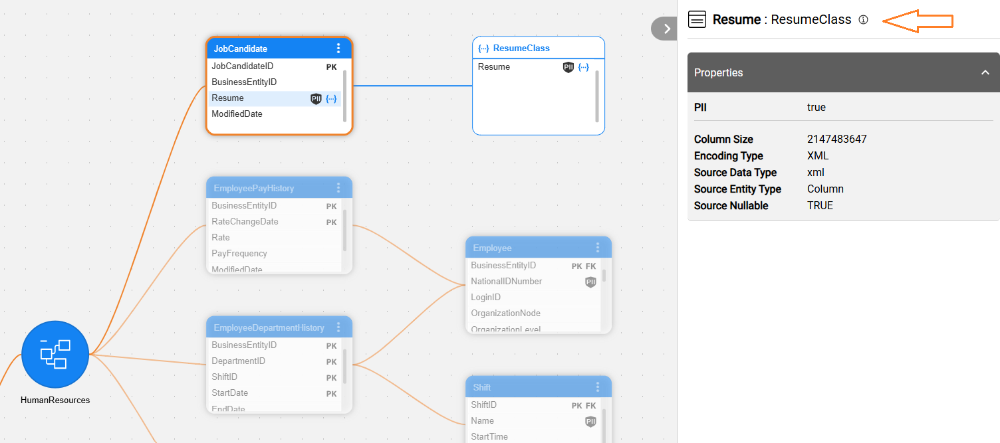
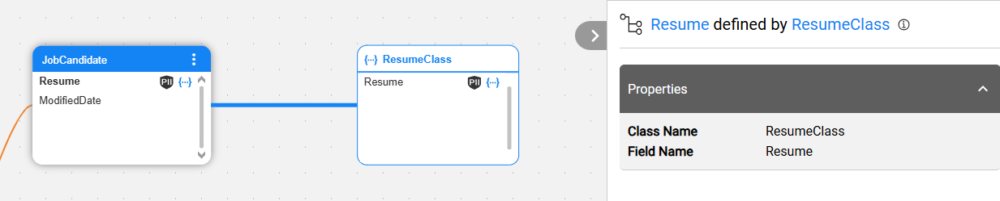

# Complex Field Parsing

Fabric's Catalog supports parsing of text fields that include complex structures (JSON or XML). The **Complex Field Parser** plugin handles this, using the data snapshot taken from the source. Starting from V8.1, the plugin also supports parsing of BLOB, CLOB and VarBinary fields.

When the plugin identifies a complex structure embedded in a field, a **Class** node is created to represent this object. Its structure is parsed recursively and a **Class** is created for each level of the complex structure. The lowest levels include fields that represent primitive values.

The complex field's `definedBy` property is set to the **Class** name. When a field includes an array of complex structures (array of objects), its `definedBy` property is set to `Collection (<class name>)`. Arrays of arrays are also supported.

The following parsing rules apply:

* If the same field includes different complex structures within the data snapshot, these structures are combined as fields of the same class.
* If the same field includes complex structures (e.g., JSON) as well as regular strings, the parsing is not performed.

In addition to the `definedBy` field property, the **definedBy** relation type links a complex field to the **Class** node that defines its structure. This relation cannot be manually overridden in Edit mode.

The plugin is completed by parsing all complex structures. If the profiling plugins are activated, all fields of the complex structure undergo the auto-profiling process - just like any regular fields. 

The profiling is performed using the profiling plugins that create the Classification property for the fields of newly created classes. The [Classification PII Marker](02_classification_plugins.md#classification-pii-marker) then creates the PII property where applicable. When at least one field within the complex field is marked as PII, the complex field itself is also marked as PII.
