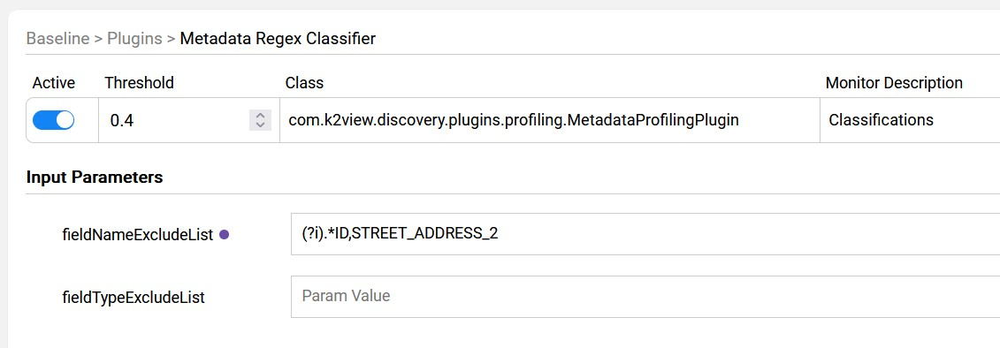
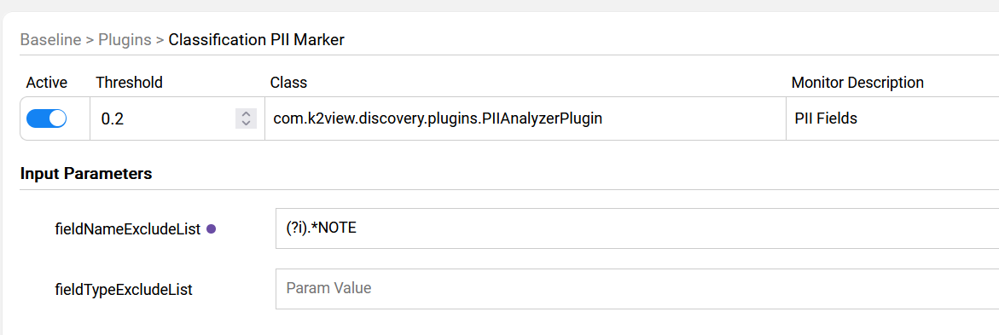

# Regex-Based Profiling

### Overview

The following article describes basic classification plugins included in the Catalog solution:

* [Data Regex Classifier](02_classification_plugins.md#data-regex-classifier) - classify the source fields based on their data (field value). 
* [Metadata Regex Classifier](02_classification_plugins.md#metadata-regex-classifier) - classify the source fields based on their metadata (field name).
* [Classification PII Marker](02_classification_plugins.md#classification-pii-marker) - create the ```PII=true``` property on Catalog fields, as based on their classification.

### Data Regex Classifier

The purpose of **Data Regex Classifier** plugin is to classify the source fields based on their data - field value. This classification helps to identify which Catalog entities store sensitive information and should therefore be masked. 

This plugin runs on a data snapshot that is extracted from the source, and it executes the regular expressions defined in a built-in **data_profiling** MTable.

If a regular expression (known as regex) matches the field's data, a Classification property is added to the field with a value corresponding to the matching regex (e.g., EMAIL). If a match is found for more than one expression, the property is created with the Classification that got a higher calculated score. 

To update the data profiling rules, go to the [Catalog Settings > Classifier Regex tab](../10_catalog_settings.md#classifier-regex-tab).

**Example:**

The below regular expression ```\b(?:\d[ -]*?){13,16}\b``` is executed on the field's values:


When the expression matches a field's value, the probability that this field holds a credit card number is 0.8. Thus, in case of a match, the score is 0.8 and when there is no match, the score is 0. The expression is executed on all values on the given column in the data sample and the average score is calculated. Then, the calculated average score is compared with the plugin's threshold as explained earlier in this article. If the calculated average score is above the threshold, the Classification = CREDIT_CARD property is added to the field.

### Metadata Regex Classifier

The purpose of **Metadata Regex Classifier** plugin is to classify the source fields based on their metadata - field name. 

The matching rules are defined using regular expressions in a built-in **metadata_profiling** MTable. 

If a regular expression (known as regex) matches the field's name, a Classification property is added to the field with a value corresponding to the matching regex (e.g., SOCIAL_SECURITY_NUMBER). If a match is found for more than one expression, the property is created with the Classification that has the highest score.


To update the metadata profiling rules, go to the [Catalog Settings > Classifier Regex tab](../10_catalog_settings.md#classifier-regex-tab).

#### Field Exclusion List

Fields can be excluded from the **Metadata Regex Classifier** plugin's logic by either their name or type. This can be useful when, for example, you need to exclude all fields with a certain name pattern from the classification process. 

The exclusion list can be defined using Discovery Pipeline Settings screen as follows:



[Click here to learn how to create the override rules using the Discovery Pipeline Settings screen](13_discovery_pipeline_settings.md).

### Classification PII Marker

The purpose of **Classification PII Marker** plugin is to go over all the fields that have got the **Classification** property (by either one of the profiling plugins) and to add the **PII** property. 

The rules as to whether the classification type is considered a PII are defined in a built-in **pii_profiling** MTable. 

To update the Classification's PII indicator, go to the [Catalog Settings > PII & Masking tab](../10_catalog_settings.md#pii--masking-tab). 

#### Field Exclusion List

Fields can be excluded from the **Classification PII Marker** plugin's logic by either their name or type. This can be useful when, for example, you need to exclude all fields with a certain name or a name pattern from the PII marking process. 

The exclusion list can be defined using Discovery Pipeline Settings screen as follows:



[Click here to learn how to create the override rules using the Discovery Pipeline Settings screen](13_discovery_pipeline_settings.md).

