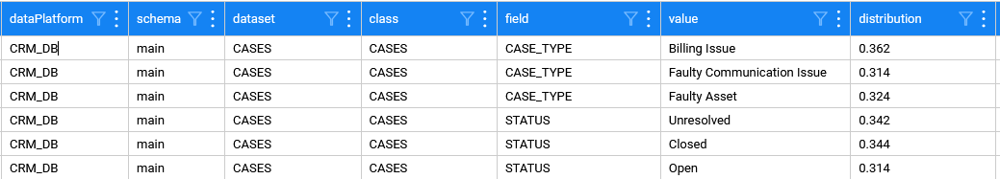

# Source Data Analysis

This article describes plugins that analyze source systems and calculate various metrics. The analysis is done based on data snapshots.

The plugins are:

* [Data Quality Metrics](04_source_data_metrics.md#data-quality-metrics) — calculates various data quality metrics as described below. These metrics can then be used for masking and synthetic data generation.
* [Option Set Analyzer](04_source_data_metrics.md#option-set-analyzer) — identifies fields with a limited number of distinct values (in a data sample) and saves them into an MTable. These metrics can then be used for masking and synthetic data generation. The plugin is introduced in Fabric V8.3.
* [NULL Percentage](04_source_data_metrics.md#null-percentage) — calculates the percentage of NULL values per column. Starting with Fabric V8.2, this plugin has been combined with the Data Quality Metrics plugin.

## Data Quality Metrics

This plugin scans the data of the data sample in order to calculate various data quality metrics. These metrics can then be used for masking and synthetic data generation.

* **Data Sample Size** — the actual number of values in a column in the data sample.
  * The data sample is retrieved per the Catalog settings. For example, the default sample size is 10% of the table size, with minimum 100 and maximum 500. However, the actual data sample size can vary, based on the table size.
* **Distinct Values** — the count of distinct values per column in the data sample. 
  * This parameter helps to assess the variety or uniqueness of data within a column. It is useful for data categorization as it helps to analyze whether the data contains a specific set of values or labels (such as status fields or categorical variables). 
  * In addition, it can help to validate whether the data values are within an acceptable or predefined range. For example, if a column is expected to store binary values (Yes/No or true/false), the presence of more distinct values might indicate data quality issues. 
  * A high number of distinct values in a column where fewer unique entries are expected may suggest potential data anomalies, typos, or other errors. 
  * This calculation is performed for alphanumeric and numeric fields (strings, integers and real numbers).
* **Minimum Value**, **Maximum Value**, **Average** and **Standard Deviation** are basic statistical calculations performed on numeric or date columns in the data sample.
  * Establishing the existing range of values in the data can help to verify whether these values fall within expected or acceptable limits. This helps to identify potential errors, such as outliers or incorrect data entries (e.g., a negative age value).
  * Understanding the range of values helps to ensure consistency across similar datasets. The range can assist business decisions making, by providing insights into variability and distribution. 
  * As part of basic descriptive statistics, these metrics provide a first glimpse into data distribution and can be a precursor to more advanced statistical analyses.
* **Null Percentage** - the percentage of null values per column. 
  * This percentage is calculated on each column of non-empty tables. The **Null Percentage** property is added to the field's properties when the calculated value is above the plugin's threshold. 
  * For example, when 30% of the values in a certain field are null, the Null Percentage property will be added to this field with the value = 0.3. However, if 20% or less of the values in this field are null, then this property would not be added.


## Option Set Analyzer

The purpose of this plugin is to identify fields with a limited number of distinct values (in data sample) and save those values into a dedicated MTable, so they can be used for masking and synthetic data generation. 

Once a field is identified as an Option Set,  the property ```optionSet = true``` is created for it. In addition, separate MTable is generated per each data platform and schema to keep the distinct values (and their distribution). The MTable has the following name format: 

```catalog_field_option_set___<dataPlatform>_<schema>.csv```, (containing 3 underscores before the data platform name).

The below image is an example of such MTable:



The rules to identify fields with a limited number of distinct values are:

* The field is **not PII** (in order to keep the privacy laws and not to expose sensitive values).
* The number of distinct values is either below a plugin's threshold (e.g. 0.05) OR below an ```Absolute Threshold```  input parameter (which is set to 15 by default).

Additional rules apply based on the plugin's input parameters, as explained below.

#### Absolute Threshold

Defines the absolute threshold number of distinct values. The value is validated against an absolute threshold if the number of distinct values per field is above the plugin's threshold. For example:

* The sample size is 100 and a field includes 10 distinct values, thus the proportion of distinct values is qual to 0.1. This is higher than the plugin's threshold (0.05).
* In this case, the results is validated against the absolute threshold to verify if it qualifies for being an **Option Set**. 
* Since 10 distinct values is below the absolute threshold level (15), the field qualifies as an **Option Set**.

#### Field Type Include List

The ```fieldTypeIncludeList``` plugin's input parameter allowד controlling which field's data types should be considered for checking the distinct values. 

By default, it is set to STRING, INTEGER for this plugin. The valid values are: STRING, INTEGER, REAL, DATETIME, DATE, BOOLEAN.

#### Field Name Include List

Allows to setup an override list of field names. These fields will be included in the plugin's validation algorithm, even if they are PII or belong to a small table (see the property ```minSampleSize```).

#### Field Name Exclude List

Allows to setup an override list of field names. These fields will be excluded from the plugin's validation algorithm.

#### Max String Length

Defines a limit of the STRING size, to prevent handling text files or complex structures inside a field. The default value is 512Kb.

#### Min Sample Size

Allows to skip small tables, by defining the minimum sample size for verification if a field qualifies for being an **Option Set**. The default value is 100.

## NULL Percentage

The purpose of this plugin is to calculate the percentage of NULL values per column, based on the data snapshot. This percentage is calculated on each column of non-empty tables. The default size of the data snapshot is configured in the plugins.discovery file as explained [here](/articles/39_fabric_catalog/04_discovery_pipeline.md#data-sample-size).

As a result, when the calculated value is above the threshold, the **Null Percentage** property is added to the field's properties. 

For example, when 30% of the values in a certain field are null, the Null Percentage property will be added to this field with the value = 0.3. However, if 20% or less of the values in this field are null, then this property would not be added.

This plugin exists until the Fabric V8.1. In V8.2 it has been combined with the Data Quality Metrics.
